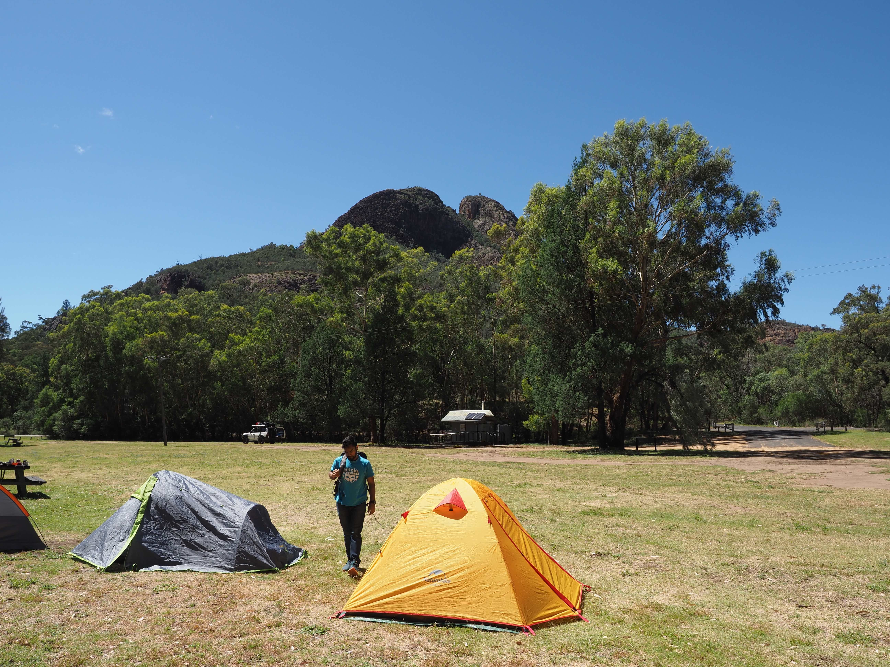
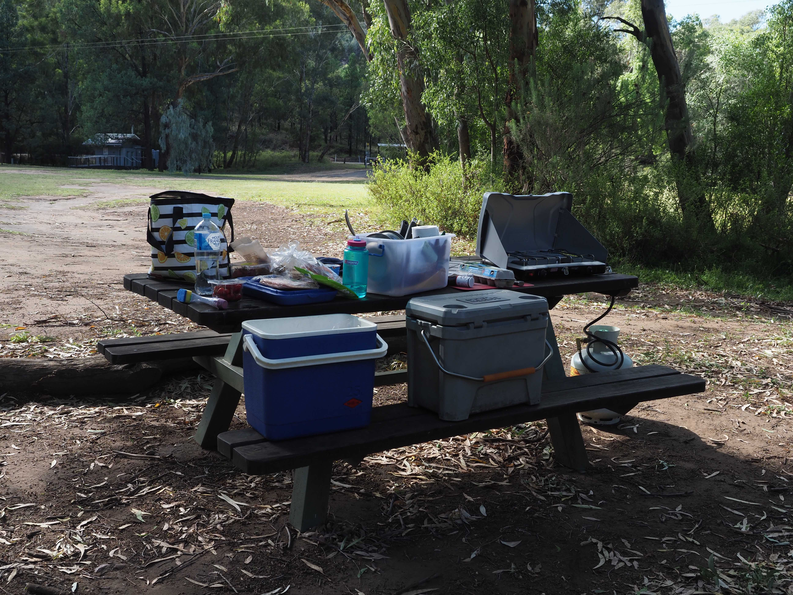
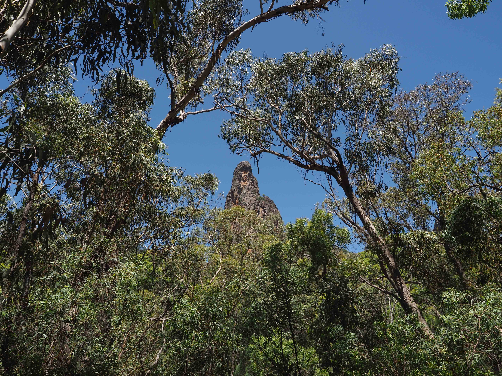

Over the weekend, I went on a 2 night camping trip with some mates to the Warrumbungle National Park, the site of Australia's first designated Dark Sky Park. I had such a rejuvenating time, connecting with friends, nature and the stars, and I'd love to recount the trip.

The premise of the trip was to go star gazing, and luckily the weekend we chose had near perfect visibility over the 2 nights. We began our journey after work on Friday in Sydney, and we had just shy of a 6-hour drive ahead of us. We left at 5pm, and expected with a break for dinner and some short rests, we'd arrive before midnight. The wonderful thing about adventure is that sometimes nothing goes according to plan.

We stopped at Lithgow for dinner to eat at the Blue Fox - a rustic restaurant, with indoor and outdoor seating serving delicious food. It reminded me of a tavern, catered to weary, hungry travellers. I got a marinated chicken and pita bread dish, and that was really hearty.

Afterwards, we stopped at a servo to get ice for the esky, and a couple of snacks before we hit the road again. As we drove, the sky got darker and darker, and the lights less and less. Our second group who started earlier in the day, suddenly messaged us, saying that they got a flat tire and that their spare wasn't inflated. We told them not to panic, and that we'd be there soon. One hour away from the campsite, and our friends, the road we were on transformed from tarmac to unsealed. Slowing down, feeling the bumps of the rocks, we kicked up dust as we continued onwards. Then, I recall we felt a bigger bump than usual, followed by a loud hissing sound. I believe it was on the same road, pretty much identical to our second group where our cars left back tire got gashed by a rock, completely unsalvageable. My friends and I stayed calm, turned on the lantern that we brought, and got to work. We got the car jack out, and lifted the car. We angled the torque wrench on the nuts on the existing wheel and heaved with as much force as we could and realised it wasn't budging at all. So, we had the idea to place the wrench on the nut, and then jump downwards on the tool. Gravity worked in our favour, and increased our force, the nuts finally coming loose. After that it was pretty smooth sailing to reach the campsite.

We arrived at Camp Wambelong close to 1 am, and luckily there weren't too many people there - so we didn't feel as bad when our headlights shone into the campsite so late at night. When all the lights turned off, the real lights turned on - the stars looked breathtaking. They were so bright, and plentiful, dotting throughout the sky - some brighter, some dimmer. They looked like they were painted, or pinned up in a sea of rolling black. You could feel as if they were three-dimensional, some further, some closer. The Milky Way hung over a tree, and I felt so happy.

I took a few photos on the first night despite being so tired.

Afterwards, when I tried to set up my tent, I realised the outer tent wasn't packed, so there would be no protection against the wind or rain. Luckily between the 6 of us, we had enough space inside the tents already there, so it worked out. Earlier that day I had bought a new air sleeping mattress, and it was so much more comfortable than the yoga mat I used to use when camping!

Sleep came late, and the Sun woke me up as the tent started to heat up near 8 am. Having a morning coffee with an Aeropress, and kettle, I felt so joyful to be surrounded by the trees and blue sky. It was only in the morning that we could see the fantastic mountain near our campsite peeking over the trees.

One friend suggested we do a morning trail run. At that moment, it felt like the most right thing to do in the world. Four of us signed up, and got ready. We found a 5 kilometre loop around that we wanted to do, and started off - running off the beaten path, crossing small streams, flying over tree trunks - all at a pace that I would associate with road running. It didn't last too long on the trail because I don't think we actually found the loop, and instead we hit the asphalt. Rocks surrounded us. Sweat gleamed on our bodies as we ran and ran, and a park ranger passed us by in car. The next day, the park ranger would ask us if we were athletes, which was cool to imagine. Overall, my tracking of the run didn't go to plan because I forgot to stop timing when we finished, so it said we did 5.7 km in a 1h 30m which gave me an unbelievable pace. Luckily another friend was tracking the run on his watch, which seemed a lot more credible at 37 minutes. Pretty happy with the 6.3 km/h pace given the 101 m elevation gain.

After we got back to camp, we rested in the shade under a branching eucalyptus tree, and drank bottle after bottle of water to stay hydrated. Then, we realised we were starving. So we got to work connecting the stove to the gas cylinder, cracking the eggs and sizzling the bacon, to make a delicious brekkie wrap.

After breakfast, we relaxed under the dazzling Sun. Then, we formulated our next plan - the epic Breadknife and Grand High Tops walk, a circuit spanning more than 14 km.

We drove to the starting point, and I was equipped with my camera around my shoulder and a 1L water bottle. My friends had bags with snacks and more water. We began our walk with the Sun at its zenith, and heat beginning to grow. Lined with Eucalypt trees and rocks with ancient iron in them, I felt at peace with everything. Walking in nature is one of my favourite things to do, because it feels like the trees, rocks, plants and animals all are letting you in, giving you access to their effortless beauty and serenity.

For the beginning (and by definition - end) part of this hike, it was well paved and relatively easy apart from the steep slope. We came across a resting point nestled to the side of the path with seats, and drank water and shared some oatmeal bars. It was only when we looked up, that we saw a gigantic spire shooting up past the trees into the sky. It was incredible to imagine it just being there the whole time, waiting for us to see it.

The name 'Warrumbungle' is believed to mean 'crooked mountains'. The whole area used to be a shield volcano, and millions of years ago it used to constantly erupt, leaving so many towering remnants today.

The next bit of the track included lots of stairs, luckily all very well maintained. Reaching the top of the stairs, raised above the trees that were surrounding us, we could see monoliths and distant mountains everywhere we looked. The most apparent of all was Crater Bluff looming in front of us.

Moving further along, we reached the Grand High Tops summit area. It was here, that a friend of mine climbed a very steep rock face, and urged us to do the same. My shoes didn't have the right grip, so I took them off and went barefoot up the rocks to a precarious view point. I was rattled by the journey up, that I didn't dare move around the narrow peak, because it was a very long drop. My friend however, was very used to this sort of thing and was prancing around unperturbed by the fact we were hundreds of metres up in the air.

After descending the rock face, we came to the main area of the Grand High Tops, and could see a vista extending to the horizon, capturing Crater Bluff, Belougery Spire, Bress Peak and the Breadknife. It was honestly spectacular, and we spent a while there sitting, soaking it all in. Imagining how violent, volcanic eruptions coated the landscape, and over millions of years eroded to produce these thin spires, and mountains.

The walk back was long, and at this point most of us were tired and quite dehydrated (definitely need to bring more water next time!). However, one of my favourite things about walking is the company you are with. I had long, meaningful conversations with my friends and I loved every second of it.

On the way back, I heard scuttling in the underbrush and was amazed to see a large goana emerge and climb up a tree. It seemed that we had disturbed its sun baking.

We finally made it back to the car, and our only thought was to get out of there to our campsite to drink water. We saw a group of hikers at the entrance as we were leaving, and advised them to bring enough water and do a short hike since it was already nearing sunset.

After reaching the campsite, we cracked open some cold Pepsi which was honestly one of the best sensations you can feel after a long day - burning past your throat, coating your tongue with sugary goodness. A few of us then went to shower at a nearby campsite.

For dinner, we had to improvise with what we had. We realised the ice in all the esky had melted, and the water had seeped into everything that was open. That wasn't great, since the bacon container was partially open, which meant everything had bacon water on it. Nevertheless, we continued onwards. We had frozen chips, wedges, green beans, tomatoes, eggs and bacon, along with some vegan sausages. Originally I started cooking the chips, but realised it was getting mushy like a stew, so a friend suggested why not make it a stew? We poured in a lot more olive oil, dumped in the wedges, and remaining ingredients and cooked it all. On the other pan, we cooked batches of bacon and then after scrambled the remaining eggs. What resulted was a delicious feast, that we lathered on top of pita bread.

After the feed, and feeling very content, as the sun began to set, we saw the stars start to appear in the purple sky. I was lucky enough to see a shooting star, and made a wish. We also happened to see star link satellites for the first time. They looked like a caterpillar in the sky, 5-6 white dots slinking behind one another across the sky, until they faded away.

The weather at night was perfect, with little to no clouds, and we really got a treat, seeing the Milky Way in all of her constellations. It was though-provoking to think that we had to make such a long journey to see it all, when these stars and night sky are always there - as they were for our ancestors. I think star gazing is one of those things, that really puts things into perspective, and makes you feel like you're part of a cohesive human story spanning hundreds of thousands of years.

We slept relatively early at 11 pm, since we were all so tired.

The next morning we awoke near 8 am, and started packing up, with kangaroos giving us curious looks as they munched on the grass. We all tidied our campsite, throwing our rubbish away (luckily there was a big bin nearby), and then got into our vehicles for the drive home. 

Or not so much. Since we had blown a tire, and were driving with the temporary spare - we had to urgently find a replacement, since it was not recommended to go over 80 km/h or a certain distance with the spare. We stopped for breakfast at Coonabarabram, the closest major town and phoned NRMA (our roadside assistance), and they tried their luck to contact tire operators around the area. However, since it was a Sunday, everything was closed. We honestly didn't know if we would make it back to Sydney that night, so were considering the worst case scenario of finding accommodation around the area for the night, all whilst frantically calling any number that appeared in our searches that could remotely help us. We finally got a text from a number, that after ringing, spoke that they could help us out, but they were in Dubbo. That was over 145km away, which meant we had to take the risk of driving with our spare for so long. We decided to do it, and drove very carefully and slowly to Dubbo, where Hannaford Tyres was our saviour - a mechanic coming into work and opening the shop just for us. We replaced the tire, and had some Chinese food for lunch in the city centre (to celebrate the Lunar New Year over Saturday!) and started the long drive home.

I made it home at around 9:30 pm and was exhausted, but very happy that the weekend happened.