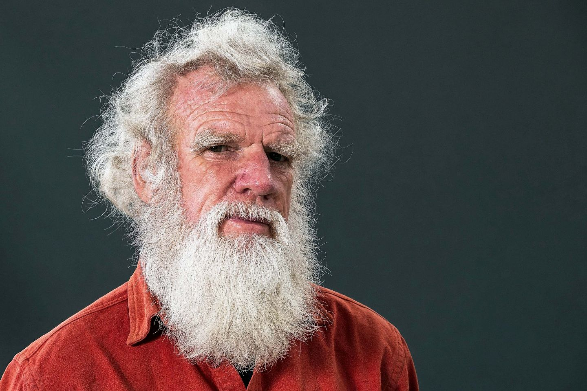

Bruce Pascoe's *Dark Emu* is a fantastic achievement, not entirely for it's content but for it's power in reviving the national attention on Aboriginal people and their unique relationship with the land. 

Pascoe takes us through journal entry after journal entry of European settlers to try and reveal the much more complicated Aboriginal economy than the primitive hunter-gatherer label instilled in the minds of Australians. 

However, this has caused controversy due to inaccuracies in the historical method used by Pascoe to present evidence of Aboriginal people being 'agriculturalists'. This has sparked arguments for the repudiation of this book, which is a shame because Dark Emu in my opinion serves its purpose - namely of shifting the narrative, by exposing the holes and flaws in our traditional understanding of Indigenous history. Terms like hunter-gatherer and farmer are both colonial labels - albeit carrying significant cultural baggage such as their basis for *terra nullius*[^1] - and we must shift away from mere categorisation to instead see Aboriginal Australian land and resource management in all its variety and ingenuity.

I found the discussion about imperialism and it's deep entanglement with history very enlightening. Since it's not merely an economic and military exercise but an act of ideology - the hubris to see 'others' as tools for the will of the European. We see this evidently in the journals, where deep-seated racism and Eurocentrism is commonplace.

Pascoe argues that "if we look at the evidence presented to us by explorers, and explain to our children that Aboriginal people *did* build houses, *did* build dams, *did* sow, irrigate, and till the land, *did* alter the course of rivers, *did* sew their clothes, and *did* construct a system of pan-continental government that generated peace and prosperity, it is likely we will admire and love our land all the more."

There are more amazing revelations such as the grain belt that spanned nearly the whole continent, which Aboriginal people harvested, planted, irrigated and turned into flour.

<figure>

<figcaption align = "center"><b>The early Australian Grain Belt</b></figcaption>
</figure>

Recent studies show that they were the world's oldest bakers by almost 15,000 years[^2]. I found the use of fire in the form of firestick farming[^3] the most interesting since they used it in an effective way to manage bush and ensure regeneration. The way it worked was that a majority of agricultural lands were fired on rotating mosaic, which controlled intensity and allowed plants and animals to survive in refuges. They also did this in a way that provided for wild animals to have access to food and water so they didn't intrude on cropland - forming a kind of psychological barrier. 

<figure>
  
  <figcaption align = "center">
    <a href="https://www.youtube.com/watch?v=Ska2fpueDLA">
      <b>Credits Cogito</b>
    </a>
  </figcaption>
</figure>

What this book taught me was that if the general population persists in hiding from obvious facts of history, we are destined to repeat the selective opinions of the colonists. Now, this does not mean to say that we have to take everything Pascoe writes as truth, but the truth of the matter is that as a society we should be so grateful that we have a culture and people who have lived in harmony with the environment for over 60,000 years[^4]. This understanding comes at a crucial time in our history plagued with rampant consumption and exponential growth. 

We should see colonisation and imperialism for what it is, people not respecting land and nature and thus constantly having to seek more because they've damaged what they already have. Aboriginal Australian law insisted the land was held in common and that people were the mere temporal custodians - thinking which is at odds with liberal philosophy of individual ownership of land. 

A quote that I like that explains this eloquently is 

> "Fences in the ground make fences in the mind."
>  ― Bill Gammage, The Biggest Estate on Earth 

As we face our biggest threat of climate change let us note that no peoples of the world in any era of their history wanted oppression, discomfort, or inconsequence. The desire for food, shelter, and purpose are universal. Perhaps we have a lot to learn from a culture that so deeply treasured these things. 

> **"All of us must be alert to the greatest limitations to wisdom: the assumption."**

I also recommend this video if you'd like a summary of the book.

<iframe allowFullScreen = "allowFullScreen"
src = "https://www.youtube.com/embed/Ska2fpueDLA?ecver=1&amp;iv_load_policy=1&amp;rel=0&amp;yt:stretch=16:9&amp;autohide=1&amp;color=red&amp;width=560&amp;width=560"
width="560"
height="315"
allowtransparency="true"
frameborder="0"> 
  
 
    <a id = "xhflih37" href = "https://downloadyou.tube"> at this website </a>
    

 
    <a id = "xhflih37" href = "https://downloadyou.tube"> Downloading YouTube videos</a>
  
 
</iframe>

[^1]: Terra nullius is a Latin term meaning “land belonging to no one”. British colonisation and subsequent Australian land laws were established on the claim that Australia was terra nullius, justifying acquisition by British occupation without treaty or payment. This effectively denied Indigenous people’s prior occupation of and connection to the land.
[^2]: https://renew.org.au/renew-magazine/community/the-worlds-first-baker-australian-indigenous-innovation/
[^3]: https://austhrutime.com/fire-stick_farmers.htm
[^4]: https://www.history.com/news/dna-study-finds-aboriginal-australians-worlds-oldest-civilization

