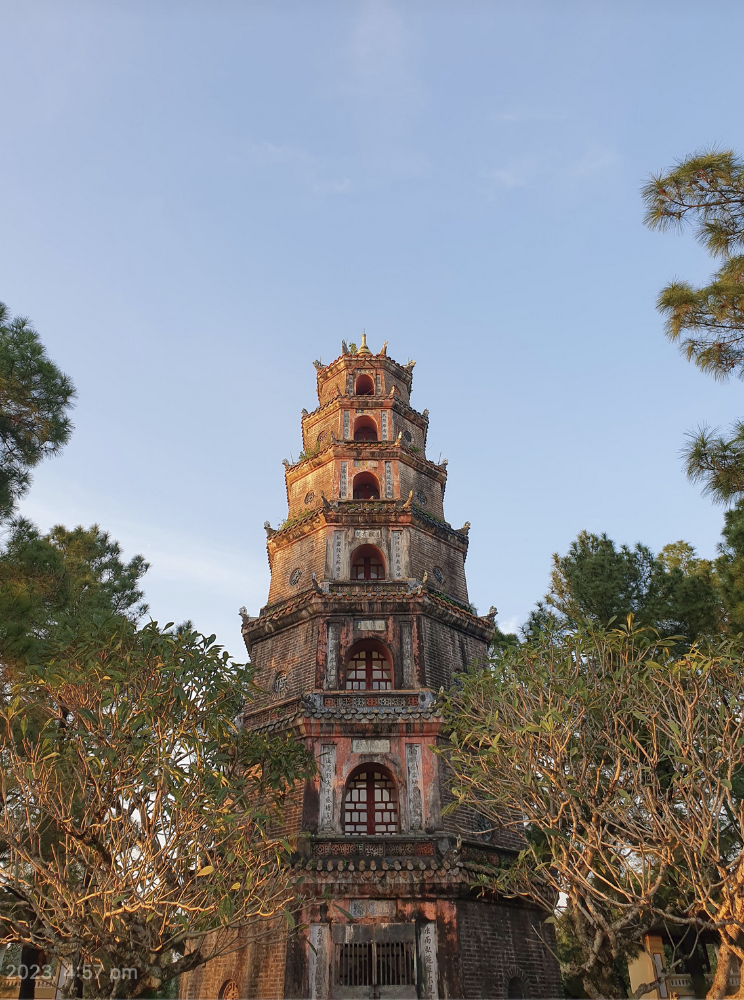
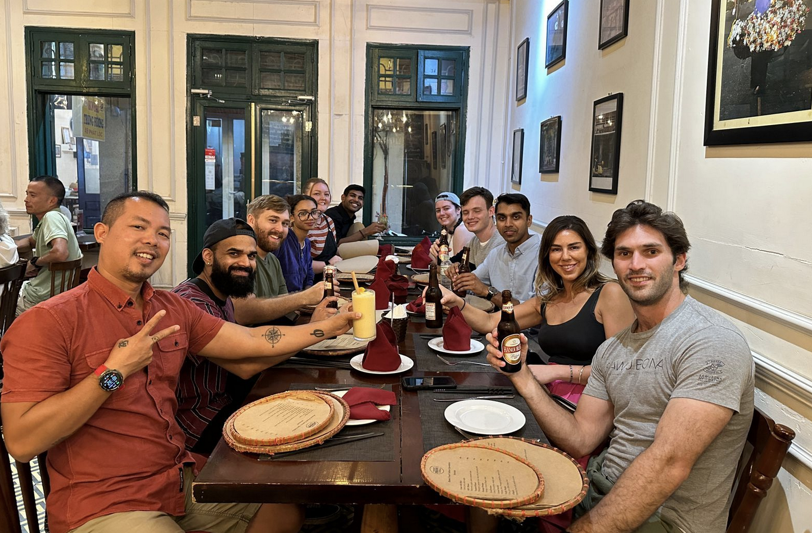

Vietnam is a magical land of vivid greenery, water buffaloes and mouth-watering food.

I had the opportunity to visit Vietnam for 2 weeks in December last year, and it was exactly what I needed. I hope to recount my experience, and paint a glimpse of colour into what Vietnam is like, and the unique charm of each of the cities and towns I visited.

## The misadventure before arriving in Vietnam

I had organised this trip literally 3 or 4 days in advance, and my first misadventure started before I even arrived at Vietnam, starting the day from Mt Fuji in Japan. The journey started in the morning where I left my hostel (K's World for those interested - highly recommend it!) at 7:45am, to walk to the bus at Kawaguchiko at 8:30am. I absolutely had to get that bus, because if I didn't, I would miss my outgoing flight. Once I made that, and got to Tokyo near 10:45am, I waited for another bus to take me to Narita airport. It felt so great to reach the airport, knowing that if at each step of my journey if I had delayed, or had made a mistake, I wouldn't be there for my flight. I got to the airport near 12pm, and my flight to Vietnam was at 2:55pm.

What happened at the airport was the most stressful series of events I've ever faced. To provide context, to enter Vietnam I needed an e-visa which I had applied for 2 days prior and at that moment it was "in processing". I got to check in and was asked for my passport, which upon handing over, was all good. Then, flight details, which also was all good. Finally, I was asked for my visa, and when I mentioned my situation the staff looked confused; a departure from the script we were following. She asked for her manager, and spoke to him for a bit. Then, the manager walks to me, and says sorry, you cannot fly. I had around 3 hours to fly at that stage, and he said the only thing you can do is wait for it to be processed. I instantly thought of all the possible scenarios, like having to book accommodation immediately, or a new flight the next day. Millions of thoughts raced through me, and I called my family in Vietnam, and they even tried to get in contact with an immigration agent and ask for emergency advice.

I have to preface that the e-visa website for Vietnam looks like it was developed in 1999, and scouring the whole website, I luckily found a contact form which I hastily wrote a saving grace message that sort of went like this:

> Hello to whom this may concern,
> 
> I am at the airport about to board my flight which is leaving in less than 2 hours. I have submitted an e-visa application 3 days ago, can I please, please get this expedited. 

Dejected, with the airport staff looking at me squatted on the floor with my bags around me, and time ticking down to my flight that I wouldn't be able to board, I decided to cut my losses and head to get some lunch (since I hadn't eaten yet) and figure out my next plan. As I started walking away from the terminal, just as I was about to give up, I refreshed my application and the visa was granted!

I immediately rushed back in line to check in, and the same attendant dealt with me and was beyond amazed that it worked, and even got her manager to agree in amazement. I got through the gates!

The funniest moment was when I was walking around the airport, and I felt someone grab my shoulders. Whirling around, I saw the manager who said "You made it!".

I was so relieved to be on the flight, and stepping down in Vietnam with my family waiting for me was amazing. 

## Setting foot in Vietnam

When I arrived in Vietnam, the first thing I felt as I stepped off the plane was relief, seconded by a wave of humidity, that seemed to hang. The third was, the bustle. Ho Chi Minh City is always moving, scooters, bikes and cars everywhere.

I spent a couple of days with my family in Vietnam and that was lovely, a real slice of life. My uncle and aunty welcomed a baby daughter, and I got to see her, only two days old! Babies are so small, and every day they magically get longer and bigger.

I went to the vet, for the dog my family had, and witnessed a metal table near the entrance of the store where pets are inspected, completely open air. We wandered wet markets to get fresh fish, and I witnessed just how fresh those fish were (spoiler: they were swimming and then promptly were not anymore). I had coffee every morning by going downstairs and walking to any of the vendors on their scooters, with their vehicle fitted out with ice cubes and coffee syrup. I also went bowling, and did archery for the very first time.

## The Start of the Tour

After that, I joined a GAdventures tour, specifically the Vietnam: Historic Cities & Halong Bay Cruising tour. Before booking this, I had no idea who and what GAdventures were, and to my great surprise it was such a fun experience. I realised later on that GAdventures often offers more intimate and smaller groups compared to Contiki.

I was a bit late to the initial group introduction, but everyone was sitting around a table and our tour guide - Phi (an absolute legend!) -  was iterating through some key information like where we are going, and how we will get from place to place. The group of travellers - around 10 - beside me all looked a bit tired (probably given that most of them flew in before the tour start and may have been jet-lagged).

We got given keys to our rooms, and were told we'd be heading to dinner in a bit. It was here we exchanged hello's and kindled our newfound friendships. Walking to dinner, we realised there were a few more travellers who were part of a larger tour that came from Laos and Cambodia before Vietnam, and some of them were staying on the tour with us and others were leaving. The first night's dinner had a lot of people!

After dinner, I was not tired at all, and I wanted to dance! There is a street in Ho Chi Minh City (HCMC) called Bui Vien Street and basically after 6pm, on either side of the street you will find clubs, with some having circular stages where dancers are facing the street, and almost all blasting out music that would surely damage your ears if you were there for too long. It reminded me of the (much bigger) Khao San road I visited a few years ago in Bangkok. We hopped from club to club, dancing, drinking and sipping on air balloons. A couple of friends and I got to dance on stage, right on top of the DJ which was a surreal experience, although I think everyone in the vicinity was out of their minds.

The day after it was a free day in HCMC, and I got out to try some Banh Mi (one of the reasons I chose to go to Vietnam was to eat Banh Mi!), and Vietnamese Iced Coffee (Cà phê sữa đá) which is basically intense coffee syrup (or espresso in more fancy places) with ice cubes and loads of condensed milk. Choosing to cross a road in HCMC is a delicate dance, where you first make eye contact with the rider or driver of the vehicle, and slowly start on your way, and they are expected to either slow down or move around you. I was familiar with this, travelling in India where the traffic situation is similar and perhaps even more chaotic. With friends however, you have to ensure that everyone commits to walk to avoid situations where people get left behind on their own.

The humidity in HCMC is next level, and after walking for a few minutes outside with the sun, you realise that your back is drenched in sweat. So, the day came to a pause as we tried to find shade and have some lunch. I tried Phở (another reason I chose Vietnam) and it was so delicious, with a very clean broth with little to no oil. 

## Nha Trang

At night, we took our first intercity trip to Nha Trang by sleeper bus, and this was by far the most comfortable bus I've been in. I realised after we arrived, that you could pull the blinds down to block out the light from outside, so I randomly woke to bright street lights flashing into my mind. 

We arrived at Nha Trang (on my birthday!) at around 5:30am, which was way before check in to the hostel we were staying at, so we dropped our bags off and set off into the sleepy city. It was a cloudy day, but still beautiful, and we went to the beach to see the sunrise. It was stunning to see so many locals out and about at 6am, dancing in a group, playing sport, and swimming in the water. It felt so vibrant and alive, and what was so surprising was that shortly after sunrise, the masses disappeared (probably to go to work!).

There was a point where I ordered a coffee from a lady on a bike, and was left behind from my group. Waddling along the promenade with my coffee in hand, I desperately tried to walk fast without looking like I was walking too fast. The coffee lady noticed me, and said "Hop on!" and I got a ride all the way to the front of the group. 

After all of this, we headed back to the hostel to check in, and then we went to our next activity which was mud baths! I've never been in a mud bath before, and was surprised at the consistency, it felt very light, and it was very buoyant, so you could float easily. Mud got everywhere, but it was great for exfoliation, and also lots of fun pouring mud over yourself and others. 

Afterwards we had lunch, and if you ever visit Nha Trang you must try a place called "Banh Mi Phan" it was my second most favourite Banh Mi place (for my number 1 favourite - keep reading onwards!). The bread was roasted just right, and the toppings were so fresh and warm, and it was a hug to your stomach. We had a fantastic group dinner at a seafood restaurant and I got to try some very interesting things, like Mantis Shrimp and Turtle (I was very sad about this one, but I didn't order it - someone else did). I also got a surprise cake which was awesome, and the whole restaurant belted out "Happy Birthday" which was slightly embarrassing, and very fun too.

Nha Trang is known as the beach resort town, and during the peak months it would get very busy, but we were travelling in the off season, so we didn't have a problem with crowds. I also tried this Phở place (Phở Hạnh Phúc) where you could see the noodles being freshly made, and it was so tasty and soft I loved it!

## Hoi An

We went on our first overnight train towards Da Nang, which was around a 10-hour journey and our guide brought a bottle of Vodka which was sorely needed for this uncomfortable ride. The sheets were stained, and you had to live with the discomfort and dirtiness, but we made it out!

After arriving at Da Nang we immediately were transferred to a bus to take us to Hoi An which is a beautiful town known for their expertise at crafting garments. In fact, many people visit there to get tailor made clothes for relatively very cheap. Some people in my tour group got suits, but I had next to no luggage space so instead went wandering around the town. There is a part of Hoi An which is called Old Town and prohibits motor vehicles, so it feels like a quaint village with shops lining the narrow streets.

The day we arrived in Hoi An it was raining quite heavily, so a couple of us decided to get a massage - if you ever visit, the massages here are incredibly cheap and so worth it! It was a funny moment because when we sat down at the massage studio, we were informed there would be 2 females and 1 male administering the massage and I and one of my friends called dibs to not get the man, and my other friend was devastated. He said he'll go somewhere else instead, and the manager said don't worry, we'll call someone in for you - so a masseuse literally got called in for him, which is stellar customer service if you ask me!

The next day, at Hoi An, we also did a bicycle tour of a nearby farm - and got to try some bootleg banana rice wine, fermenting in a shed behind someone's house!

We rode around 20 km, and went on two boats. One of which was the basket boat ride, where the captain wove us through coconut forests. At one point, it felt like a party, with loud music radiating from some fishing vessels in an open part of the water. In the center of all the commotion, there was one boat which was going crazy. It was being spun around and around, with a thrill seeker on board. For a small price, I also hopped onto that boat and was taken for a ride -  I really had to grip the seats to not fall, not too different to riding a bull (I imagine…).

The second boat we went on took us along the river back near our hostel, and we could see endless farms, armed with their water buffaloes. Rice fields surrounded us, and we caught glimpses of shrimp farms too!

Hoi An was such a great place for shopping as well, and there are so many souvenir shops, art, and clothing shops. A friend and I chanced upon a small gallery, and got to buy a lovely painting on silk each.

I saw the prettiest sunset lighting up the river where people floated lanterns for good luck.

I also did a cooking class here which was a great experience, and got to cook fresh rice paper rolls, Phở, and other local dishes. 

It's here where I also went to a [fantastic performance](https://www.luneproduction.com/lune-center-hoi-an) which featured people doing acrobatics with bamboo poles, vaulting across the stage, and doing crazy things.

At dinner time, our group was very adventurous, and I got to try stingray, and silk worms - a very interesting nutty aftertaste for these!

One of my favourite memories was in the evening when after dinner, we went karaoke and I - not having sung for a while - was so keen to sing as much as I could. It was really heartwarming seeing everyone in the group open up and sing and feel comfortable doing so. 

And **d-d-d-drumroll**, the best Banh Mi I've ever tasted resides in Hoi An too. It's called Madam Khanh - The Banh Mi Queen, and I agree - it holds that regal title. Not only is it is world acclaimed, but it doesn't feel inauthentic the way so many famous places do. The ladies serving you from the small stand, lather just the right amount of fresh ingredients on the golden toasted bread. What results, is mouth-watering, and beyond delicious. I highly, highly recommend it!

## Huế

After Hoi An, we took a bus to go Huế. We stopped on the way at Phú Lộc where we saw mists gliding over rolling hills, vibrant and green. We were very lucky to see a goods train pass by, metres away, roaring away into the mountains.

Huế is a gorgeous city, nestled next to the Perfume river which was wide and deep. Unfortunately, it did not quite like perfume though. Huế was a short visit of only a day, and most of it was with a motorbike tour that took us to see local villages where incense was made by hand, and the Thien Mu Pagoda which stood tall and proud.

A fascinating thing we saw was a [Colosseum](https://saigoneer.com/vietnam-heritage/3041-hu-citadel-s-colosseum-where-tigers-and-elephants-battled-to-the-death) that was used to wager live fights between tigers and elephants, and due to the Royal Family's wishes the elephants always won (they removed the claws of the tigers). Inside, we saw the room for the tigers and I could see claw marks on the walls and that was striking to me, to see on the stone their suffering and rage, many many years later.

> Tiger claws on walls,
> Stained in time, on stone,
> Remnants of their suffering

We stayed at a hostel called the DMZ at Huế, and it was an ode to the demilitarised zone and the single bloodiest battle of the Vietnam War. It's decor was spartan and militaristic, which was very interesting.  Situated across the river in the city, was the Imperial City of Huế constructed in the 1800's, a majestic citadel with gardens and preserved buildings. I attempted to enter, but lost too much water by sweating there and decided to cut my losses and get a coffee.

One of my favourite things in Huế was eating Bun Bo Huế straight from the city it originated from. Aromatic, and spicy, it was exactly what I envisioned.

## Phong Nha

After Huế, we were on route to Phong Nha which is the defacto adventure capital of Vietnam. It's here where Son Doong lies, the largest cave in the world. We didn't get to see that one since it's a very restricted cave, only allowing 1000 visitors a year. 

We spent our time here travelling between misty hills, where trees rose up covered in moss to enter caves. I saw a cave where the ceiling was over a hundred metres high, and it felt like you were in this world of stone. It was incredible. There was even a cave, where the entrance was a river, and so we entered by boat.

It's amazing to think people discovered these places millennia ago, and that the stalactites (from top), stalagmites (from bottom), stalagnate (when both touch) took millions of years to form, and are still forming as water drips down. I think it's a special place in nature because when you see mountains and rock formations, they seem so static like they've been shaped a long time ago, a time that you can't fathom, whereas in caves you feel like you're witnessing it every single moment, as if it's alive.

## Halong Bay

After Phong Nha, we took our last overnight train towards Hanoi and oh my goodness it was the worst experience ever. There were cockroaches and bugs everywhere, and you really had to close your eyes and just accept anything touching your body. The air conditioner switched between incredibly hot humid hair and freezing air, which made you sweat like crazy and then freeze. Everyone was so over it, and glad to touch land again when we stepped outside.

> I collect temporary things, hold them in my hand, turn them over, and then have to return them.

We went to Halong Bay as our second last visit of the Vietnam trip, of which the main highlight was of course seeing the bay, and these beautiful mountains rising up from the water. It reminded me of Milford Sound in New Zealand. I'm not going to lie, most of us fell asleep or closed our eyes on the boat ride just because we were so tired from the overnight nightmare train.

In the evening, we went to a beach club, and it exceeded every expectation I had and then some. They had a fantastic sound system, DJ, drops and lighting. The lasers made me feel like I was in a high production music festival, and there were even dancers! It was so surprising to see it in Halong Bay, nestled away from the main city.

## Hanoi

After Halong Bay, we took our bus to finally end our travels at Hanoi. I love Hanoi, it feels calmer than HCMC, and closer to nature with many lakes around the city. It is also much cooler climate wise, situated so far up north, which made the whole time there so pleasant. The highlights here was the Egg Coffee which Hanoi is famous for.  Basically they use egg to make this layer of cream really thick on top of the coffee, and it's delicious! I also got to see this famous train street where you can drink at a café as the train passes literally centimetres away from you.

Hanoi is where I had the most delicious Bún Cá I've ever tasted. The secret is that they roast the pork in a fire outside the store, and give you fresh hand made noodles, with fresh chillis. The broth is sweet and salty, and a once in a lifetime delight for your taste buds.

We shared our final dinner here with the group, and afterwards walked around the lake. We stopped by a café (The Note Coffee) where everywhere you saw was covered with sticky notes filled with messages from past travellers. After writing our own messages, tucked away in the corner of Hanoi, we left. Let me know if you ever end up finding my message!

Vietnam is one of my favourite countries that I've visited, and I hope to be back again one day because there is so, so much more to see!

