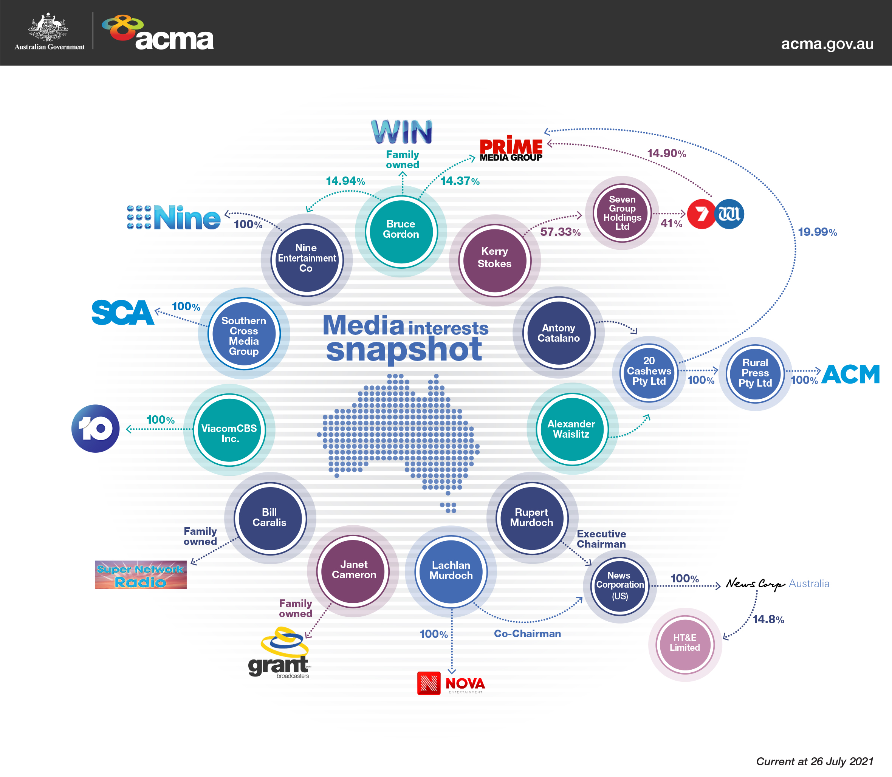

Over the past few years, we've seen populism rise across the globe. Underpinning each of these movements is this gnawing feeling that the mass population was being left behind, that the rich were getting richer and there existed elites who were secretly controlling the world. 

Now, we may dismiss some of this as conspiracy but the truth about media is that it is controlled by a specific few, and their interests often do not lie with telling the objective truth as much as we'd like to think. In this article we will dive into the premises of Noam Chomsky and Edward S. Herman's *Manufacturing Consent*.

Most of us who live in democracies are led to believe that the media are independent and committed to discovering and reporting the truth with unbiased professional and objective criteria. It would be the aim of such media to enable us to navigate our world, and ensure we have enough knowledge to inform our political choices, however, this is not the case. Instead there is extensive evidence to show that the societal purpose of the media is

> to amuse, entertain and inform, and to inculcate individuals with the values, beliefs and codes of behavior that will integrate them into the institutional structures of the larger society. In a world of concentrated wealth and major conflicts of class interest, to fulfil this role requires **systematic propaganda**.
> ― Manufacturing Consent

Chomsky and Herman say that this is true whether the media operate in liberal democracies or under totalitarian regimes. The only difference is that in communist and other authoritarian societies, it is clear to everyone that the media are instruments of the dominant elite. In capitalist societies, however, this fact is concealed, since the media “actively compete, periodically attack and expose corporate and governmental malfeasance, and aggressively portray themselves as spokesmen for free speech and the general community interest.”

Our belief of journalism and media being the full of grit, always fighting for truth and justice is led by dialogue such as how the Vietnam war was lost in the living rooms of America - not on the battlefields of Vietnam (Marshall McLuhan). This view was not developed by accident, it was carefully crafted and is false. There are countless examples but you can read more [here](https://www.globalissues.org/article/402/media-propaganda-and-vietnam#MediaandtheWar).

So, how can all media outlets, newspapers and television stations be in it together? 

Pretty easily, if you look at the money trail. Let's look at the institutional structure of mainstream media. What are they? They're corporations, that are often part of mega-corporations. The first and foremost function they have to fulfil is to sell a product to the market - now you'd think the product is simply the newspaper or article itself and the market are the consumers, but in reality the product is the readers, viewers, and listeners of newspapers, television, podcasts (name any other medium you'd like), and the market is advertisers. It's no question that the biggest revenue source of media companies is their advertisements[^1]. Furthermore, the media is closely linked to government, and there is a lot of flow in and out of people with a lot of influence - meaning the same people making decisions may be the same people broadcasting the narrative about them. This is a massive issue since the lack of critical analysis of policy is a path towards corruption, and inequality - I mean if no one is paying attention to what's really happening then how can we be sure that our politicians are leading us in the right direction?  

Now, the question of whether the structure of the producer, the market, and the links to other power structures affect media content is what defines the propaganda model. 

We can think of how these power dynamics play out with **5 filters**, each of which shepherd media content to fit into narratives that are aligned with what those in power want us to think about - whether they like it or not. 

1. **Ownership** - The size, ownership and orientation of mass media is the first filter. In Australia most mass media can be traced to a handful of powerful people as you can see in this infographic. The problem with the monopolisation of media is that it tightens the agenda on what can and what can't be spoken about in the public domain. Only things that are sanctioned by these powerful people make it to the daily ink. 

2. **Advertising** - The money in media is no longer from people buying newspapers, it's focused solely around advertisements. This is a serious problem because with advertising there is no neutral system in which the final buyer choice decides decides, it's the advertisers' choices which influence which media companies prosper and which burn. The hardest hit are working-class and radical papers most of whose readers have modest means - a big factor that affects advertiser interest. Suddenly, we have media being sold to the highest bidder, who have serious pull in the content and nature of the media outlet - and with rare exceptions that these are culturally and politically conservative maybe reword for clarity. The bottom line with advertisers is that they want to avoid programs with serious complexities and disturbing controversies that interfere with the *"buying mood"*. Just think, why do we have so much mass entertainment that serves little to no purpose apart from passing the time?

3. **Sourcing** - This might be a mouthful, but Chomsky and Herman attest this to the 'principle of bureaucratic affinity: only other bureaucracies can satisfy the input needs of a news bureaucracy'. What this means is that mass media are drawn into a symbiotic relationship with powerful sources of information by economic necessity and reciprocity of interest - they need a steady beat of information at regular times, and who best to supply that than powerful established groups like governments and business groups - any other group needs to struggle to access the gates. This leads to a chilling result - officials have and give the facts; reporters merely receive them, and any difference to this can lead to a damaging of that relationship (think less investigative journalism as a way to not upset authorities). This problem is confounded by putting 'experts' on the payroll in a way that bias may be structured, and the supply of experts may be skewed in the direction desired by governments and "the market" - whoever else is willing to pay top dollar to shape public research. 

4. **Flak** - Flak simply means a negative response to a media statement or program, and can take numerous forms such as (and not limited to) letters, telegrams, phone calls, petitions, lawsuits, speeches, threats and even laws. Now, if certain facts or positions are thought to elicit flak this is can be a deterrent. Certain organisations are created ONLY for the purpose of eliciting flak[^2]. However we see this everywhere now, not just in organisations - just look at your average Twitter or Facebook newsfeed, social media has become a powerful tool of polarisation where rhetoric is militant rather than compassionate. 

5. **Control filter** - Mass media often use the idea of the common enemy as a means of uniting the masses. Fifty years ago, it was Communism - the word itself sending shivers to property owners, as it threatened the very root of their class position and superior status. Since then it's taken different forms like threat of Iran, the war against terror, and now most recently the scare of China's world dominance. Each of these mobilise the population against an enemy, and because the concept is fuzzy it can be used against anybody that toes the line with elite interests (whether that be threatening property rights, supporting encryption, or asking the fundamental why behind waging war). 

The purpose of this article was to expose how flawed our mass media is, and to whom they serve and by what means. Hopefully this has piqued your interest in the subject, and has made you a little bit more mindful of the news you see around you. Drop a comment below if you have any thoughts on this matter!

Keep an eye out for part 2 to see practical ways to consume media without being influenced to think in a specific way. 

[^1]: https://www.smh.com.au/politics/federal/tech-giants-ad-revenue-overwhelms-major-australian-media-companies-20200730-p55gzq.html
[^2]: https://en.wikipedia.org/wiki/Climate_change_denial