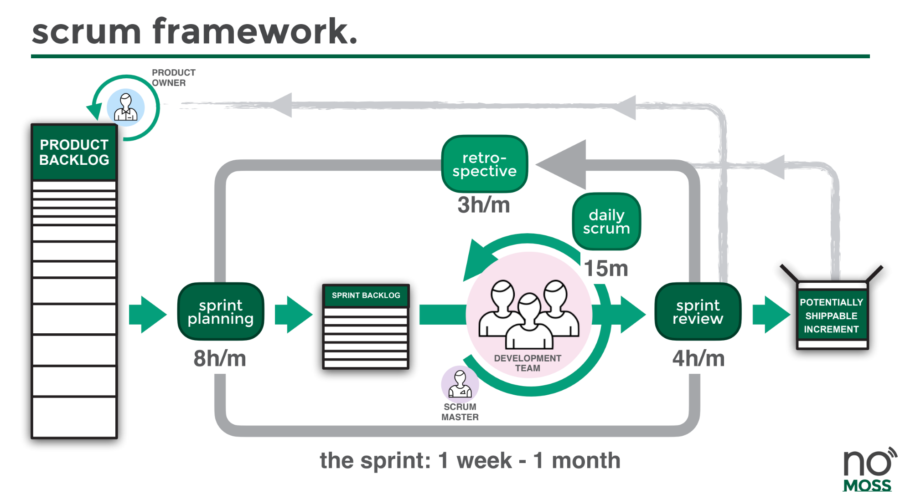
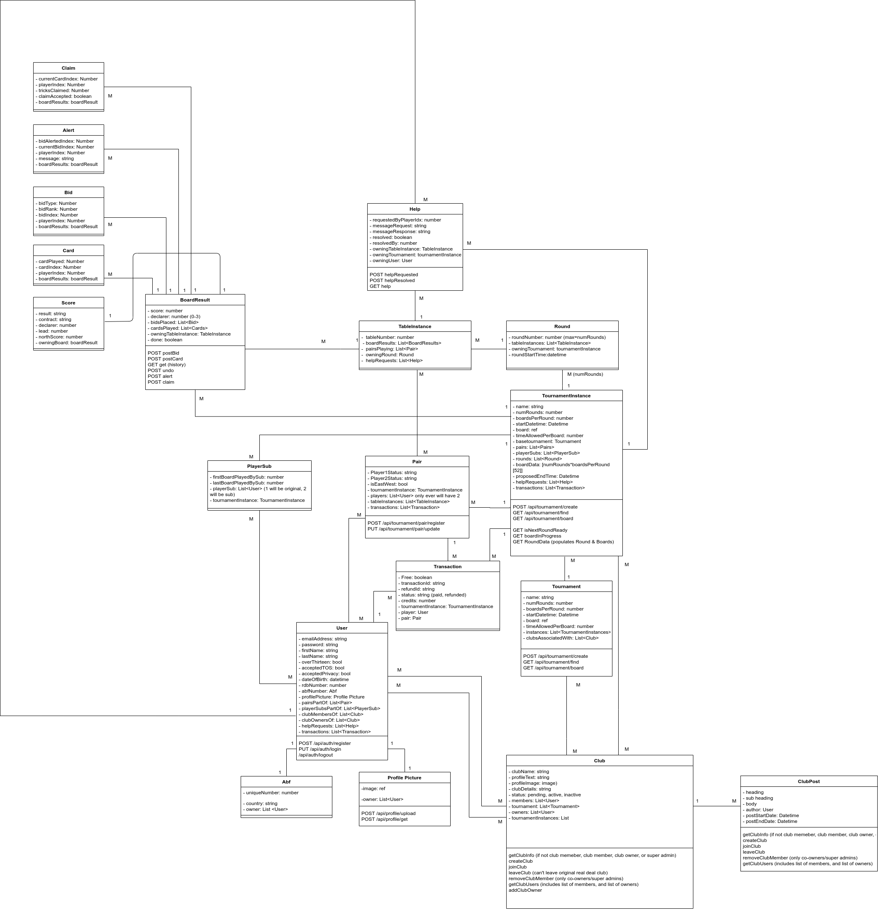

Over a period of four months our game studio team at [No Moss Co](https://nomoss.co), led the development of [Real Deal Bridge](https://play.realdealbridge.com) - a realtime multiplayer, cross-platform card game available on iOS, Android, Windows, MacOS, and Web. This article will detail both personal and team learnings, as I developed the backend architecture for this game.  


[](https://realdealbridge.com)

** So what is Real Deal Bridge? **

> Real Deal Bridge is all about giving real bridge players the chance to play in real bridge club sessions.  Local clubs can use the Real Deal Bridge platform to set up their online home run virtual bridge sessions. 
>
> Real Deal also operates a club and runs sessions which are open entry to all users.  When users sign up for a Real Deal Bridge account they are automatically granted membership to the Real Deal Bridge Club.  If their local club operates online through Real Deal Bridge they can search for and join their club using the "clubs" tab.
>
> Once you are a member of a club, you will be able to view and join games.  The Real Deal Bridge Club also runs games regularly which all Real Deal Bridge players are welcome to join.
>
> -- [Real Deal Bridge][1]

The need for this service was precipitated by the COVID-19 pandemic which saw the shutdown of local community centers where Bridge clubs all around Australia gathered to play together. With this application, players can get accredited points just as if they were playing in person. 

## Team Structure & Introduction to Scrum

Our team operated with a diligent scrum focus, and our first day of the project was the first of many sprint planning sessions. The development team were the scrum team members, our leader was the scrum master and our client was the product owner. The sprint planning pulled cards from our *priortised backlog* - a priortised backlog is a list of work for the development team that is derived from the roadmap and its requirements ordered by the product owner - into our sprint. 

[](https://nomoss.co/resources)

Over the next few months, we constantly refined our team norms and processes based on feedback from our biweekly *retrospectives*. Every morning we had a *daily stand-up* in which all members of the scrum team were present to bypass any blockers and ensure visibility on progress. Our *weekly reviews* were an opportunity to present finished sprint items and push them to our master branch.

[](https://nomoss.co/resources)

## Initial Infrastructure set up

Our approach to creating this game was to decouple the frontend game with the backend logic and database. This proved to be a very smart choice in the coming months as the backend server provided a robust API that could be consumed by the Unity application. 

Our stack was a Unity frontend coupled with the photon networking engine, and PlayFab alongside a SailsJS backend with mySQL being our database of choice. 

My first step after we all agreed on the tech stack was to set up a simple test SailsJS project running on an EC2 that was accessible through a domain name that handled authentication. *Ahh!* This was my first time using AWS and its features alongside SailsJS, and it was so daunting. For an afternoon that week I was feeling super overwhelmed with my cards for the week.

Luckily my team was super supportive, and I had the courage to admit that I was uncertain on how to do something. **Aaand just like that, I was unblocked!** I was able to shadow a senior developer who did a speed run on setting up an EC2 instance as I took notes. They're detailed below:

    1. Install apache2 with apt
    2. Create new user `ubuntu` and make them own /var/www/ using chown command
    3. Pulled backend repository into /var/www/
    4. Installed nodejs, by adding PPA and installing LTS version of node
    5. Inside repository, did an npm install to install npm dependencies.
    6. Globally installed forever, and ran app using forever start app.js 
       (this was to be changed later to PM2)
    7. Enable, apache mods, proxy, proxy_http, using a2enmod.
    8. Create new apache config file and setup reverse proxy to serve the node app from / to 1337 port
       since this is where the app was running on
    9. Repeat for staging, when available. 
    10. Setup basic auto deploy by creating a bash script to 
        git pull from master, and run forever start.
    11. Setup certbot following guide online, making sure to 
        update PPA before installing else it won't find apache.

To set up a reverse proxy as mentioned in step 8 we needed to create an enabled site in /etc/apache2/sites-enabled/

```js {numberLines}
<VirtualHost *:80>
	#ServerName www.example.com
        #DocumentRoot /var/www/html

	ServerAdmin webmaster@localhost

        ProxyPreserveHost On
        ProxyPass / http://127.0.0.1:1337/
        ProxyPassReverse / http://127.0.0.1:1337/

	ErrorLog ${APACHE_LOG_DIR}/error.log
	CustomLog ${APACHE_LOG_DIR}/access.log combined

RewriteEngine on
RewriteCond %{SERVER_NAME} =dev.example.com
RewriteRule ^ https://%{SERVER_NAME}%{REQUEST_URI} [END,NE,R=permanent]
</VirtualHost>
```

The above configuration does 2 things:
1. Maps the request coming from dev.example.com on port 80 (i.e. HTTP traffic) to the internal port of 1337 (where the node app is running)
1. Forces HTTPS by using the RewriteEngine

## Model building & functionality

The actual development of our SailsJS application came in at this stage. My first task was to have a way for users to register, log in and log out. After researching ways to accomplish this I settled on using [JSON Web Tokens](https://jwt.io/) (JWT) as our authentication method since it was stateless and our plan was that our game frontend would handle sessions, and from there it would communicate securely with our SailsJS application over HTTPS. This proved to be a very good choice for our architecture since it: 

1. Allowed horizontal scaling to handle authentication as reliably as it did with 1 server.
1. Fit in with the nature of Bridge gameplay (which is to say that it is turn based)

One of the biggest hiccups we faced in the first couple of weeks was the lack of transparency between the frontend and backend, especially in relation to what the overall models and structure looked like. To combat this, we utilised [draw.io](https://draw.io) to help visualise everything, and ensure everyone was on the same page. As a tip for the future, this should be one of the first things everyone on the team should do to ensure a steady pace ahead. 



## CI/CD with Gitlab, & Slack integrations

To aid in our velocity I set up a CI/CD pipeline using Gitlab. I'll let our .gitlab-ci.yml speak for itself. 

```yaml
image: node:12.16.3
 
stages:
  - tests
  - deploy

before_script:
  - apt-get update -qq

run_tests:
  stage: tests
  script:
    - npm i
    - npm run test-with-coverage
    - npx nyc report --reporter=text-summary
  coverage:
    '/Statements.*?(\d+(?:\.\d+)?)%/' # This is a regex expression allowing coverage to be shown on Gitlab's pipeline itself
  artifacts:
    when: always
    paths:
      # save coverage results for 10 days
      - coverage
    expire_in: 10 days
  only:
    - dev
    - master
  
deploy_dev_server:
  stage: deploy
  before_script:
    - echo "I am preparing to copy the SSH key"
    # Setup SSH deploy keys
    - 'which ssh-agent || ( apt-get install -qq openssh-client )'
    - eval $(ssh-agent -s)
    - ssh-add <(echo "$SSH_PRIVATE_KEY")
    - mkdir -p ~/.ssh
    - '[[ -f /.dockerenv ]] && echo -e "Host *\n\tStrictHostKeyChecking no\n\n" > ~/.ssh/config'
  environment:
    name: dev
    url: dev.example.com
  script:
    - ssh ubuntu@dev.example.com "./dev-deploy.sh"
  only:
    - dev

deploy_stage_server:
  stage: deploy
  before_script:
    - echo "I am preparing to copy the SSH key"
    # Setup SSH deploy keys
    - 'which ssh-agent || ( apt-get install -qq openssh-client )'
    - eval $(ssh-agent -s)
    - ssh-add <(echo "$SSH_PRIVATE_KEY")
    - mkdir -p ~/.ssh
    - '[[ -f /.dockerenv ]] && echo -e "Host *\n\tStrictHostKeyChecking no\n\n" > ~/.ssh/config'
  environment:
    name: staging
    url: stage.example.com
  script:
    - ssh ubuntu@dev.example.com "./stage-deploy.sh"
    - ssh ubuntu@dev.example.com "./stage_backup.sh"
  only:
    - master
```

The above script allowed us to deploy to our dev and stage server on changes to our **dev** and **master** branch, by running a deploy script like *./dev-deploy.sh* which is detailed below.

```shellscript
forever stop /var/www/real-deal-server-dev/app.js
cd /var/www/real-deal-server-dev
git pull
npm install
echo "Starting DB migrations"
node_modules/db-migrate/bin/db-migrate up
forever start /var/www/real-deal-server-dev/app.js 
echo "Latest version of dev application deployed"
```

I utilised Slacks API to create a simple application that used [Gitlab's Webhooks feature](https://docs.gitlab.com/ee/user/project/integrations/webhooks.html) to notify every time a push was made on dev, and master and the subsequent pipeline it ran. This was a **big** timesaver! Often at times members of our development team would ask questions like "Did our server just go down?" with no visibility on it's status. With this, the whole development team subscribed to a special channel which let us have relevant and contextual conversations relating to each new push.

## Documentation & Testing backseat

Unfortunately with the velocity we were going, and the prioritsation of feature cards in the backlog meant that for a period of a month we had virtually no testing and documentation. This was a **harsh** learning that we paid the price for by having to dedicate explicit resources and time to test. 

I know the importance of automated unit tests, and integration tests after having to go back and comb through our existing code base and writing detailed tests for each controller and helper. The [tech debt](https://en.wikipedia.org/wiki/Technical_debt) that one accrues by opting to develop more features before testing is simply too much (and will continue to grow as the project increases in complexity). A tip for the future is to properly communciate the long term benefit of testing vs. the short term loss on new features to the client such they understand this.    

Our code coverage went from 0% to a happy 61.57% as it became a team norm to include tests for our cards before we could define them as 'done'. There has now been multiple moments that our CI has stopped us from deploying a quick fix that suddenly broke tests in a seemingly unrelated place.

The immediacy for API documentation became clear when members of our team were partway through their development process when by chance in a check in the specifics of the functionality differed entirely between the backend and frontend. I wished I had more time to explore the OpenAPI spec, and even found a nifty [hook](https://github.com/theoomoregbee/sails-hook-swagger-generator) to do most of the work but at the time it didn't work as intended. I ended up creating a shared spreadsheet that had different pages for different folders of our API's, and within each it housed the name, description, route, inputs, outputs, error/success codes, and any notes to accompany it. This just like testing was something that required upfront effort to create but the benefits only shone later in the project.

## Testing with Mocha & Supertest 

Mocha was a fantastic testing framework to use with our SailsJS project. It was super easy to set up, with the ability to load anything we needed (such as mock JWT tokens) before the start of *all* tests, and then before a specific test, followed by any actions after tests. Here's a small excerpt of what it looks like to test with this setup. 


```js
var supertest = require('supertest'); //Used to send/recieve HTTP requests 
var expect = require('chai').expect; //Chai is an excellent assertion library

var agent;

describe('auth', function() {
  before(function(done) {
    agent = supertest.agent(sails.hooks.http.app);
    done();
  })

  describe('POST /api/auth/register', function() {
    var pw;

    before(async function() { //Execute the below before running any more tests within this describe
      pw = await sails.helpers.hashThisPasswordPlease('test'); //Obfuscated password hash :)
    })

    it('should create a user and return relevant keys in body', function (done) {
      agent
      .post('/api/auth/register')
      .send({
        emailAddress: 'mocha@coffee.com',
        firstName: 'Mocha',
        lastName: 'Test',
        acceptedPrivacy: true,
        acceptedTOS: true,
        uniqueGameNumber: '999999a',
        password: pw,
      })
      .expect(hasAuthKeys)
      .expect(200, done);
    });
  })

  after( function(done) {
    User.destroy({}) //Remove newly registered users
    .then( () => {
      return done();
    });
  });
});
```

## Scaling for production 

Finally, the last topic to cover is the public release of our game! The long awaited version 1.0. I'll explore the set up we used to ensure our server was reliable and scalable. 

After reading this excellent [series](https://medium.com/iquii/good-practices-for-high-performance-and-scalable-node-js-applications-part-1-3-bb06b6204197) I implemented both internal load balancing within our EC2's using [PM2](https://pm2.keymetrics.io/docs/usage/pm2-doc-single-page/), and external load balancing with AWS's load balancer connected to an autoscaling group that had a threshold of maintaining an average of 50% CPU usage in each server (i.e. if there was more, it would spin up another server and if there was less it would wind down a server). 

First step is understanding what load balancers do:
> Load balancing is defined as the methodical and efficient distribution of network or application traffic across multiple servers in a server farm. Each load balancer sits between client devices and backend servers, receiving and then distributing incoming requests to any available server capable of fulfilling them.
> -- [Citrix][2]

Fantastic! Then, I followed this [tutorial](https://docs.aws.amazon.com/autoscaling/ec2/userguide/as-register-lbs-with-asg.html) to create a load balanced application with EC2 Autoscaling.

- [EC2 Autoscaling](https://docs.aws.amazon.com/autoscaling/ec2/userguide/):
    - Amazon EC2 Auto Scaling helps you ensure that you have the correct number of Amazon EC2 instances available to handle the load for your application.
    - Our current configuration is an autoscaled group having 1 EC2 minimum, 3 maximum. 
        - Our scaling policy is set to be 50% average CPU Utilization meaning, based on all EC2's running if there is an imbalance of average CPU utilization past 50% it will auto-create a new EC2
        - I've set it so the EC2 created runs the forever script meaning our server is ready to be reached
        - To deploy production changes the ideal way is to manually run our prd-deploy.sh script which puills from git repo. Then we must create a new **golden image** . Then we would update our launch template to point to this new golden image, and then do an instance refresh on our Auto Scaling Group (this can specify how many healthy servers remain as they're restarted). I've set our autoscaling group to select the *latest* launch template so we will not need to do anything extra here.
- AWS Load balancer:  
    - This is attached to our EC2 Autoscaling Group meaning any port 80 (http) or port 443 (https) when we hit play.realdealbridge.com will then be given to our EC2's within that group.
    - The way I binded play.realdealbridge.com was through a CNAME to our load balancers name. 
- Instance type 
    - To decide on instance type for our autoscaling group, I was mindful of the performance of our application. Throughout testing we noticed a large spike in CPU usage versus Memory or Disk IO and decided that our application was a compute bound application. 
    - I was mindful of the cost vs. reward and decided to go for the C5a due to its cheap price and depending upon real world usage tweak it as required (if it is under/over provisioning).
- PM2 
    - Since node processes are bound to a single core, if we had a multi-core machine we wouldn't be fully utilising the machine if we used forever to run our application. Using PM2 we can use something called cluster feature to scale our process across all the cores without having to worry about the [native cluster module](https://nodejs.org/api/cluster.html). 

    All we have to do is have a file called ecosystem.config.js, and call *pm2 start ecosystem.config.js*

     ```js
      // ecosystem.config.js
      module.exports = { 
        apps : [{
        name: 'production RDB',
        script: '/var/www/real-deal-server-prod/app.js',
        env: {
	        "NODE_ENV": "production",
        },
        instances: "max", //Scales to the maximum amount of instances based on CPU cores
        exec_mode: "cluster"
      ],
    };
     ```

## Final thoughts

This project was my first ever greenfield project, where I took on the role of architect, and developer and it was very rewarding. I went from being paralysed by my ineptitude to being OK with that fact, and moving forward anyway. I learnt that the unknown is always scary, but what matters is having a positive outlook to it and a great team beside you to help! 

Have a go at playing our game here: https://play.realdealbridge.com/ 😃


[1]: https://www.realdealbridge.com/about
[2]: https://www.citrix.com/en-au/glossary/load-balancing.html

