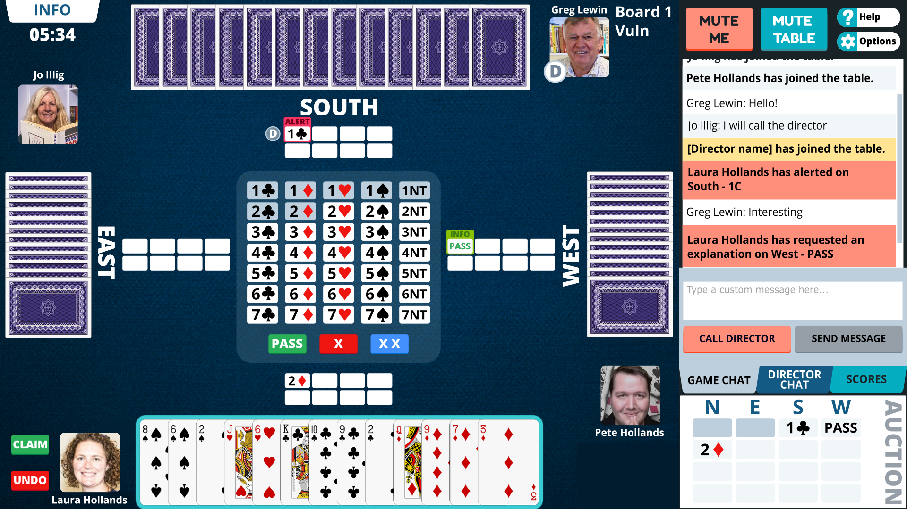
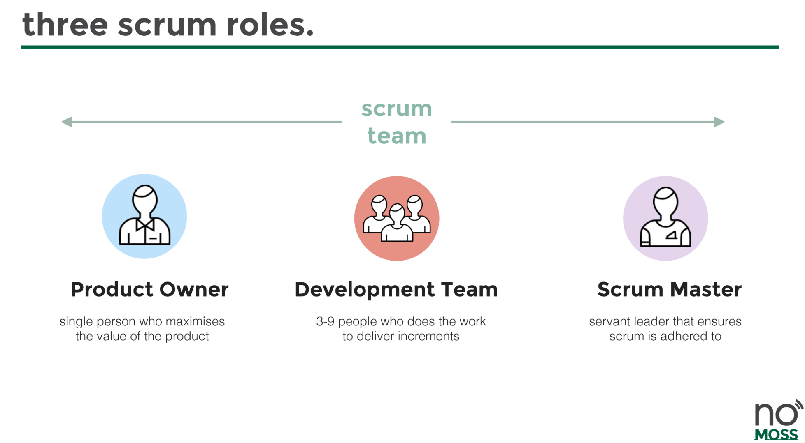

Over a period of four months our game studio team at [No Moss Co](https://nomoss.co), led the development of [Real Deal Bridge](https://play.realdealbridge.com) - a realtime multiplayer, cross-platform card game available on iOS, Android, Windows, MacOS, and Web. This article will detail both personal and team learnings, as I developed the backend architecture for this game.  




** So what is Real Deal Bridge? **

> Real Deal Bridge is all about giving real bridge players the chance to play in real bridge club sessions.  Local clubs can use the Real Deal Bridge platform to set up their online home run virtual bridge sessions. 
>
> Real Deal also operates a club and runs sessions which are open entry to all users.  When users sign up for a Real Deal Bridge account they are automatically granted membership to the Real Deal Bridge Club.  If their local club operates online through Real Deal Bridge they can search for and join their club using the "clubs" tab.
>
> Once you are a member of a club, you will be able to view and join games.  The Real Deal Bridge Club also runs games regularly which all Real Deal Bridge players are welcome to join.
>
> -- [Real Deal Bridge][1]

The need for this service was precipitated by the COVID-19 pandemic which saw the shutdown of local community centers where Bridge clubs all around Australia gathered to play together. With this application, players can get accredited points just as if they were playing in person. 

## Team Structure & Introduction to Scrum

Our team operated with a diligent scrum focus, and our first day of the project was the first of many sprint planning sessions. The development team were the scrum team members, our leader was the scrum master and our client was the product owner. The sprint planning pulled cards from our *priortised backlog* - a priortised backlog is a list of work for the development team that is derived from the roadmap and its requirements ordered by the product owner - into our sprint. 

[](https://nomoss.co/resources)

Over the next few months, we constantly refined our team norms and processes based on feedback from our biweekly *retrospectives*. Every morning we had a *daily stand-up* in which all members of the scrum team were present to bypass any blockers and ensure visibility on progress. Our *weekly reviews* were an opportunity to present finished sprint items and push them to our master branch.

[](https://nomoss.co/resources)

## Infrastructure set up Dev/Staging Infrastructure set up on AWS (EC2)

Our approach to creating this game was to decouple the frontend game with the backend logic and database. This proved to be a very smart choice in the coming months as the backend server provided a robust API that could be consumed by the Unity application. 

Our stack was a Unity frontend coupled with the photon networking engine, and PlayFab alongside a SailsJS backend with mySQL being our database of choice. 

My first step after we all agreed on the tech stack was to set up a simple test project running on an EC2 that was accessible through a domain name. *Ahh!* This was my first time using AWS and its features, and it was so daunting. For an afternoon that week I was feeling super overwhelmed with my cards for the week.

Luckily my team was super supportive, and I had the courage to admit that I was uncertain on how to do something. **Aaand just like that, I was unblocked!** I was able to shadow a senior developer who did a speed run on setting up an EC2 instance as I took notes. They're detailed below:

    1. Install apache2 with apt
    2. Create new user `ubuntu` and make them own /var/www/ using chown command
    3. Pulled backend repository into /var/www/
    4. Installed nodejs, by adding PPA and installing LTS version of node
    5. Inside repository, did an npm install to install npm dependencies.
    6. Globally installed forever, and ran app using forever start app.js 
       (this was to be changed later to PM2)
    7. Enable, apache mods, proxy, proxy_http, using a2enmod.
    8. Create new apache config file and setup reverse proxy to serve the node app from / to 1337 port
       since this is where the app was running on
    9. Repeat for staging, when available. 
    10. Setup basic auto deploy by creating a bash script to 
        git pull from master, and run forever start.
    11. Setup certbot following guide online, making sure to 
        update PPA before installing else it won't find apache.

To set up a reverse proxy as mentioned in step 8 we needed to create an enabled site in /etc/apache2/sites-enabled/

```clike
<VirtualHost *:80>
	#ServerName www.example.com

	ServerAdmin webmaster@localhost
	#DocumentRoot /var/www/html

        ProxyPreserveHost On
        ProxyPass / http://127.0.0.1:1337/
        ProxyPassReverse / http://127.0.0.1:1337/

	ErrorLog ${APACHE_LOG_DIR}/error.log
	CustomLog ${APACHE_LOG_DIR}/access.log combined

RewriteEngine on
RewriteCond %{SERVER_NAME} =realdealdev.nomoss.dev
RewriteRule ^ https://%{SERVER_NAME}%{REQUEST_URI} [END,NE,R=permanent]
</VirtualHost>
```
## Model building & functionality (sailsJS with)

## CI/CD with Gitlab, & Slack integration

## Documentation & Testing backseat --> how that was overcome by me

## Multiplayer functionality (JWT etc.), sending mail, password forget flow, credits etc.

## Testing with Mocha & Supertest 

## Production AWS (Autoscaling, load balancer, PM2 internal load balancing)


## Start of greenfield project & issues in the first weeks


```javascript
export function foo () {
    console.log("Hello world!");
}
```
[1]: https://www.realdealbridge.com/about

