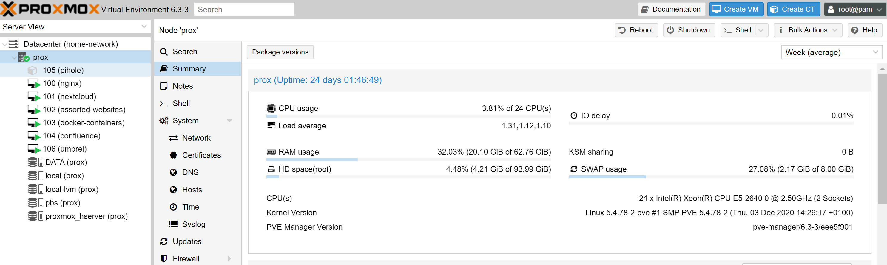

What if I told you there was a way out from having your online movements tracked; precious personal data harvested; and locked in to feeding the coffers of the same few companies that seem to get more powerful year after year - ALL while saving some money?

Selfhosting is simply running the software you use yourself instead of relying on other people's services.

There is no shortage of evidence showing how the modern internet is being increasingly controlled by a handful of companies, which means that only a handful of companies dictate how we spend our time and money. Self-hosting is an effort to break that cycle by running what you need on a computer at home (or on a virtual private server (VPS) if that is how you prefer it).

What’s worse is when these companies have the power to ruin your life - just see how it happened to [Terraria's lead developer](https://arstechnica.com/gadgets/2021/02/terraria-developer-cancels-google-stadia-port-after-youtube-account-ban/).

<blockquote class="twitter-tweet">
I absolutely have not done anything to violate your terms of service, so I can take this no other way than you deciding to burn this bridge. Consider it burned. <a href="https://twitter.com/hashtag/Terraria?src=hash&amp;ref_src=twsrc%5Etfw">#Terraria</a> for <a href="https://twitter.com/GoogleStadia?ref_src=twsrc%5Etfw">@GoogleStadia</a> is canceled. My company will no longer support any of your platforms moving forward.
&mdash; Andrew Spinks (@Demilogic) <a href="https://twitter.com/Demilogic/status/1358661842147692549?ref_src=twsrc%5Etfw">February 8, 2021</a></blockquote>

The kicker? The best hardware is hardware you already have - so dust off that 10 year old desktop PC and you can very well be on your way. If you don't have any hardware - don't fret! You can get started with a Raspberry Pi 4 for under [$100](https://core-electronics.com.au/raspberry-pi-4-model-b-4gb.html).

</img>

It's super rewarding to get started and you'll eventually save money, own your data, and learn a lot!

There are of course varying degrees of self-hosting and I can bet that once you begin you'll find yourself going down many rabbit holes on your new found potential. 

I learnt that by running the software I use I'm saving over **$1300 AUD** a year!

Take a look at this table to see what I would be paying and the free equivalent that you can self host. 

<table class="tg">
<colgroup>
    <col style="width: 169px"></col>
    <col style="width: 219px"></col>
    <col style="width: 570px"></col>
    <col style="width: 184px"></col>
</colgroup>
<thead>
  <tr>
    <td class="tg-bold">Cloud Equivalent</td>
    <td class="tg-bold">Self-Hosted Equivalent</td>
    <td class="tg-bold">Description</td>
    <td class="tg-bold">Yearly Saved Cost ($AUD)</td>
  </tr>
</thead>
<tbody>
  <tr>
    <td class="tg-normal"><a href="https://one.google.com/storage#upgrade" target="_blank" rel="noopener noreferrer">Google One</a> 2TB Storage</td>
    <td class="tg-normal"><a href="https://nextcloud.com/" target="_blank" rel="noopener noreferrer">Nextcloud </a>(File Sync, Photos, Meets, Collabra - docs, sheets, slides)</td>
    <td class="tg-normal">This is my favourite switch, I LOVE Nextcloud, and I use it as a replacement for Google Drive and Photos, as well as Zoom/Google Meets and collaborative editing software like Google Docs/Slides/Sheets.</td>
    <td class="tg-normal">125</td>
  </tr>
  <tr>
    <td class="tg-normal"><a href="https://evernote.com/compare-plans">Evernote</a></td>
    <td class="tg-normal"><a href="https://joplinapp.org/" target="_blank" rel="noopener noreferrer">Joplin</a></td>
    <td class="tg-normal">I would've continued using Evernote or OneNote (constrained by your OneDrive storage) before I discovered Joplin. It has apps on all platforms and has fantastic syncing capabilities - I've used this to write everything from lecture notes to a daily journal.</td>
    <td class="tg-normal">90</td>
  </tr>
  <tr>
    <td class="tg-normal"><a href="https://1password.com/sign-up/" target="_blank" rel="noopener noreferrer">1Password</a></td>
    <td class="tg-normal"><a href="https://bitwarden.com/">Bitwarden</a></td>
    <td class="tg-normal">Password management in this day and age is as essential as housing in real life. You simply need it to ensure your security hygiene is up to date. If you aren't convinced, check if your email/phone number/password has been leaked here: <a href="https://haveibeenpwned.com/">https://haveibeenpwned.com/</a> . My top pick is Bitwarden, which is fully open source and has apps on all platforms.</td>
    <td class="tg-normal">85</td>
  </tr>
  <tr>
    <td class="tg-normal"><a href="https://todoist.com/pricing">Todoist</a></td>
    <td class="tg-normal">Nextcloud (<a href="https://apps.nextcloud.com/apps/tasks">Tasks</a>, <a href="https://apps.nextcloud.com/apps/calendar">Calendar</a>, <a href="https://apps.nextcloud.com/apps/calendar">Deck</a>)</td>
    <td class="tg-normal">I would've stuck with using Todoist or Trello for my daily todo's and project planning but with Nextcloud I can manage all of that in one place. The Tasks and Calendar also get synced to your Android/iOS native apps so it works seamlessly!</td>
    <td class="tg-normal">48</td>
  </tr>
  <tr>
    <td class="tg-normal"><a href="https://mailchimp.com/pricing/marketing/" target="_blank" rel="noopener noreferrer">MailChimp</a></td>
    <td class="tg-normal"><a href="http://listmonk.app/">Listmonk</a></td>
    <td class="tg-normal">As you might know I recently released my <a href="#newsletter">newsletter subscription</a>, and I've used Listmonk to manage this. Looking at alternatives, if I didn't have this choice the closest thing would be MailChimp, and for the features Listmonk has it would cost upwards of $108 USD. </td>
    <td class="tg-normal">145</td>
  </tr>
  <tr>
    <td class="tg-normal"><a href="https://anonaddy.com/#pricing">AnonAddy</a></td>
    <td class="tg-normal"><a href="https://simplelogin.io/">SimpleLogin</a></td>
    <td class="tg-normal">This is a super nifty service I use, which basically allows you to create as many email addresses as you want so you can hide your real email. This is incredibly useful when you sign up on new websites so you're guarded against spam and have utmost privacy. I would've used AnonAddy's paid service were it not for SimpleLogin!</td>
    <td class="tg-normal">50</td>
  </tr>
  <tr>
    <td class="tg-normal"><a href="https://www.notion.so/pricing">Notion Team</a></td>
    <td class="tg-normal"><a href="https://www.atlassian.com/software/confluence/features">Confluence Server</a>*</td>
    <td class="tg-normal">I spend a lot of time on knowledge management, and have experimented a lot but nothing quite fits as great as Confluence. I've been using their server offering as a home wiki, personal knowledge bank and collaboration tool with family and friends. The closest thing to this is Notion's Team offering which is $96 USD a year. </td>
    <td class="tg-normal">135</td>
  </tr>
  <tr>
    <td class="tg-normal"><a href="https://webflow.com/pricing#site">Webflow</a></td>
    <td class="tg-normal"><a href="https://wordpress.org/">WordPress</a></td>
    <td class="tg-normal">I'm hosting my partner's website which you can see <a href="https://angelahuang.studio/">here</a>. If she wasn't using WordPress, she would've liked to use the CMS version of Webflow which costs upwards of $192 USD a year.</td>
    <td class="tg-normal">270</td>
  </tr>
  <tr>
    <td class="tg-normal"><a href="https://disqus.com/pricing/" target="_blank" rel="noopener noreferrer">Disqus</a></td>
    <td class="tg-normal"><a href="https://staticman.net/">Staticman</a></td>
    <td class="tg-normal">I use Staticman to send a pull request (PR) to my Github project whenever someone comments, which with some Netlify magic builds a new production site. This all means that the comments on my blog are all static - hence they're blazingly fast to load with no creepy trackers. The alternative would've been Disqus and their heavy ad-ridden client side code - for no ads I'd have to pay $132 USD a year!</td>
    <td class="tg-normal">185</td>
  </tr>
  <tr>
    <td class="tg-normal"><a href="https://stipe.com.au/?page=products-minecraft.php&game=minecraft">Minecraft Server Hosting</a></td>
    <td class="tg-normal"><a href="https://github.com/itzg/docker-minecraft-server">Minecraft Server</a></td>
    <td class="tg-normal">I turn on my Minecraft server whenever my friends and I want to play. Having a look online showed that something similar would cost $240 AUD 🤯</td>
    <td class="tg-normal">240</td>
  </tr>
  <tr>
    <td class="tg-bold" colspan="3">TOTAL COST</td>
    <td class="tg-bold">1373</td>
  </tr>
</tbody>
</table>

A few others things I'm running include my own Bitcoin node to maintain decentralisation, and a Pi-Hole to block ads for all devices connected to my Wi-Fi. 

Here's what my setup looks like - it's running Proxmox with multiple Virtual Machines[^1] (VM's) to host all of these applications. 

</img>

</img>

I have also built a PC for my partner, which acts as an offsite backup for my server too! 

</img>

If ANY of this has piqued your interest, do checkout just how much you can do with self-hosted applications here https://github.com/awesome-selfhosted/awesome-selfhosted, and check out my favourite community on Reddit here https://www.reddit.com/r/selfhosted/.

Thanks for reading and I hope you enjoyed! Drop a comment if you have any questions or share your own set up if you have one!

Subscribe for a future article about how to get things up and running if you'd like to start.

*Confluence was $10 when they were still doing their server licenses - you can use [Anytype](https://anytype.io/) or [Wiki.js](https://js.wiki/) instead.

[^1]: Virtual machines can be thought of dividing one computer up into multiple mini computers each with their own resources.

