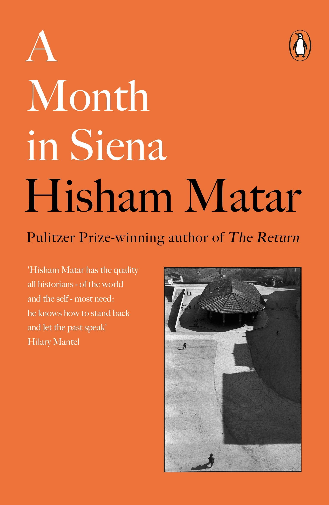

---    
date: 2026-05-12T14:26:30.994Z
title: "A Month in Siena by Hisham Matar"
description: "He stood staring at a piece for hours at a time, letting it slowly unfold before him, as if each brushstroke held a Mecca"
tags: ["bookshelf", "non-fiction", "travel", "spirituality"]
featuredimage: './cover.jpg'
---   

I was given this book as a parting gift by someone I admire. 

 

*A Month in Siena* unfolds in the medieval Italian city where Matar had long dreamt of going. It was a deeply personal quest forged by the disappearance of his father when he was much younger; forlorn and stumbling into an art gallery, it was there he discovered the Sienese art sphere. 

He stood staring at a piece for hours at a time, letting it slowly unfold before him, as if each brushstroke held a Mecca. 

The prose and contents of this book are layered and strong, leaving you swirling with your own thoughts.

Matar guides us into a painting, describing it with an intimacy that comes from a conversation with the artwork. His way of somatically experiencing a city is inspiring, and it's convincing me to follow a day in the life of a stranger too. 

In fact, it's convinced me to fashion my own experiment to let art unfold itself to me over a long period of time. I'll report back after a week in Paris.

Read in April 2026

---

“You can detect them asking how much a picture might rely on a viewer’s emotional life; how a shared human experience might change the contract between artist and viewer, and between artist and subject; and what creative possibilities this new collaboration might offer.”

“to demonstrate the transformative possibility of crossing a threshold. We often never think of this, of how our sense of being is subtly changed by walking into even the most inconsequential of buildings or transitioning from one room to the next.”

“Siena resists this. It is as though the wall that encircles the city like a ribbon is as much a physical boundary as it is a spiritual veil.”

“as though our exchanges over what freedom and assertiveness might be were the means by which we had entered the city.”

“It is as though the fresco is arguing that the criticisms proffered by the detractors of democratic rule—the system’s exaggerated confidence in the variance of human nature, its overreliance in matters of the common good on the unreliably mysterious inner lives of ordinary individuals—are exactly its strength.”

“Desire, its continuum, is reliant on yearning, on the unfulfilled wish, the frustrated appetite.”

“there is a contradiction between what desire wants—complete conquest—and what it needs in order to continue to exist: mystery, the unknowable. Desire is that animal that remains fit only through undernourishment. In evolutionary terms, failure is its prerequisite, frustration its generator.”

“And hadn’t we always done this in our childhood, spent hours slinging pebbles at the stars, knowing full well that, even before we fired them, the stones would fall right back and probably on our own heads? And isn’t this the way one must surely live, for all time; that the true pleasure is not in hitting the target but in aiming at it?”

“We were, or so it seemed that night in Tripoli, old childhood friends who, after three decades of being apart, of communicating only through telephone and letters, then email and text messages, were now sharing, with the full-heartedness of rescued stowaways or vagabonds, what precious stones the years had gathered in our pockets.”

“Lorenzetti’s Allegory, Caravaggio’s David and indeed the entire history of art can be read as that: a gesture of hope and also of desire, a playing out of the human spirit’s secret ambition to connect with the beloved, to see the world through her eyes, to traverse that tragic private distance between intention and utterance, so that, finally, we might be truly comprehended, and to do this not in order to advocate a position but rather to be truly seen, to be recognized, not to be mistaken for someone else, to go on changing while remaining identifiable by those who know us best.”

“The most casual turn, an innocent encounter—with a person, a book, a painting, a piece of unexpected news—or a mere thought passing through one’s head can leave one ever so slightly altered. And somehow we know, as the minutes pass, that we are being quietly made and that there is nothing we can do to stop it, because, when it comes to the present, we are susceptible and enthralled. By comparison the past is more easily locatable, or at least we have concocted the illusion that it is, and the future, no matter how uncertain, always seems distant. It is the guest who is forever not quite yet here.”

“What is it like to be born here, I wondered, and what is it like to die here? Those twin questions have followed me into every city. I have learned to make use of them. They have become part of the logic of my thinking, of how I engage with a place. I am never oblivious to where I am, and how often I have wished to be”

“I could imagine the magistrates who had, over the centuries, met here in the Sala dei Nove in order to discuss the welfare of the citizenry, the distribution of taxes, the threat of invading forces and other matters of state, being occasionally drawn to his portrayal.”

“And it seemed to me then that these Sienese women suspected, when their picture was taken, that the captured image would outlast them.”
