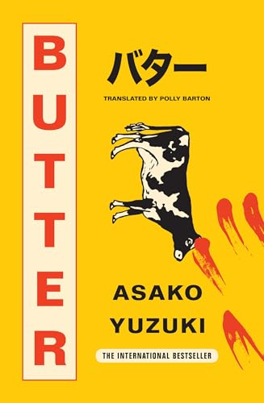

---    
date: 2024-08-20T13:12:26.928Z
title: "Butter by Asako Yuzuki"
description: "A review of Butter by Asako Yuzuki ⭐ ⭐ ⭐"
featuredimage: './cover.jpg'
tags: ["bookshelf", "fiction", "society"]
---   
⭐ ⭐ ⭐ 

I picked this book up because the cover looked so intriguing. Blood marks on a bright yellow page, with a black and white cow. Asako Yuzuki’s Butter is a tale on many fronts, each of the characters devised to illustrate a point, or perhaps contradictions. 

 

We follow the life of Rika, one of the few remaining female journalists in her company, who over the years has become accustomed to the trade. Her life is centred around her work, and leaves little room for cooking. This point is important, because she finds herself enthralled by Manako Kajji, an alleged murder who had a penchant for cooking elaborate meals. 

We witness a story that aims to speak volumes about society’s enshrinement of beauty, and the impervious ways gender roles bleed into daily life. We’re confronted by patriarchal ignorance, and the fine line between obsession and infatuation. 

Overall, I found the book an enjoyable read, but I do believe it tried to bite off a bit more than it could chew, and some of the themes became too explicit.  

Read in June

