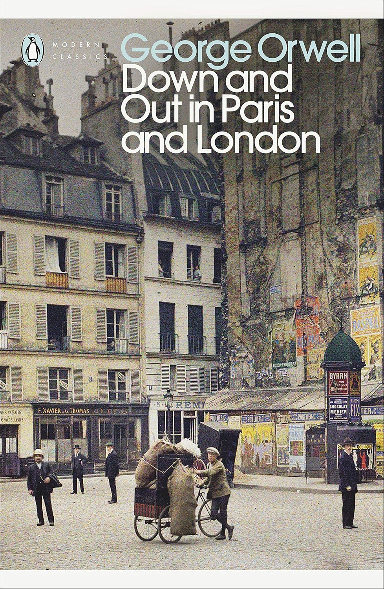

---    
date: 2026-05-19T12:46:52.893Z
title: "Down and Out in Paris and London by George Orwell"
description: "Orwell paints a vivid scene which makes you writhe with the imaginary bugs that infest his characters"
tags: ["bookshelf", "non-fiction", "travel", "poverty"]
featuredimage: './cover.jpg'
---   

I picked this book up because I was going to see Paris and London soon, and thought that this would be a good primer to the milleu I was going to face.

 

*Down and Out in Paris and London* **might** not have been the right book for that purpose, seeing how it was set over a hundred years ago, in the unseen dens of poverty. It's contentious how much of this Orwell experienced firsthand, but despite that, the story he conveys is gritty and heartbreaking. 

We dive into the suffocating basements that serve as the heart of each respectable restauraunt in Paris. Frenetic, dirty and relentless, these chambers are in turn powered by the toil of the workers. 

For a *plongeur* (term for dishwasher) life might look like waking up after sleeping not enough hours, rushing to the Metro, packed elbow to elbow far earlier than the sun rises. Then, arriving at the Hotel, catching a glimpse at the tables and chairs that seem like royalty. Then, the daydream vanishes. You push past the door separating two universes, the rich and the poor, to seal yourself into the same claustrophobic organ, working for 16 hours at a time to the point of near collapse. 

Orwell paints a vivid scene which makes you writhe with the imaginary bugs that infest his characters. 

We can see the traces of his later works in a text like this, as he questions the morality of poverty and excess, and how systems are perpetuated to cement the divide.

I found it fascinating as a time capsule, yet its true power is in its relevancy even now. 

Read in May 2026.

--- 

The power of swallowing quarts of wine, and then sweating it out before it can do much damage, is one of the compensations of their life. 

“I remember Valenti telling me of some banquet at Nice at which he had once served, and of how it cost two hundred thousand francs and was talked of for months afterwards. ‘It was splendid, MON P’TIT, MAIS MAGNIFIQUE! Jesus Christ! The champagne, the silver, the orchids—I have never seen anything like them, and I have seen some things. Ah, it was glorious!”

“It was the typical life of a PLONGEUR, and it did not seem a bad life at the time. I had no sensation of poverty, for even after paying my rent and setting aside enough for tobacco and journeys and my food on Sundays, I still had four francs a day for drinks, and four francs was wealth. There was—it is hard to express it—a sort of heavy contentment, the contentment a **well-fed beast might feel, in a life which had become so simple**. For nothing could be simpler than the life of a PLONGEUR. He lives in a rhythm between work and sleep, without time to think, hardly conscious of the exterior world; **his Paris has shrunk to the hotel, the Metro, a few BISTROS and his bed**. If he goes afield, it is only a few streets away, on a trip with some servant-girl who sits on his knee swallowing oysters and beer. On his free day he lies in bed till noon, puts on a clean shirt, throws dice for drinks, and after lunch goes back to bed again. Nothing is quite real to him but the BOULOT, drinks and sleep; and of these sleep is the most important.”

“Similarly with the PLONGEUR. He is a king compared with a rickshaw puller or a gharry pony, but his case is analogous. He is the slave of a hotel or a restaurant, and his slavery is more or less useless. For, after all, where is the REAL need of big hotels and smart restaurants? They are supposed to provide luxury, but in reality they provide only a cheap, shoddy imitation of it. Nearly everyone hates hotels. Some restaurants are better than others, but it is impossible to get as good a meal in a restaurant as one can get, for the same expense, in a private house."

“I believe that this instinct to perpetuate useless work is, at bottom, simply fear of the mob. The mob (the thought runs) are such low animals that they would be dangerous if they had leisure; it is safer to keep them too busy to think”

“We know that poverty is unpleasant; in fact, since it is so remote, we rather enjoy harrowing ourselves with the thought of its unpleasantness. But don’t expect us to do anything about it. We are sorry for you lower classes, just as we are sorry for a, cat with the mange, but we will fight like devils against any improvement of your condition. We feel that you are much safer as you are. The present state of affairs suits us, and we are not going to take the risk of setting you free, even by an extra hour a day. So, dear brothers, since evidently you must sweat to pay for our trips to Italy, sweat and be damned to you.”
- Except now that everyone can go to Italy (not everyone...)

“To sum up. A PLONGEUR is a slave, and a wasted slave, doing stupid and largely unnecessary work. He is kept at work, ultimately, because of a vague feeling that he would be dangerous if he had leisure. And educated people, who should be on his side, acquiesce in the process, because they know nothing about him and consequently are afraid of him.”
- Nascent David Graeber on Bullshit Jobs here

“It was malnutrition and not any native vice that had destroyed his manhood.”

“Well, I’ve found just the contrary,’ I said. ‘It seems to me that when you take a man’s money away he’s fit for nothing from that moment.’
‘No, not necessarily. If you set yourself to it, you can live the same life, rich or poor. You can still keep on with your books and your ideas. You just got to say to yourself, ‘I’m a free man in HERE‘‘—he tapped his forehead—‘and you’re all right.”

“A man receiving charity practically always hates his benefactor—it is a fixed characteristic of human nature; and, when he has fifty or a hundred others to back him, he will show it.”

