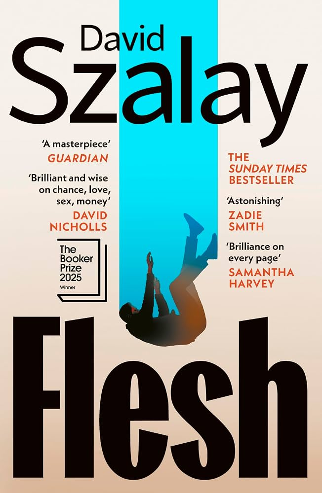

---    
date: 2026-09-07T12:17:26.954Z
title: "Flesh by David Szalay"
description: "We follow the life of Istaván and see a man who lives almost a half life; a shadow of what could have been"
tags: ["bookshelf", "fiction", "booker-prize-winner"]
featuredimage: './cover.jpg'
---   

For some reason I couldn’t put this book down, as if I was scratching a mosquito itch hoping it would magically get better. But, we all know doing that leaves you with a bigger wound.

 

We follow the life of Istaván and see a man who lives almost a half life; a shadow of what could have been. With morbid curiosity we observe a life that was unrealised, and that itself is the greatest tragedy.

Undoubtedly, it is a realistic portrayal of a boy turned man, who, due to a variety of reasons grew up stilted. As if the soil itself lacked the right nutrients, and then was lashed by terrible storm. Part of it was self-esteem and agency, affected greatly by a grooming incident when he was younger. Another was the stifling masculinity which never gave him the toolkit to be honest with his emotions.

As a whole it deals with the male condition in a precarious world, beginning and ending in Hungary, a country still reeling from the end of communism after 1989. In a way, it shows how the past is a force to be reckoned with, not something that can be discarded even if you try to forget.

Sexuality is a big part of this novel, and often Istaván indicates a detachment from what it means to him. It can happen or not happen for all he cares, yet still he acts according to his carnal desires.

It’s a big surprise to him when he is old and alone that he actually did care about some of the people in his past, and that it wasn’t just something to pass the time.

Szalay’s subject matter reminds me of Tolstoy’s death of Ivan Ilyich and stoner by John Williams.

I enjoyed it, but was saddened by it.

The thing that irked me was he said I don’t know so much, but the exposition had him explain his thoughts, if only he made the effort to articulate how he felt. So many missed opportunities.

Read some time in New York, June 2026. 