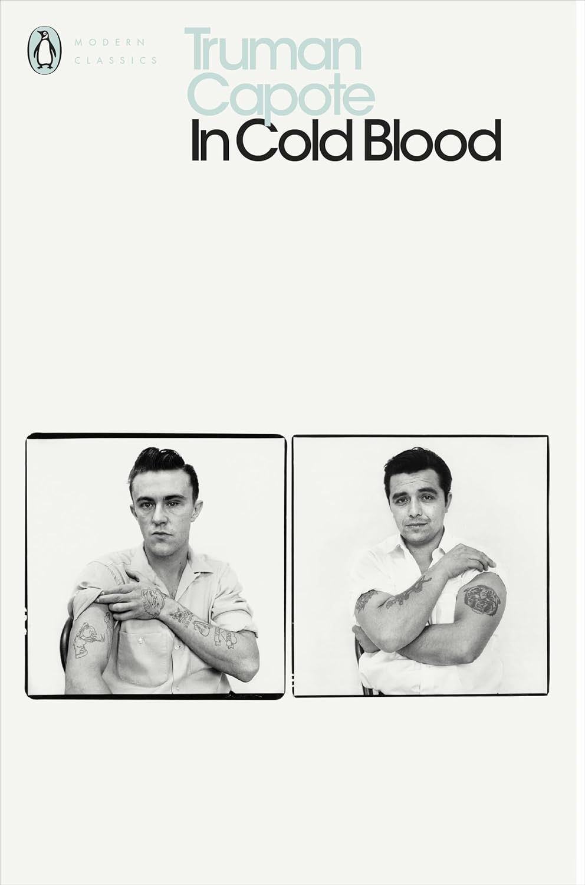

---    
date: 2024-11-11T11:57:36.814Z
title: "In Cold Blood by Truman Capote"
description: "In Cold Blood details a series of events that seem incredulous, but at the same time bone-chillingly real"
featuredimage: './cover.jpg'
tags: ["bookshelf", "non-fiction", "pscyhology", "true-crime", "murder"]
---   
⭐ ⭐ ⭐

In Cold Blood by Truman Capote was a tale it feels you’d hear from a stranger at a bar, detailing a series of events that seem incredulous, but at the same time bone-chillingly real. 

 

The way the story is told, first from the perspective of the Clutter family living in Holocomb, a small sleepy town of agrarians. They are one of the most well-known families in town, being prime examples of distinguished citizenry. 

What happens next though, is unfathomable. The father, mother, daughter, and son all get murdered, but in a way that casts the killers in a compassionate light. A gentle pillow to ease the comfort of Kenyon, before we learn they were shot through the head with a shotgun. Tucking Nancy in bed, pulling the covers up after blood had soaked through her mattress.

I believe entering the mind of someone is sacred, because it strips you of ‘othering’ them. Capote, through his meticulous research and collation, allows us to enter the mind of Dick and Perry, two former convicts. We learn of their dreams, fears, past, and future all at once. 

Taking in a person via dialogue is a deeply intimate experience, and it doesn’t absolve any crimes they may have committed, but it does give you a glimpse of a universe in which one of those two individuals may have been you, if you had their past. I don’t mean to resign to fatalism - just illuminate that these infinite configurations probably do exist within our multiverse - and thus stop short of stony judgement. 

Capote doesn’t prescribe judgment, instead he lays out the scene and asks you to search within yourself what you feel. 

> What is life? It is the flash of a firefly in the night. It is a breath of a buffalo in the wintertime. It is as the little shadow that runs across the grass and loses itself in the sunset." -- Said by Chief Crowfoot, Blackfoot Indian Chief. 

I found the book a bit slower in the beginning, and then picking up in the next two thirds as the murders unfold, and the man-hunt begins. It reaches a denouement when they are eventually captured, and then analysed to try begin to understand why this tragedy happened. 

I recommend this book if you are interested in 1950’s rural American culture, psychology, and true crime. 

Read in October

--- 

> Dick had once observed, “Every time you see a mirror you go into a trance, like. Like you was looking at some gorgeous woman. I mean, my God, don’t you ever get tired?” Far from it; his own face enthralled him. Each angle of it induced a different impression. It was a changeling’s face, and mirror-guided experiments had taught him how to ring the changes, how to look now ominous, now impish, now soulful; a tilt of the head, a twist of the lips, and the corrupt gypsy became the gentle romantic.

> “Just nothing scares you,” she said, commenting upon a generally recognized quality of Mr. Clutter’s: a fearless self-assurance that set him apart, and, while it created respect, also limited the affections of others a little. “I can’t imagine you afraid. No matter what happened, you’d talk your way out of it.”

Willie Jay writing a letter for Perry:
> “You are a man of extreme passion, a hungry man not quite sure where his appetite lies, a deeply frustrated man striving to project his individuality against a backdrop of rigid conformity. You exist in a half-world suspended between two superstructures, one self-expression and the other self-destruction. You are strong, but there is a flaw in your strength, and unless you learn to control it the flaw will prove stronger than your strength and defeat you. The flaw? Explosive emotional reaction out of all proportion to the occasion. Why? Why this unreasonable anger at the sight of others who are happy or content, this growing contempt for people and the desire to hurt them? All right, you think they’re fools, you despise them because their morals, their happiness is the source of your frustration and resentment. But these are dreadful enemies you carry within yourself—in time destructive as bullets. Mercifully, a bullet kills its victim. This other bacteria, permitted to age, does not kill a man but leaves in its wake the hulk of a creature torn and twisted; there is still fire within his being but it is kept alive by casting upon it faggots of scorn and hate. He may successfully accumulate, but he does not accumulate success, for he is his own enemy and is kept from truly enjoying his achievements.”

>"How was it possible that such effort, such plain virtue, could overnight be reduced to this—smoke, thinning as it rose and was received by the big annihilating sky?" 
 
> “It is no shame to have a dirty face- the shame comes when you keep it dirty.” 

> She and Perry are astride a pony, their heads are together, their cheeks touch; beyond them dry mountains burn.

> But when the crowd caught sight of the murders, with their escort off blue-coated highway patrolmen, it fell silent, as though amazed to find therm humanly shaped.

> "They never hurt me.  Like other people.  Like people have all my life.  Maybe it's just that the Clutters were the ones who had to pay for it." 

> "After everybody had gone, and I'd started to wash some dishes- I heard him crying.  I turned on the radio.  Not to hear him.  But I could.  Crying like a child.  He'd never broke down before, shown any sign of it.  Well, I went to him.  The door of his cell.  He reached out his hand.  He wanted me to hold his hand, and I did, I held his hand, and all he said was, 'I'm embraced by shame.'" (-The lady who worked at the prison after Perry received his sentence)

> I’ve walked along a lot of mean streets. I’ve seen a white man flogged. I’ve watched babies born. I’ve seen a girl, and her no more than fourteen, take on three guys at the same time and give them all their money’s worth. Fell off a ship once five miles out to sea. Swam five miles with my life passing before me with every stroke. Once, I shook hands with President Truman, in the lobby of the Hotel Muehlebach. Harry S. Truman. When I was working for the hospital, driving an ambulance, I saw every side of life there is. Things that would make a dog vomit. But Andy. He didn’t know one dumb-damn-darn thing except what he’d read in books. He was innocent as a little child. Some kid with a box of Cracker Jack. He’d never once been with a woman. Man or mule. He said so himself. Maybe that’s what I liked about him most. How he wouldn’t prevaricate.

