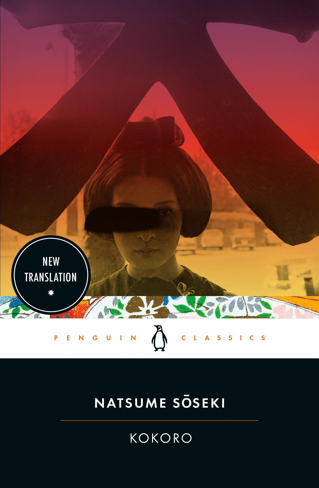

---    
date: 2025-05-19T14:02:05.378Z
title: "Kokoro by Natsume Sōseki"
description: "Quite honestly, the language that Sōseki uses - as far as it was translated - reflect hues that make me feel seen. These novels are the reason I love reading so much."
tags: ["bookshelf", "fiction", "favourites", "international", "love", "literature"]
featuredimage: './cover.jpg'
---   

⭐ ⭐ ⭐ ⭐ ⭐

Kokoro by Natsume Sōseki begins like the stirring of a fugue, a story in which the unnamed narrator meets an enigmatic elder whom he refers to as Sensei. A path treading loneliness, the narrator affixes himself to Sensei, with whom he shares a bond he can’t explain. Sensei however, with an air of stolidness seems unaffected, yet doesn’t mind the company. 

 

Throughout the first half of the novel, we glimpse into life in the late-Meiji era;  Japan undergoing rapid transformation as we vacillate between bustling Tokyo and the countryside - each landscape a physical manifestation of the vastly different values, technology, and future that awaited the country. The narrator is a student who is finishing up their studies, when they return back home to tend to their ill father. There’s a sense of tension in not being able to understand each others place in the world, the father and mother unable to comprehend the questions the narrator is grappling with, and likewise the narrator dismissing what he believes is countryside unsophistication.

A theme in the novel is the eerie feeling of not belonging. For many, when Emperor Meiji passed away, almost overnight the world and era you were familiar with seemed to disappear. In this twilight, were more questions on how society should form.

Sōseki writes this tale in a format where we learn very little of the narrator, and instead he is used as a device to explore Sensei. We see underneath the reticence, is a life agonisingly alone. 

The latter part of the novel is Sensei offering his life story, likening it to wrenching his heart and pouring out his blood for the narrator to read. 

To not spoil the novel, the only thing I can say is we discover that something plagues Sensei which produces in him an unshakeable pit in the stomach, shadowing any flutters of life. Concepts of shame, and regret lace with deeply introspective descriptions that make you forget it was written over a hundred years ago.

Quite honestly, the language that Sōseki uses - as far as it was translated - reflect hues that make me feel seen. These novels are the reason I love reading so much.

Read in May 2025 as part of bookclub.

---

## Notes and highlights

K’s self-elected death foreshadows the ultimate death of that old world, **a world Sōseki himself had inherited and whose unattainable and rapidly vanishing certainties preoccupied him.** 
- what world have we currently inherited? 

On the contrary, whenever some unexpected terseness of his shook me, my impulse was to press on.

For all his unresponsiveness to others’ affection, I now see, it was not them he despised but himself.

Sensei was a man who could, indeed must love, yet he was unable to open his arms and accept into his heart another who sought to enter.

“No time is as lonely as youth”

“But even when you’re with me,” he went on, “you probably still feel somehow lonely. I don’t have the strength, you see, to really take on your loneliness and eradicate it for you. In time, you’ll need to reach out toward someone else. Sooner or later your feet will no longer feel inclined to take you here.” 

“It’s a step in the direction of love. You had the impulse to find someone of the same sex as the first step toward embracing someone of the opposite sex.” 

“I don’t even trust myself. It’s because I can’t trust myself that I can’t trust others. I can only curse myself for it.” 
- do you trust yourself? 

Thus were comforter and comforted equally at sea, adrift on shifting waves. Lost as she was, she clung to what frail judgment I could offer.

I suppose everyone experiences this shift when they return home for a vacation - for the first week or so you are fussed over and treated as an honked guest, then the family’s enthusiasm wanes, and finally you are treated quite offhandedly, as if they don’t care whether you are there or not.

These days, though, I’ve come to feel that there’s nothing particularly shameful about not knowing, so I don’t any longer have the urge to push myself to read. I’ve grown old, in a word.

I want to have trusted even just one person before I die, you know. Can you be that person? Would you do that for me? Are you sincerely in earnest, from your heart? 

His view of life was firmly confined to the little world where he’d spent his life.

This time it wasn’t a continuous shrill but the intermittent call of the cicada known as tsutsukubōshi, which sings toward the end of summer. … I had often tasted a strange sadness as I sat quietly in the midst of the seething cicada song. This sorrow seemed to pierce deep into my heart along with the piercing insect cry.  … As the summer cicada’s strident song gradually gave way to the more hesitant call of the tsutsukubōshi, the fates of those around me also seemed to be slowly turning through the great karmic wheel. 

My brother believed, as did I, that our father was doomed, and this being so, we longed for it all to be over.

You were prepared to rip open my heart and drink at its warm fountain of blood. I was still alive then. I did not want to die. And so I evaded your urgings and promised to do as you asked another day. Now I will wrench open my heart and pour its blood over you. I will be satisfied if, when my own heart has ceased to beat, your breast houses new life. 
your story is you.

But I spoke from experience. I was upset at the time, I agree. But I believe that a commonplace idea stated with conviction carries more living truth than some novel observation expressed with cool indifference.

It was usually Ojosan that came to call me. She would sometimes appear on the verandah, and sometimes she would come through the morning room and appear at my door. She would stand still for a moment, and then call my name and say, "Are you studying?"
I was usually staring hard at some heavy tome lying open on my desk, and so I must have seemed a rather scholarly fellow. But to tell the truth, I was not much of a student in those days. I might have looked at a lot of books, but I was usually waiting for Ojosan to appear.  
If by chance she failed to do so, then I would get up and go to her room and say, "Are you studying?”
- isn’t this love? A series of questions you ask each other.

I felt for her a love that was close to pious faith. You may find it odd that I use a specifically religious word to describe my feelings for a young woman, but real love, I firmly believe is not so different from the religious impulse. Whenever I saw her face, I felt that I myself had become beautiful. At the mere thought of her, I felt elevated by contact with her nobility. If this strange phenomena we call Love can be said to have two poles, the higher of which is a sense of holiness and the baser the impulse of sexual desire, this love of mine was undoubtedly in the grip of Love’s higher realm. Being human, of course, I could not leave my fleshly self behind, yet the eyes that behold her, the heart that treasured thoughts of her, knew nothing of the reek of the physical. 

My real anguish began when out occurred to me that Ojōsan might be as devious as her mother. The instant it occurred to me that everything was a result of plotting behind my back, I was ranked with agony. And yet, at the same time I continued to have unwavering faith in Ojōsan. Thus I found myself paralysed, suspended between conviction and doubt. 
letting someone into your life like this, giving them power over you is the basis of the depth of love. 
I had been taught to maintain dignified self-respect, but a blatant greed for information undermined it; both were evident on my face.
how real these thoughts are

My aim was to apply a sunny warmth that would thaw his ice. Once the melted water began to trickle, I thought, he would sooner or later come to his senses.
His sights were fixed on far higher things than mine, I’ll not deny it. But it is surely surely crippling to limp along, so out of step with the loft gaze you insist on maintaining. 
Could that delicate and complex instrument that lies in the human breast ever really produce a reading that was absolutely clear and truthful, like a clock’s hands pointing to numbers on its dial? 

I flatter myself that I was born with a compassionate sympathy for others. Just then, however, I was a different person. 

But I was haunted with worry over how to deal with K. I prepared an arsenal of justifications for my defence, but none would hold up when I was face-to-face with him. Coward that I was, I had no stomach for the explanation I would have to give.  

In short, I was a fool whose foot had slipped from the straight and narrow path of honest that I had set myself to walk. 

“I wish I could give them a wedding gift,” he apparently said, “but I’m afraid I haven’t the money.” 
As I sat before her hearing those these words, my heart clenched tight with pain.,

The world might be rotten, I felt, but I at least am a man of integrity. But this faith in myself had been shattered on account of K. I suddenly understood that I was no different from my uncle, and the knowledge made me reel. What could I do? Others were already repulsive to me, and now I was pulse even to myself.

In my heart, though, I was saddened that the person I loved and trusted most in the world could not understand me. But it’s within your power to help her understand, I thought, and yet you’re too cowardly to do so, and I grew sadder. Desolation filled me.