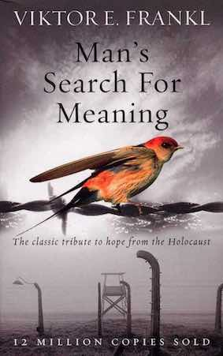

---    
date: 2024-02-25T13:28:10.434Z
title: "Man's Search For Meaning by Viktor E. Frankl"
description: "A review of Man's Search For Meaning"
featuredimage: './cover.jpg'
tags: ["bookshelf", "WW2"]
---   
⭐ ⭐ ⭐ ⭐ ⭐

*Man's Search For Meaning* by Victor E. Frankl is an effort to distil the importance of meaning in life, and provides guiding principles to help individuals ascertain theirs.

 

The book begins with his horrifying experiences as a Holocaust victim and survivor, detailing key moments such as his arrival into camp, working at the freezing railroads, dehumanising interactions with the Kapo<a href="#f1">1</a>, and the daily morbidity that dulled the senses. He recounts the moment of liberation, and what that felt like. Synthesising these experiences, Frankl explains there were three main stages of psychological reaction as a prisoner:

1. Admission/Shock
2. Entrenchment in Camp Routine/Apathy
3. The Period Following Liberation/Disillusionment.

Frankl's writing is emotional, and often characterized by his personal remarks on the situations he experienced, which guides the reader into contemplation. He did his best as a survivor to recollect his experience, and provide evidence for his theory of logotherapy. We'll discuss what that is just a bit further below.

The key moment during admission is when the victim realised that whatever led up to that moment in their lives where they were, whoever they were, and no matter what they had accomplished all melted away into irrelevance. Who are we, when our history is wiped? It's a question millions had to contend with.

There is a fantastic analysis on predicting behavior, where Frankl states:

> How can we dare to predict the behaviour of man? We may predict the movements of a machine, of an automaton; more than this, we may even try to predict the mechanisms or "dynamisms" of the human psyche as well. But man is more than psyche.

It is a powerful statement as a survivor to have level-headed insights into the nature of good and evil, and an aversion to judgement.

> But it is not for me to pass judgment on those prisoners who put their own people above everyone else. Who can throw a stone at a man who favours his friends under circumstances when, sooner or later, it is a question of life or death? No man should judge unless he asks himself in absolute honesty whether in a similar situation he might not have done the same.

Behaviour is ultimately described as a line between freedom and responsibleness - one has the freedom to change at any instant, capable of changing themselves and world for the better but also worse. This is contingent on how the freedom manifests itself.

Frankl is no prophet who claims to know the ultimate meaning in life that holds true for everyone, at every time. Instead, he asks illuminating perspective-redirecting questions, which guide us closer to what that question even means in the first place.

> We needed to stop asking about the meaning of life, and instead to think of ourselves as those who were being questioned by life—daily and hourly. Our answer must consist, not in talk and meditation, but in right action and in right conduct. Life ultimately means taking the responsibility to find the right answer to its problems and to fulfil the tasks which it constantly sets for each individual.

This sets the stage for understanding logotherapy, which in a nutshell can be described by a singular statement.

> **"Live as if you were living already for the second time and as if you had acted the first time as wrongly as you are about to act now!"**

This statement is a call to look at life retrospectively, and absorb the finality of one's actions with the insight that you have the freedom to make your choices count in the present, such that they stand in the annals of your own history.

Frankl furthermore states that mental health, and one's satisfaction with life can be defined as a tension between what one has already achieved and what one still has to accomplish. The gap between the person you are today, and the person you wish to become is something deeply personal, and often the bed from which potential meanings of life can arise.

Onto the meaning of life. Frankl states that life sets us in motion with its unimaginably unique delights and sorrows, and our degrees of freedom in responding to what life throws to us is the only thing which is constant. Through careful introspection, and picking through ones actions and holding them to one's own candle can the question of meaning - 'have you acted in ways that are congruent to your meaning?'- be satisfied.

> "I doubt whether a doctor can answer this question in general terms. For the meaning of life differs from man to man, from day to day and from hour to hour. What matters, therefore, is not the meaning of life in general but rather the specific meaning of a person's life at a given moment. To put the question in general terms would be comparable to the question posed to a chess champion: "Tell me, Master, what is the best move in the world?" There simply is no such thing as the best or even a good move apart from a particular situation in a game and the particular personality of one's opponent. The same holds for human existence. One should not search for an abstract meaning of life. Everyone has his own specific vocation or mission in life to carry out a concrete assignment which demands fulfilment. Therein he cannot be replaced, nor can his life be repeated. Thus, everyone's task is as unique as is his specific opportunity to implement it. As each situation in life represents a challenge to man and presents a problem for him to solve, the question of the meaning of life may actually be reversed. Ultimately, man should not ask what the meaning of his life is, but rather he must recognize that it is he who is asked. In a word, each man is questioned by life; and he can only answer to life by answering for his own life; to life he can only respond by being responsible. Thus, logotherapy sees in responsibleness the very essence of human existence."

Meaning can be derived in three different ways.

- by creating a work or doing a deed
- by experiencing something or encountering someone - which can be goodness, truth and beauty, by experiencing nature and culture or, last but not least, by experiencing another human being in his very uniqueness; by loving them.
- by the attitude we take toward unavoidable suffering - in some way, suffering ceases to be suffering at the moment it finds a meaning, such as the meaning of a sacrifice.

A beautiful paragraph on the transitoriness of life I found is highlighted below.

> "Thus, the transitoriness of our existence in no way makes it meaningless. But it does constitute our responsibleness; for everything hinges upon our realizing the essentially transitory possibilities. Man constantly makes his choice concerning the mass of present potentialities; which of these will be condemned to nonbeing and which will be actualized? Which choice will be made an actuality once and forever, an immortal "footprint in the sands of time"? At any moment, man must decide, for better or for worse, what will be the monument of his existence. Usually, to be sure, man considers only the stubble field of transitoriness and overlooks the full granaries of the past, wherein he had salvaged once and for all his deeds, his joys and also his sufferings. Nothing can be undone, and nothing can be done away with. I should say having been is the surest kind of being."

The corollary of transitoriness, is the wealthy past one accrues simply by living. By keeping our fleeting nature in mind, one can pounce at life with voraciousness and veracity. Instead of passively looking at the dwindling calendar of life, week by week falling away one can take each leaf from the calendar and richly detail one's activity, so that looking back one can remember a life fully lived.

> What will it matter to him if he notices that he is growing old? Has he any reason to envy the young people whom he sees, or wax nostalgic over his own lost youth? What reasons has he to envy a young person? For the possibilities that a young person has, the future which is in store for him? "No, thank you," he will think. "Instead of possibilities, I have realities in my past, not only the reality of work done and of love loved, but of sufferings bravely suffered. These sufferings are even the things of which I am most proud, though these are things which cannot inspire envy." 

Tragic optimism is a framework coined by Frankl in which what matters is to make the best of any given situation. An optimism in the face of tragedy and in view of the human potential which at its best always allows for: 
1. turning suffering into a human achievement and accomplishment;
2. deriving from guilt the opportunity to change oneself for the better
3. deriving from life's transitoriness an incentive to take responsible action. 

To conclude, I would like to add in a call for hope in the midst of suffering. One has nothing more to lose to live in this life, than the days earmarked for you to live, and see the new day dawn. Frankl explains in his experience with suicidal patients, who after their failed suicide attempt, had lived on, realised there was a solution to their problem, an answer to their question, a meaning to their life.

> "Even if things only take such a good turn in one of a thousand cases," my explanation continues, "who can guarantee that in your case it will not happen one day, sooner or later? But in the first place, you have to live to see the day on which it may happen, so you have to survive in order to see that day dawn, and from now on the responsibility for survival does not leave you."

Frankl states that the final meaning of your life, by it's very definition may only appear in your last paragraph.

> To invoke an analogy, consider a movie: it consists of thousands upon thousands of individual pictures, and each of them makes sense and carries a meaning, yet the meaning of the whole film cannot be seen before its last sequence is shown. However, we cannot understand the whole film without having first understood each of its components, each of the individual pictures. Isn't it the same with life? Doesn't the final meaning of life, too, reveal itself, if at all, only at its end, on the verge of death? And doesn't this final meaning, too, depend on whether or not the potential meaning of each single situation has been actualized to the best of the respective individual's knowledge and belief.

Our lives are long, but what matters most is how we feel about ourselves, our trajectory of our lives and values, and the responsibility that we impart each action we take. We don't know when we will reach the brink of death, so, it is important to treat each moment as one which will stand as an immortal "footprint in the sands of time".

> Our generation is realistic, for we have come to know man as he really is. After all, man is that being who invented the gas chambers of Auschwitz; however, he is also that being who entered those gas chambers upright, with the Lord's Prayer or the Shema Yisrael on his lips

---

A few quotes are listed below which I found touching.

> 'We who have come back, by the aid of many lucky chances or miracles - whatever one may choose to call them - we know: the best of us did not return'

> If someone now asked of us the truth of Dostoevsky’s statement that flatly defines man as a being who can get used to anything, we would reply, "Yes, a man can get used to anything, but do not ask us how."

## Stay asleep for reality is a nightmare

I shall never forget how I was roused one night by the groans of a fellow prisoner, who threw himself about in his sleep, obviously having a horrible nightmare. Since I had always been especially sorry for people who suffered from fearful dreams or deliria, I wanted to wake the poor man. Suddenly I drew back the hand which was ready to shake him, frightened at the thing I was about to do. At that moment I became intensely conscious of the fact that no dream, no matter how horrible, could be as bad as the reality of the camp which surrounded us, and to which I was about to recall him.

## Love

A thought transfixed me: for the first time in my life I saw the truth as it is set into song by so many poets, proclaimed as the final wisdom by so many thinkers. The truth —that love is the ultimate and the highest goal to which man can aspire. Then I grasped the meaning of the greatest secret that human poetry and human thought and belief have to impart: The salvation of man is through love and in love. I understood how a man who has nothing left in this world still may know bliss, be it only for a brief moment, in the contemplation of his beloved. In a position of utter desolation, when man cannot express himself in positive action, when his only achievement may consist in enduring his sufferings in the right way—an honourable way— in such a position man can, through loving contemplation of the image he carries of his beloved, achieve fulfilment. For the first time in my life I was able to understand the meaning of the words, "The angels are lost in perpetual contemplation of an infinite glory."

My mind still clung to the image of my wife. A thought crossed my mind: I didn't even know if she were still alive. I knew only one thing—which I have learned well by now: Love goes very far beyond the physical person of the beloved. It finds its deepest meaning in his spiritual being, his inner self. Whether or not he is actually present, whether or not he is still alive at all, ceases somehow to be of importance.

## Beauty of art and nature

As the inner life of the prisoner tended to become more intense, he also experienced the beauty of art and nature as never before. Under their influence he sometimes even forgot his own frightful circumstances. If someone had seen our faces on the journey from Auschwitz to a Bavarian camp as we beheld the mountains of Salzburg with their summits glowing in the sunset, through the little barred windows of the prison carriage, he would never have believed that those were the faces of men who had given up all hope of life and liberty. Despite that factor—or maybe because of it—we were carried away by nature's beauty, which we had missed for so long.

## Becoming less human

Under the influence of a world which no longer recognized the value of human life and human dignity, which had robbed man of his will and had made him an object to be exterminated (having planned, however, to make full use of him first—to the last ounce of his physical resources)— under this influence the personal ego finally suffered a loss of values. If the man in the concentration camp did not struggle against this in a last effort to save his self-respect, he lost the feeling of being an individual, a being with a mind, with inner freedom and personal value. He thought of himself then as only a part of an enormous mass of people; his existence descended to the level of animal life. The men were herded—sometimes to one place then to another; sometimes driven together, then apart—like a flock of sheep without a thought or a will of their own. A small but dangerous pack watched them from all sides, well versed in methods of torture and sadism. They drove the herd incessantly, backwards and forwards, with shouts, kicks and blows. And we, the sheep, thought of two things only—how to evade the bad dogs and how to get a little food.

As I have mentioned before, we had no documents; everyone was lucky to own his body, which, after all, was still breathing. All else about us, i.e., the rags hanging from our gaunt skeletons, was only of interest if we were assigned to a transport of sick patients. The departing "Moslems" were examined with unabashed curiosity to see whether their coats or shoes were not better than one's own. After all, their fates were sealed. But those who stayed behind in camp, who were still capable of some work, had to make use of every means to improve their chances of survival. They were not sentimental. The prisoners saw themselves completely dependent on the moods of the guards—playthings of fate—and this made them even less human than the circumstances warranted.

## A tearful exchange

I found a good friend waiting for me.

"You really want to go with them?" he asked sadly.

"Yes, I am going."

Tears came to his eyes and I tried to comfort him. Then there was something else to do—to make my will:

"Listen, Otto, if I don't get back home to my wife, and if you should see her again, then tell her that I talked of her daily, hourly. You remember. Secondly, I have loved her more than anyone. Thirdly, the short time I have been married to her outweighs everything, even all we have gone through here."

Otto, where are you now? Are you alive? What has happened to you since our last hour together?

Did you find your wife again? And do you remember how I made you learn my will by heart—word for word—in spite of your childlike tears? 

- Brings me to tears too - this moving passage, transports you as a witness to their exchange.

## Be worthy of your sufferings

We who lived in concentration camps can remember the men who walked through the huts comforting others, giving away their last piece of bread. They may have been few in number, but they offer sufficient proof that everything can be taken from a man but one thing: the last of the human freedoms—to choose one's attitude in any given set of circumstances, to choose one's own way. And there were always choices to make. Every day, every hour, offered the opportunity to make a decision, a decision which determined whether you would or would not submit to those powers which threatened to rob you of your very self, your inner freedom; which determined whether or not you would become the plaything of circumstance, renouncing freedom and dignity to become moulded into the form of the typical inmate.

Seen from this point of view, the mental reactions of the inmates of a concentration camp must seem more to us than the mere expression of certain physical and sociological conditions. Even though conditions such as lack of sleep, insufficient food and various mental stresses may suggest that the inmates were bound to react in certain ways, in the final analysis it becomes clear that the sort of person the prisoner became was the result of an inner decision, and not the result of camp influences alone. Fundamentally, therefore, any man can, even under such circumstances, decide what shall become of him—mentally and spiritually. He may retain his human dignity even in a concentration camp. Dostoevsky said once, "There is only one thing that I dread: not to be worthy of my sufferings." These words frequently came to my mind after I became acquainted with those martyrs whose behaviour in camp, whose suffering and death, bore witness to the fact that the last inner freedom cannot be lost. It can be said that they were worthy of their sufferings; the way they bore their suffering was a genuine inner achievement. It is this spiritual freedom— which cannot be taken away—that makes life meaningful and purposeful.

An active life serves the purpose of giving man the opportunity to realize values in creative work, while a passive life of enjoyment affords him the opportunity to obtain fulfilment in experiencing beauty, art, or nature. But there is also purpose in that life which is almost barren of both creation and enjoyment and which admits of but one possibility of high moral behaviour: namely, in man's attitude to his existence, an existence restricted by external forces. A creative life and a life of enjoyment are banned to him. But not only creativeness and enjoyment are meaningful. If there is a meaning in life at all, then there must be a meaning in suffering. Suffering is an ineradicable part of life, even as fate and death. Without suffering and death human life cannot be complete. The way in which a man accepts his fate and all the suffering it entails, the way in which he takes up his cross, gives him ample opportunity—even under the most difficult circumstances—to add a deeper meaning to his life. It may remain brave, dignified and unselfish. Or in the bitter fight for self-preservation he may forget his human dignity and become no more than an animal. Here lies the chance for a man either to make use of or to forgo the opportunities of attaining the moral values that a difficult situation may afford him. And this decides whether he is worthy of his sufferings or not.

- Be worthy of your sufferings, and remember we're precisely what we're observing right now, and we always have a choice.

## Suffering ceases to be suffering when we observe it

What does Spinoza say in his Ethics?—"Affectus, qui passio est, desinit esse passio simulatque eius claram et distinctam formamus ideam." Emotion, which is suffering, ceases to be suffering as soon as we form a clear and precise picture of it.

## The dangers of giving up

The prisoner who had lost faith in the future—his future —was doomed. With his loss of belief in the future, he also lost his spiritual hold; he let himself decline and became subject to mental and physical decay. Usually this happened quite suddenly, in the form of a crisis, the symptoms of which were familiar to the experienced camp inmate. We all feared this moment—not for ourselves, which would have been pointless, but for our friends. Usually it began with the prisoner refusing one morning to get dressed and wash or to go out on the parade grounds. No entreaties, no blows, no threats had any effect. He just lay there, hardly moving. If this crisis was brought about by an illness, he refused to be taken to the sick-bay or to do anything to help himself. He simply gave up. There he remained, lying in his own excreta, and nothing bothered him any more.

## What has one really lost?

I speculated that for most of them these losses had really been few. Whoever was still alive had reason for hope. Health, family, happiness, professional abilities, fortune, position in society—all these were things that could be achieved again or restored. After all, we still had all our bones intact. Whatever we had gone through could still be an asset to us in the future. And I quoted from Nietzsche: "Was mich nicht umbringt, macht mich starker." (That which does not kill me, makes me stronger).

## Liberation
One day, a few days after the liberation, I walked through the country past flowering meadows, for miles and miles, toward the market town near the camp. Larks rose to the sky and I could hear their joyous song. There was no one to be seen for miles around; there was nothing but the wide earth and sky and the larks' jubilation and the freedom of space. I stopped, looked around, and up to the sky—and then I went down on my knees. At that moment there was very little I knew of myself or of the world—I had but one sentence in mind—always the same: "I called to the Lord from my narrow prison and He answered me in the freedom of space."

How long I knelt there and repeated this sentence memory can no longer recall. But I know that on that day, in that hour, my new life started. Step for step I progressed, until I again became a human being.

---

3: prisoner self-government - https://en.wikipedia.org/wiki/Kapo 