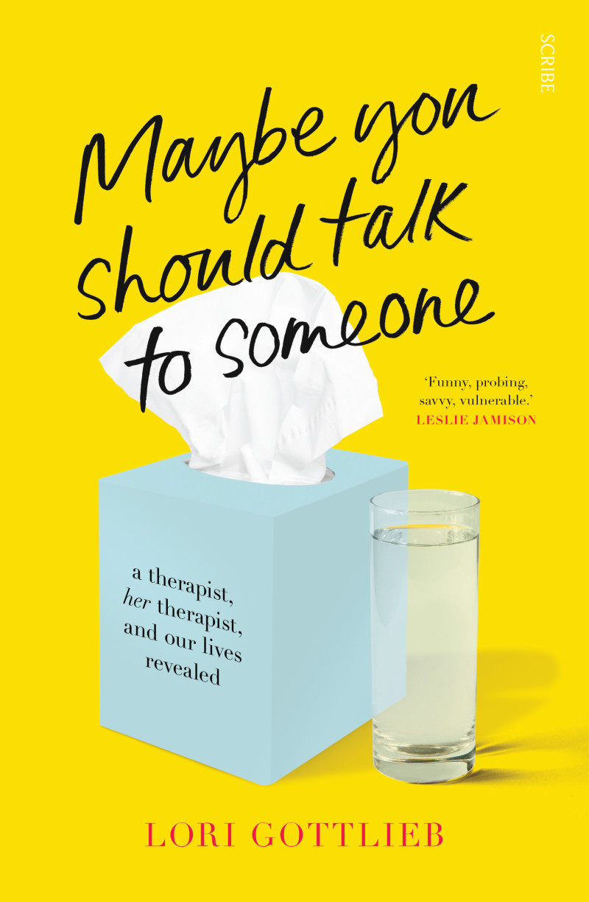

---    
date: 2024-08-20T12:39:04.674Z
title: "Maybe You Should Talk to Someone by Lori Gottlieb"
description: "A review of Maybe You Should Talk to Someone: revolves around understanding other people, and in doing so, understanding more about yourself"
featuredimage: './cover.jpg'
tags: ["bookshelf", "love", "non-fiction", "humanity"]
---   
⭐ ⭐ ⭐ ⭐ ⭐

*Maybe You Should Talk to Someone* is one of those books that broadens your mind, because it revolves around understanding other people, and in doing so, understanding more about yourself. 

 

Lori Gottlieb, a renowned therapist herself, finds her life thrown off course after the end of a relationship. In the midst of grief, she sits on a couch that is all too familiar to her, but this time on the other side.

This book is special, in that it follows the intimate lives of Lori’s patients, and herself as they at first work through ostensible problems that first led them to choose therapy, but then morph into open ended explorations of the self. 

I found this book like a manifesto championing the work that therapy involves, which in a nutshell is helping to identify and edit the life story of a person. It’s too often we craft a narrative of who we think we are, solidifying tangential moments in our life, and presenting them in a way that leaves no room for question. Our identity becomes enmeshed with the stories we tell ourselves. Lori explores how with therapy, we can be guided to explore topics and areas of life which are sensitive, with an intense awareness and compassion. We’re also shown consistently through stories, how these sensitive topics are the most conducive to personal growth.

Overall, this book was a delightful read, that definitely made me need a box of tissues (as the cover suggests).

Read in April

--- 

> “Most big transformations come about from the hundreds of tiny, almost imperceptible, steps we take along the way.” —> just keep swimming

> Loss of trust is harder to repair. 

> Countertransference - the emotional reaction of the analyst to the subject's contribution.

> “Before you speak, ask yourself, What is this going to feel like to the person I’m speaking to?”

> “Philip Larkin put it best: “They fuck you up, your mum and dad, / They may not mean to, but they do.”

## Helping Others When Heightened State of Emotion

“Neuroscientists discovered that humans have brain cells called mirror neurons that cause them to mimic others, and when people are in a heightened state of emotion, a soothing voice can calm their nervous systems and help them stay present.”

## Snapshots of who we are and the hope of who we can become

“Because therapists know that at first, each patient is simply a snapshot, a person captured in a particular moment. It’s like a photo of you taken from an unfortunate angle and with a sour expression on your face. There might also be a photo in which you’re glowing, caught opening a present or mid-laugh with a lover. Both are you in that fraction of time, and neither is you in your entirety.”

“Which is why when people first come in, we’re imagining them down the line. We do this not just on that first day but in every single session, because that image allows us to hold for them the hope that they can’t yet muster themselves, and it informs how the treatment unfolds.” - seeking help is understanding there its a better place for you.

## Defense Mechanisms Shielding us from Truth

“Earlier, Wendell had pointed out that I’d kept my distance from Boyfriend—ignoring clues that would have made his revelation less shocking—because if I’d inquired about them, Boyfriend might have said something I didn’t want to hear. I told myself it meant nothing that he seemed irritated by kids in public places, that he’d happily run errands for us rather than attend my son’s basketball games, that he said it was more important to his ex-wife than to him to have children when they were having fertility problems, and that his brother and sister-in-law stayed in a hotel when they came to visit because Boyfriend didn’t want the commotion of their three kids in his house. And yet, neither he nor I had ever discussed our feelings about children directly. I figured: He’s a dad, he likes kids.”

## Welcome to Holland - A parable on dealing with life’s expectations turned upside down

“When you’re going to have a baby, it’s like planning a fabulous vacation trip—to Italy. You buy a bunch of guide books and make your wonderful plans. The Coliseum. The Michelangelo David. The gondolas in Venice. You may learn some handy phrases in Italian. It’s all very exciting.

After months of eager anticipation, the day finally arrives. You pack your bags and off you go. Several hours later, the plane lands. The flight attendant comes in and says, “Welcome to Holland.”

“Holland?!?” you say. “What do you mean Holland?? I signed up for Italy! I’m supposed to be in Italy. All my life I’ve dreamed of going to Italy.”

But there’s been a change in the flight plan. They’ve landed in Holland and there you must stay.

The important thing is that they haven’t taken you to a horrible, disgusting, filthy place, full of pestilence, famine and disease. It’s just a different place.

So you must go out and buy new guide books. And you must learn a whole new language. And you will meet a whole new group of people you would never have met.

It’s just a different place. It’s slower-paced than Italy, less flashy than Italy. But after you’ve been there for a while and you catch your breath, you look around . . . and you begin to notice that Holland has windmills . . . and Holland has tulips. Holland even has Rembrandts.

But everyone you know is busy coming and going from Italy . . . and they’re all bragging about what a wonderful time they had there. And for the rest of your life, you will say “Yes, that’s where I was supposed to go. That’s what I had planned.”

And the pain of that will never, ever, ever, ever go away . . . because the loss of that dream is a very, very significant loss.

But . . . if you spend your life mourning the fact that you didn’t get to Italy, you may never be free to enjoy the very special, the very lovely things . . . about Holland.”

“Until one day she came across “Welcome to Holland” and realized that she would have to not only cope in this strange land but find joy there where she could. There were still pleasures to be had, if she could let them in.”

## Do away with normal or good, focus on honesty

“Do you think I’m a bad person?” she’d ask, and I’d assure her that everyone who comes to therapy worries that what they think or feel might not be “normal” or “good,” and yet it’s our honesty with ourselves that helps us make sense of our lives with all of their nuances and complexity. Repress those thoughts, and you’ll likely behave “badly.” Acknowledge them, and you’ll grow.”

## Ideas

“Often people think about bucket lists when somebody close to them dies. That’s what happened for Candy Chang, an artist who, in 2009, created a space on a public wall in New Orleans with the prompt Before I die _____. Within days the wall was completely filled. People wrote things like Before I die, I want to straddle the international dateline. Before I die, I want to sing for millions. Before I die, I want to be completely myself. Soon the idea spawned over a thousand such walls all over the world: Before I die, I would like to have a relationship with my sister. Be a great dad. Go skydiving. Make a difference in someone’s life.”

“Julie was grieving for what she would never have—all of the milestones and firsts that people in their thirties just assume will happen. Julie had, as she put it, “a concrete deadline” 
- what if you set that your will live for only 10 more years 
- how would that change things? Positive + Negative. Shedding a version of yourself - 7 is a nice number since our cells get replaced.

## Clusters of Personality Disorders

“The most recent version of the Diagnostic and Statistical Manual of Mental Disorders, the clinical bible of psychological conditions, lists ten types of personality disorders, broken into three groups, called clusters:
Cluster A (odd, bizarre, eccentric): Paranoid PD, Schizoid PD, Schizotypal PD
 Cluster B (dramatic, erratic):  Antisocial PD, Borderline PD, Histrionic PD, Narcissistic PD
 Cluster C (anxious, fearful):  Avoidant PD, Dependent PD, Obsessive-Compulsive PD”

## Ego-syntonic vs Ego-dystonic

“In other words, personality disorders are ego-syntonic, which means the behaviors seem in sync with the person’s self-concept; as a result, people with these disorders believe that others are creating the problems in their lives. Mood disorders, on the other hand, are ego-dystonic, which means the people suffering from them find them distressing. They don’t like being depressed or anxious or needing to flick the lights on and off ten times before leaving the house. They know something’s off with them.”

## The use of diagnosis

“Diagnosis has its usefulness. I know, for example, that people who are demanding, critical, and angry tend to suffer from intense loneliness. I know that a person who acts this way both wants to be seen and is terrified of being seen. I believe that for John, the experience of being vulnerable feels pathetic and shameful—and I’m guessing that he somehow got the message not to show “weakness” at six years old when his mother died. If he spends any time at all with his emotions, they likely overwhelm him, so he projects them onto others as anger, derision, or criticism. That’s why patients like John are especially challenging: they’re masters at getting your goat—all in the service of deflection.”

## Self-blame vs self-acceptance 

A second quality of mature spirituality is kindness. It is based on a fundamental notion of self acceptance.” - Jack Kornfield.

## Second Arrow

“Then there’s the fact that losses tend to be multilayered. There’s the actual loss (in my case, of Boyfriend), and the underlying loss (what it represents). That’s why for many people the pain of a divorce is only partially about the loss of the other person; often it’s just as much about what the change represents—failure, rejection, betrayal, the unknown, and a different life story than the one they’d expected.” 

## Understanding —> empathy —> compassion

“We all have a deep yearning to understand ourselves and be understood. When I see couples in therapy, often one or the other will complain, not “You don’t love me” but “You don’t understand me.” (One woman said to her husband, “You know what three words are even more romantic to me than ‘I love you’?” “You look beautiful?” he tried. “No,” his wife said. “I understand you.”)”

## Therapists and Brain Surgeons

“It’s Wendell’s job to help me edit my story. All therapists do this: What material is extraneous? Are the supporting characters important or a distraction? Is the story advancing or is the protagonist going in circles? Do the plot points reveal a theme?

The techniques we use are a bit like the type of brain surgery in which the patient remains awake throughout the procedure; as the surgeons operate, they keep checking in with the patient: Can you feel this? Can you say these words? Can you repeat this sentence? They’re constantly calibrating how close they are to sensitive regions of the brain, and if they hit one, they back off so as not to damage it. Therapists delve into a mind rather than a brain, and we can see from the subtlest gesture or expression if we’ve hit a nerve. But unlike neurosurgeons, we gravitate toward the sensitive area, pressing delicately on it, even if it makes the patient feel uncomfortable.

## Falling into the same puddle

Why do I do the very thing that will guarantee my own unhappiness over and over again? 
- What is that? 

## What are we afraid of?

We are afraid of being hurt. We are afraid of being humiliated. We are afraid of failure and we are afraid of success. We are afraid of being alone and we are afraid of connection. We are afraid to listen to what our hearts are telling us. We are afraid of being unhappy and we are afraid of being too happy (in these dreams, inevitably, we’re punished for our joy). We are afraid of not having our parents’ approval and we are afraid of accepting ourselves for who we really are. We are afraid of bad health and good fortune. We are afraid of our envy and of having too much. We are afraid to have hope for things that we might not get. We are afraid of change and we are afraid of not changing. We are afraid of something happening to our kids, our jobs. We are afraid of not having control and afraid of our own power. We are afraid of how briefly we are alive and how long we will be dead. (We are afraid that after we die, we won’t have mattered.) We are afraid of being responsible for our own lives.”

## The parts we find unacceptable, listen to them

“The therapist explained that often different parts of ourselves want different things, and if we silence the parts we find unacceptable, they’ll find other ways to be heard. He asked the guy to sit in a different chair, across the room, and see what happened when the part of him that chose to cheat wasn’t shoved aside but got to say its piece.

At first the poor guy was at a loss, but gradually, he began to give voice to his hidden self, the part that would goad the responsible, loving husband into engaging in self-defeating behavior. He was torn between these two aspects of himself, just as I was torn between the part of me that wanted to provide for my family and the part of me that wanted to do something meaningful—something that touched my soul and hopefully others’ souls as well.

## Resisting Positive Change

Sometimes people even resist positive changes in their friends -> members of the system, try to do everything they can to regain homeostasis in the system. 

## Get rid of limiting thoughts

“I know that therapy won’t make all my problems disappear, prevent new ones from developing, or ensure that I’ll always act from a place of enlightenment. Therapists don’t perform personality transplants; they just help to take the sharp edges off. A patient may become less reactive or critical, more open and able to let people in. In other words, therapy is about understanding the self that you are. But part of getting to know yourself is to unknow yourself—to let go of the limiting stories you’ve told yourself about who you are so that you aren’t trapped by them, so you can live your life and not the story you’ve been telling yourself about your life.” -  what have been my limiting stories? Who am I not? 

## You are your own jailer
“I’m reminded,” he begins, “of a famous cartoon. It’s of a prisoner, shaking the bars, desperately trying to get out—but to his right and left, it’s open, no bars.”
He pauses, allowing the image to sink in.
“All the prisoner has to do is walk around. But still, he frantically shakes the bars. That’s most of us. We feel completely stuck, trapped in our emotional cells, but there’s a way out—as long as we’re willing to see it.”

“There is a way out—as long as we’re willing to see it. A cartoon, of all things, has taught me the secret of life.
I open my eyes and smile, and Wendell smiles back. It’s a conspiratorial smile, one that says, Don’t be fooled. It may seem as though you’ve had an earth-shattering breakthrough, but this is just the beginning. I know full well what challenges lie ahead, and Wendell knows that I know, because we both know something else: freedom involves responsibility, and there’s a part of most of us that finds responsibility frightening.”

## How much is too much? 
“ I wondered if Julie would ever have asked herself the questions about risk and safety and identity that had been hiding beneath her awareness had she not faced the terror of imminent death. And now that she had, how far should we delve into them?
These are questions we all deal with in a quieter way: How much do we want to know? How much is too much? And how much is too much when you’re dying?”

## Follow your envy
“ Therapists tell their patients: Follow your envy—it shows you what you want. Did watching Julie’s blossoming highlight the fact that we were too afraid to act on our own equivalents of working at Trader Joe’s—and that we wanted Julie to remain like us, dreaming without doing, constrained by nothing more than the open bars on our prison cells?”
- **once you glimpse your ambitions don’t let them die.**

The universe conspires with us, when we choose to follow our dreams. What are yours? 

## Do the opposite of this
“Her list of mistakes was long: choosing the wrong husbands, failing to put her children’s needs above her own (including not protecting them from their alcoholic father), not using her skills in a professionally fulfilling way, not making an effort when she was younger to form a community. She had numbed herself with denial for as long as that worked. Recently, it had lost its efficacy. Even painting—the one activity she enjoyed and excelled at—barely held her interest.”
- What should be accepted and what should be changed in my own life? 

## Human Touch
“But it’s a deep human need. It’s well documented that touch is important for well-being throughout our lifetimes. Touch can lower blood pressure and stress levels, boost moods and immune systems. Babies can die from lack of touch, and so can adults (adults who are touched regularly live longer). There’s even a term for this condition: skin hunger.

Rita tells me that she splurges on pedicures not because it matters if her toenails are painted (“Who’s going to see them?”), but because the only human touch she gets is from a woman named Connie. Connie has been doing her toes for years and doesn’t speak a lick of English. But her foot massages, Rita says, “are heaven.”

When she got divorced for the third time, Rita didn’t know how to live without being touched even for a week. She’d get antsy, she says. Then it was a month. Then years turned to a decade. She doesn’t like to spend the money on a pedicure nobody will see, but what choice does she have? The pedicures are a necessity because she’ll go crazy with no human contact at all.”

## Silence

“In movies, therapist silences have become a cliché, but it’s only in silence that people can truly hear themselves. Talking can keep people in their heads and safely away from their emotions. Being silent is like emptying the trash. When you stop tossing junk into the void—words, words, and more words—something important rises to the surface. And when the silence is a shared experience, it can be a gold mine for thoughts and feelings that the patient didn’t even know existed. It’s no wonder that I spent an entire session with Wendell saying virtually nothing and simply crying. Even great joy is sometimes best expressed through silence, as when a patient comes in after landing a hard-won promotion or getting engaged and can’t find the words to express the magnitude of what she’s feeling. So we sit in silence together, beaming.”

## Familiar Attraction

“What most people mean by type is a sense of attraction—a type of physical appearance or a type of personality turns them on. But what underlies a person’s type, in fact, is a sense of familiarity. It’s no coincidence that people who had angry parents often end up choosing angry partners, that those with alcoholic parents are frequently drawn to partners who drink quite a bit, or that those who had withdrawn or critical parents find themselves married to spouses who are withdrawn or critical.” 
- what is familiar to me? 

## Projective Identification

“This felt like a classic example of projective identification. In projection, a patient attributes his beliefs to another person; in projective identification, he sends them into another person. For instance, a man may feel angry at his boss at work, then come home and say to his spouse, “You seem angry.” He’s projecting, because the spouse isn’t angry. In projective identification, on the other hand, the man may feel angry at his boss, return home, and essentially insert his anger into his partner, actually making the partner feel angry. Projective identification is like tossing a hot potato to the other person. The man no longer has to feel his anger, since it’s now living inside his partner.”

## Early Incompatibilities - warning signs, to be aware of 

“Did Boyfriend leave me because I was sick—or he thought I was paranoid for believing I was? Or did he leave me because I was as dishonest with him as he had been with me about who I was and what I wanted in a partner? It turns out that we weren’t that different after all. In the hopes of making it work with a person he genuinely enjoyed, he wanted to postpone his confession for the same reason I did: so that we could continue to be together even though we couldn’t. ”

## A beautiful description of love that made my heart move

“Here’s what Myron realized: He missed Rita. Deeply. He wanted to tell her things—all the time, every day—the way he had wanted to tell his wife Myrna things throughout their marriage. Rita made him laugh and think, and when photos of his grandchildren popped up on his phone, he wanted to show them to Rita. He didn’t want to do any of this with Randie in the same way. He loved Rita’s sharp intellect and sharper wit, her creativity, her kindness. How she picked up his favorite cheese if she was at the grocery store.

He liked Rita’s worldliness and wry observations and wise counsel whenever he asked her advice. He adored her throaty laugh and her eyes that were green in the sunlight and brown indoors and her bright red hair and her values. He loved that if they started a conversation on one topic, it would segue into two or three others before it would loop back around or that sometimes they’d get so immersed in their tangents that they’d forget what they’d been talking about in the first place. Her paintings and sculptures made his heart thrill. “He was curious about her, wanted to know more about her kids, her family, her life, her. He wanted her to feel comfortable telling him and wondered why she had been like a cipher, revealing so little of her past.”

**Every decision you make is based on two things: fear and love**

## Repetition Compulsion

“When you’re a child and your father is loving and playful, then disappears for a while, and later comes back and acts as if nothing happened—and does this repeatedly—you learn that joy is fickle. When your mother emerges from her depression and suddenly seems interested in your days and acts the way you see other kids’ moms acting, you don’t dare feel joy because you know from experience that it will all go away. And it does. Every single time. Better to expect nothing too stable. Better to “hang out” with the guy in the waiting room who either still has a girlfriend or no longer does but flirted with you when he did.”

## What are your living deal breakers?
“She’s been figuring out how much has to be taken away before she’s no longer herself. What constitutes life even if you’re alive? I think about how people barely talk about this with their elderly parents, all the would-you-rathers that they’d rather not contemplate. Besides, it’s all a thought experiment until you’re there. What are your deal-breakers? When your mobility goes? When your mind does? How much mobility? How much cognition? Will it still be a deal-breaker when it actually happens?”

## Beautiful writing, forever changed and paradoxically alive

“Julie is crying now. “He kept wanting to take back what he’d said, but it was already out there, hanging between us. I understand why he wants a night off from cancer.” She pauses. “I’ll bet he wishes that I would just die already.”

I’ll bet sometimes he does, I think for a second. It’s hard enough in a marriage to do the give-and-take of putting one’s wants and needs aside for another, but here the scales are tipped, the imbalance unrelenting. Yet I also know it’s much more complicated than that. I imagine that Matt feels trapped in time, newly married, young, wanting to live a normal life and start a family, all the while knowing that what he has left with Julie is temporary. He sees his future as a widower, then as a father in his forties rather than his thirties. He probably hopes that this doesn’t go on for another five years, five years at the prime of his life spent in hospitals, caretaking his young wife whose body is being cut apart. At the same time, I’ll bet that he is touched to his core by this experience, that in some ways it makes him feel, as one man told me in the months before his wife of thirty years died, “forever changed and paradoxically alive.” I’d wager that, like that man, Matt wouldn’t choose to go back in time and marry a different person. But Matt’s at a life stage when everyone else is moving forward; the thirties are a decade of building the foundation of the future. He’s out of sync with his peers, and in his own way, in his own grief, he probably feels completely alone.”

## Human Encounters

“The therapy room seemed to be one of the only places left where two people sit in a room together for an uninterrupted fifty minutes. Despite its veil of professionalism, this weekly I-thou ritual is often one of the most human encounters that people experience.”

## Four ultimate concerns
“The four ultimate concerns are death, isolation, freedom, and meaninglessness.”

“Death, of course, is an instinctive fear that we often repress but that tends to increase as we get older. What we fear isn’t just dying in the literal sense but in the sense of being extinguished, the loss of our very identities, of our younger and more vibrant selves. How do we defend against this fear? Sometimes we refuse to grow up. Sometimes we self-sabotage. And sometimes we flat-out deny our impending deaths. But as Yalom wrote in Existential Psychotherapy, our awareness of death helps us live more fully—and with less, not more, anxiety.”

“There’s a reason that solitary confinement makes prisoners literally go crazy; they experience hallucinations, panic attacks, obsessional behavior, paranoia, despair, difficulty with focus, and suicidal ideation. When released, these people often struggle with social atrophy, which renders them unable to interact with others. (Perhaps this is simply a more intense version of what happens with our increasing want, our loneliness, created by our speedy lifestyles.)”

“ freedom, and all the existential difficulties that freedom poses for us. On the surface, it’s almost laughable how much freedom I have—if, as Wendell pointed out, I’m willing to walk around those bars. But there’s also the reality that as people get older, they face more limitations. It becomes harder to change careers or move to a different city or marry a different person. Their lives are more defined, and sometimes they crave the freedom of youth. But children, bound by parental rules, are really free only in one respect—emotionally. For a while, at least, they can cry or laugh or have tantrums unselfconsciously; they can have big dreams and unedited desires. Like many people my age, I don’t feel free because I’ve lost touch with that emotional freedom. And that’s what I’m doing here in therapy—trying to free myself emotionally again.”

## Trauma not as a badge of honour

“I think, too, about how there are many ways to defend oneself from the unspeakable. Here’s one: you split off unwanted parts of yourself, hide behind a false self, and develop narcissistic traits. You say, Yeah, this catastrophic thing has happened, but I’m A-Okay. Nothing can touch me because I’m special. A special surprise. When John was a boy, wrapping himself in the memory of his mother’s delight was a way to shield himself from the horror of life’s utter unpredictability. He may have comforted himself this way as an adult too, clinging to how special he was after Gabe died. Because the one certainty that John can count on in this world is that he is a special person surrounded by idiots.
Through his tears, John says that this is exactly what he didn’t want to happen, that he didn’t come here to have a breakdown.
But I assure him that he’s not breaking down; he’s breaking open.”
- Dig deeper it’s okay to reflect on things that have happened.

## Transtheoretical Model of Behaviour Change (TTM) 

Stage 1: Pre-contemplation
Stage 2: Contemplation
Stage 3: Preparation
Stage 4: Action
Stage 5: Maintenance

Quicken this process till you become ever ready to change

## Changes you want in another person aren’t always on their agenda

“Every relationship is a dance. The Dude does his dance steps (approach/retreat), and Charlotte does hers (approach/get hurt)—that’s how they dance. But once Charlotte changes her steps, one of two things will happen—the Dude will be forced to change his steps so that he doesn’t trip and fall down, or he’ll simply walk off the dance floor and find somebody else’s feet to stomp on.”

## Awakening and death
“As your eyes are opening, his are beginning to close,” Wendell says now, and I think about how bittersweet but true that is. My awakening is happening at an opportune moment.”

## Truth releases us from shame
“I feel lighter, relieved of a burden. Sharing difficult truths might come with a cost—the need to face them—but there’s also a reward: freedom. The truth releases us from shame.”

## Erikson & Freud

“In the mid-1900s, Erikson came up with eight stages of psychosocial development that still guide therapists in their thinking today. Unlike Freud’s stages of psychosexual development, which end at puberty and focus on the id, Erikson’s psychosocial stages focus on personality development in a social context (such as how infants develop a sense of trust in others). Most important, Erikson’s stages continue throughout the entire lifespan, and each interrelated stage involves a crisis that we need to get through to move on to the next. 

They look like this:
Infant (hope)—trust versus mistrust
Toddler (will)—autonomy versus shame
Preschooler (purpose)—initiative versus guilt
School-age child (competence)—industry versus inferiority
Adolescent (fidelity)—identity versus role confusion
Young adult (love)—intimacy versus isolation
Middle-aged adult (care)—generativity versus stagnation
Older adult (wisdom)—integrity versus despair”

## Travelling to foreign lands

“She was used to viewing the world from a place of deficit, and as a result, joy felt foreign to her. If you’re used to feeling abandoned, if you already know what it’s like for people to disappoint or reject you—well, it may not feel good, but at least there are no surprises; you know the customs in your own homeland. Once you step into foreign territory, though—if you spend time with reliable people who find you appealing and interesting—you might feel anxious and disoriented. All of a sudden, nothing’s familiar. You have no landmarks, nothing to go by, and all of the predictability of the world you’re used to is gone. The place you came from may not be great—it might, in fact, be pretty awful—but you knew exactly what you’d get there (disappointment, chaos, isolation, criticism).”

## Forgiveness isn’t necessary for compassion

“Forgiveness is a tricky thing, in the way that apologies can be. Are you apologizing because it makes you feel better or because it will make the other person feel better? Are you sorry for what you’ve done or are you simply trying to placate the other person who believes you should be sorry for the thing you feel completely justified in having done? Who is the apology for?”

Compassion is simply viewing the other as a human.

## Dancing
“When we dance, we express our buried feelings, talking through our bodies instead of our minds—and that can help us get out of our heads and to a new level of awareness. That’s partly what dance therapy is about. It’s another technique some therapists use.”

## Pain 
“You can’t get through your pain by diminishing it, he reminded me. You get through your pain by accepting it and figuring out what to do with it. You can’t change what you’re denying or minimizing. And, of course, often what seem like trivial worries are manifestations of deeper ones.”

## Love after Loss
“I remember a woman I treated whose husband had died. When she fell in love a year later—a love all the more sweet because of the loss of her husband—she worried that others would judge her. (So soon? Didn’t you love your husband of thirty years?) In fact, her friends and family were excited for her. It wasn’t their judgment she was hearing—it was her own. What if her happiness was an insult to her husband’s memory? It took her a while to see that her happiness didn’t diminish her love for her husband—it honored it.”

## Price of Loving Deeply
“ The price of loving so deeply is feeling so deeply—but it’s also a gift, the gift of being alive. If we no longer feel, we should be grieving our own deaths.”

## Psychological Immune System

“A series of studies by the researcher Daniel Gilbert at Harvard found that in responding to challenging life events from the devastating (becoming handicapped, losing a loved one) to the difficult (a divorce, an illness), people do better than they anticipate. They believe that they’ll never laugh again, but they do. They think they’ll never love again, but they do. They go grocery shopping and see movies; they have sex and dance at weddings; they overeat on Thanksgiving and go on diets in the New Year—the day-to-day returns. John’s reaction while playing with Grace wasn’t unusual; it was the norm.”

Things will be okay. 

## Privacy vs Secrecy

“In couples therapy, therapists talk about the difference between privacy (spaces in people’s psyches that everyone needs in healthy relationships) and secrecy (which stems from shame and tends to be corrosive)”

## Your Parents Version of Events

“I have the fantasy that all adults should be given the opportunity to hear parents—not their own—rip themselves open, become completely vulnerable, and give their versions of events, because in seeing this, you can’t help but come to a newfound understanding of your own parents’ lives, whatever the situation.”

## Emotional Defence Mechanisms

“We all use defense mechanisms to deal with anxiety, frustration, or unacceptable impulses, but what’s fascinating about them is that we aren’t aware of them in the moment. A familiar example is denial—a smoker might cling to the belief that his shortness of breath is due to the hot weather and not his cigarettes. Another person might use rationalization (justifying something shameful)—saying after he’s rejected for a job that he never really wanted the job in the first place. In reaction formation, unacceptable feelings or impulses are expressed as their opposite, as when a person who dislikes her neighbor goes out of her way to befriend her or when an evangelical Christian man who’s attracted to men makes homophobic slurs.
Some defense mechanisms are considered primitive and others mature. In the latter group is sublimation, when a person turns a potentially harmful impulse into something less harmful (a man with aggressive impulses takes up boxing) or even constructive (a person with the urge to cut people becomes a surgeon who saves lives).

Displacement (shifting a feeling toward one person onto a safer alternative) is considered a neurotic defense, neither primitive nor mature. A person who was yelled at by her boss but could get fired if she yelled back might come home and yell at her dog. Or a woman who felt angry at her mother after a phone conversation might displace that anger onto her son.”

## What would be Lost
“ It seems not that long ago that he was in preschool, and my parents were healthy, and I was healthy, and the neighborhood kids all ran outside to play every evening after dinner, and the only thought I had about the future at all was the sense of Things will be easier, I’ll have more flexibility, more sleep. I never thought about what would be lost.”

> “The nature of life is change and the nature of people is to resist change.”

## Hurt and Relationships

“I told Rita what I tell everyone who’s afraid of getting hurt in relationships—which is to say, everyone with a heartbeat. I explained to her that even in the best possible relationship, you’re going to get hurt sometimes, and no matter how much you love somebody, you will at times hurt that person, not because you want to, but because you’re human. You will inevitably hurt your partner, your parents, your children, your closest friend—and they will hurt you—because if you sign up for intimacy, getting hurt is part of the deal.”

## Love is always as strong no matter your age

“Sitting with Rita, I was reminded that the heart is just as fragile at seventy as it is at seventeen. The vulnerability, the longing, the passion—they’re all there in full force. Falling in love never gets old. No matter how jaded you are, how much suffering love has caused you, a new love can’t help but make you feel hopeful and alive, like that very first time. Maybe this time it’s more grounded—you have more experience, you’re wiser, you know you have less time—but your heart still leaps when you hear your lover’s voice or see that number pop up on your phone. Late-in-life love has the benefit of being especially forgiving, generous, sensitive—and urgent.”

## It’s because of pain you can enjoy happiness
 “Every laugh and good time that comes my way feels ten times better than before I knew such sadness.”

