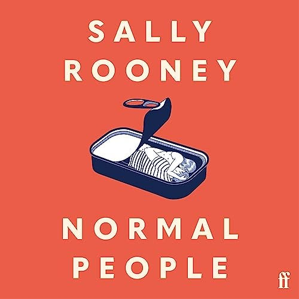

---    
date: 2025-03-26T12:05:06.580Z
title: "Normal People by Sally Rooney"
description: "Normal People by Sally Rooney suprised me"
tags: ["bookshelf", "fiction", "favourites"]
featuredimage: './cover.jpg'
---   

⭐ ⭐ ⭐ ⭐ ⭐

Normal People by Sally Rooney surprised me. In essence it had the characteristics of an simple and uncomplicated read, the kind where your eyes can flit across the page, taking in the gist of what’s happening. Instead, it was the kind where your eyes dwell long and hard at a short passage, or phrase, until it makes you crack as if you were an egg; your insides gently oozing out. Rooney has a gift of transforming simple dialogue into one where silences and things left unsaid speak volumes. The questions never asked, and feelings never explained, bubble up into months passing in miscommunication. Until suddenly everything spills over.

 

What makes this addictive, is just how realistic it all is. At times you wish you could shake some sense into the characters, and force them to reveal their thoughts to the other person, but just like reality - that’s not how things often play out.

Marianne and Connell’s relationship operated in the realm where we don’t have traditional words like friends, partners or even lovers. It was a tale of connection, the kind which strikes you out of nowhere, giving you the instant realisation that there is someone else who, despite all odds, understands you. The kind where you can transpose them onto the frightened child they once were, under an inky black sky, lightning rupturing through the clouds; realising that in those moments we all crave warmth and reassurance. The rarity of that is not lost on me. 

I got gifted this book by a dear friend, and thoroughly treasured it. 

Read sometime in January 2025 whilst travelling in Thailand.

---

## Notes and highlights

“Marianne had the sense that her real life was happening somewhere very far away … All she knew was that when it started, she wouldn’t need to imagine it anymore.”

“They were cheering together, they had seen something magical which dissolved the ordinary social relations between them”
- Dissolved is such a good word

“If she was different with Connell, the difference was not happening inside herself, in her personhood, but in between them, in the dynamic.”

“Their secret weighed inside her body pleasurably, pressing down on her pelvic bone when she moved.”

“Connell felt a pleasurable sorrow come over him, which brought him close to tears. Moments of emotional pain arrived like this, meaningless or at least indecipherable.”

“He wants to understand how her mind works. If he silently decides not to say something when they’re talking, Marianne will ask ‘what?’ within one or two seconds. This ‘what?’ question seems to him to contain so much: not just the forensic attentiveness to his silences that allows her to ask in the first place, but a desire for total communication, a sense that anything unsaid is an unwelcome interruption between them.”

“He likes to give her that feeling.”

“Nothing would feel more exhilarating to her at this moment than to say: They’ll be on their way shortly. How much terrifying and bewildering status would accrue to her in this one moment, how destabilising it would be, how destructive.”
rearrange the hierarchy with a phrase

“If he really wished for any of those things, Marianne knows, then they would happen.”
- how true, words are facetious and alluring, but they sometimes convey an island separating action

“Most people go through their whole lives, Marianne thought, without ever really feeling that close with anyone.”

“She wants to pick up his hand and suck on his fingertips one after another.”

“He leans down and kisses her on the forehead. I would never hurt you, okay? he says. Never. She nods and says nothing. You make me really happy, he says. His hand moves over her hair and he adds: I love you. I’m not just saying that, I really do. Her eyes fill up with tears again and she closes them. Even in memory she will find this moment unbearably intense, and she’s aware of this now, while it’s happening. She has never believed herself fit to be loved by any person. But now she has a new life, of which this is the first moment, and even after many years have passed she will still think: Yes, that was it, the beginning of my life.”

“He noticed how long it took her to say anything in response, and how her pause had bothered him, as if she might not say it back”

“It gave him a queasy feeling, to have this information about her, to be tied to her in this way.”

“A crow on the forecourt picks at a discarded crisp packet. A family comes out of the shop holding ice creams. The smell of petrol infiltrates the car interior, heavy like a headache. He starts the engine.”

“He had never tried to delude her into thinking she was socially acceptable; she’d deluded herself.”

“Marianne wonders what it would be like to belong here, to walk down the street greeting people and smiling. To feel that life was happening here, in this place, and not somewhere else far away.”

“She believes Marianne lacks ‘warmth’, by which she means the ability to beg for love from people who hate her.”

“They just move through the world in a different way, and he’ll probably never really understand them, and he knows they will never understand him, or even try.”

“He’s amused at himself, getting wrapped up in the drama of novels like that. … But there it is: literature moves him.”

“If anything, his personality seemed like something external to himself, managed by the opinions of others, rather than anything he individually did or produced. Now he has a sense of invisibility, nothingness, with no reputation to recommend him to anyone.”
- The feeling of having to be at your “peak” all the time to prove your worth

“He felt a debilitating shame about the kind of person he’d turned out to be, and he missed the way Marianne had made him feel, and he missed her company”

“There was no one he could talk to about that.”

“He had thought that being with her would make him feel less lonely, but it only gave his loneliness a new stubborn quality, like it was planted down inside him and impossible to kill.”

“Surrounded by people who doesn’t make you less lonely, if you’re not understood” 

“This was probably the most horrifying thing Eric could have said to him, not because it ended his life, but because it didn’t. He knew then that the secret for which he had sacrificed his own happiness and the happiness of another person had been trivial all along, and worthless.”

“Their life in Carricklea, which they had imbued with such drama and significance, just ended like that with no conclusion, and it would never be picked back up again, never in the same way.”

“he likes knowing how to act around her.”

“Her gaze unsettles him like it used to, like looking into a mirror, seeing something that has no secrets from you.”

“What’s not to like about you?He smiles and looks into his glass. If Niall could see Marianne, he would say: Don’t tell me. You like her. It’s true she is Connell’s type, maybe even the originary model of the type: elegant, bored-looking, with an impression of perfect self-assurance. And he’s attracted to her, he can admit that. After these months away from home, life seems much larger, and his personal dramas less significant. He’s not the same anxious, repressed person he was in school, when his attraction to her felt terrifying, like an oncoming train, and he threw her under it. He knows she’s acting funny and coy because she wants to show him that she’s not bitter. He could say: I’m really sorry for what I did to you, Marianne. He always thought, if he did see her again, that’s what he would say. Somehow she doesn’t seem to admit that possibility, or maybe he’s being cowardly, or both.
I don’t know, he says. ”
- interesting exchange, not to like is everything in this paragraph so it’s interesting he says I don’t know

“She knows Joanna would disapprove, because Marianne herself also disapproves, but when Joanna disapproves of things she doesn’t go ahead and do them anyway.”
has there been anything that I’ve opposed and done anyway - inverse. 

“She nodded. She continued looking up at the black ceiling, swallowing, worried that he could make out her expression.”

“She squeezed his hand and he squeezed back, so tightly it almost hurt her, and this small gesture of desperation on his part made her smile.I forgive you, she said.Thank you. I think I did learn from it. And hopefully I have changed, you know, as a person. But honestly, if I have, it’s because of you.They kept holding hands underneath the quilt, even after they went to sleep.”
- these conversations are golden, after the dust settles, with some one who cares.

“When the weather is good, the sky feels miles away, and birds wheel through limitless air and light overhead”
- when the sky isn’t 3D because there aren’t any clouds or references.

“At times he has the sensation that he and Marianne are like figure-skaters, improvising their discussions so adeptly and in such perfect synchronisation that it surprises them both. She tosses herself gracefully into the air, and each time, without knowing how he’s going to do it, he catches her. Knowing that they’ll probably have sex again before they sleep probably makes the talking more pleasurable, and he suspects that the intimacy of their discussions, often moving back and forth from the conceptual to the personal, also makes the sex feel better.”

“Rich people look out for each other, and being Marianne’s best friend and suspected sexual partner has elevated Connell to the status of rich-adjacent: someone for whom surprise birthday parties are thrown and cushy jobs are procured out of nowhere.”
are birthday parties reserved for the materially rich? Or emotionally rich. 

“For the privacy between himself and Marianne to be invaded by Peggy, or by another person, would destroy something inside him, a part of his selfhood, which doesn’t seem to have a name and which he has never tried to identify before.”

“In a way I like the idea of something so dramatic happening to me. I would like to upset people’s expectations.”

“I know it probably feels like they don’t, he said. But at the end of the day they’re your family, they love you.”
- Easy to say when things are so much more complicated. 

“It was in Connell’s power to make her happy. It was something he could just give to her, like money or sex. With other people she seemed so independent and remote, but with Connell she was different, a different person. He was the only one who knew her like that.”

“You shouldn’t do things you don’t want to do, he says.

“He has a terrible sense all of a sudden that he could hit her face, very hard even, and she would just sit there and let him. The idea frightens him so badly that he pulls his chair back and stands up. His hands are shaking. He doesn’t know why he thought about it.”
- The analogy of your bellies being turned up.
 
“I’m not a religious person but I do sometimes think God made you for me.”

“She’s not worried, he said.She didn’t know what that meant, really, but she smiled, and then the game began. She felt happy to be surrounded by people she liked, who liked her. She knew that if she wanted to speak, everyone would probably turn around and listen out of sincere interest, and that made her happy too, although she had nothing at all to say.”

“Is this what life is like? Connell said.She looked at his face, but she couldn’t tell from his expression if he was pleased or miserable. What do you mean? she said. But he only shrugged. A few days later he told her he was leaving Dublin for the summer.”

“Is this what life is like? Connell said.She looked at his face, but she couldn’t tell from his expression if he was pleased or miserable. What do you mean? she said. But he only shrugged. A few days later he told her he was leaving Dublin for the summer.”

“He just assumes the best of everyone and knows nothing.”

“At this moment she remembers leaving a flask in Connell’s car the day they drove to Howth in April, and she never got the flask back. It might still be in his glovebox. She eyes the glovebox but doesn’t feel she can open it, because he would ask what she was doing and she would have to bring up the trip to Howth. They went swimming in the sea that day and then parked his car somewhere out of sight and had sex in the back seat. It would be shameless to remind him of that day now that they’re once again in the car together, even though she would really like her flask back, or maybe it’s not about the flask, maybe she just wants to remind him he once fucked her in the back seat of the car they’re now sitting in, she knows it would make him blush, and maybe she wants to force him to blush as a sadistic display of power, but that wouldn’t be like her, so she says nothing.”
- The inner monologue is so interesting - when things are unsaid

“Although he takes pleasure in seeing her look good, he feels a special sympathy with her when she looks ill or her skin is bad, like when someone who’s usually very good at sports has a poor game.”

“His eyes were hurting and he closed them. He couldn’t understand how this had happened, how he had let the discussion slip away like this. It was too late to say he wanted to stay with her, that was clear, but when had it become too late? It seemed to have happened immediately. He contemplated putting his face down on the table and just crying like a child. Instead he opened his eyes again.Yeah, he said. I’m not dropping out, don’t worry.So you’ll only be gone three months.Yeah.There was a long pause.I don’t know, he said. I guess you’ll want to see other people, then, will you?Finally, in a voice that struck him as truly cold, Marianne said: Sure.”

“Connell can’t figure out what kind of relationship they are supposed to have now. Are they agreeing not to find each other attractive anymore? ”

“I’m going to get sick, he said. She jerked back then, pulling her dress after her, and he took the opportunity to stand up from the sofa and button his jeans back up. Cautiously she asked if he was okay. When he looked at her he could make out two separate Paulas sitting on the couch, so clearly delineated that it was no longer obvious which was the real Paula and which the ghost. Sorry, he said. He woke up the next day fully clothed on the floor of his living room. He still has no idea how he made it home.”
- Midnights you’d rather forget

“It’s not that I get off on being degraded as such, she says. I just like to know that I would degrade myself for someone if they wanted me to. Does that make sense? I don’t know if it does, I’ve been thinking about it. It’s about the dynamic, more than what actually happens.”

“She gives him a look. He feels like the fear has consumed him and turned him into something else now, like he has passed through the fear, and looking at her is like swimming towards her across a strip of water. He picks up the cigarette packet and looks into it. His teeth start chattering and he puts a cigarette on his lower lip and lights it. Marianne is the only one who ever triggers these feelings in him, the strange dissociative feeling, like he’s drowning and time doesn’t exist properly anymore.”
- This comes with caring about someone so much

“It was different with you. We were, you know. Things were different.”

“I didn’t need to play any games with you, she says. It was real. With Jamie it’s like I’m acting a part, I just pretend to feel that way, like I’m in his power. But with you that really was the dynamic, I actually had those feelings, I would have done anything you wanted me to. Now, you see, you think I’m a bad girlfriend. I’m being disloyal. Who wouldn’t want to beat me up?”

“Anyway, she says. How are you?He knows the question is meant honestly. He’s not someone who feels comfortable confiding in others, or demanding things from them. He needs Marianne for this reason. This fact strikes him newly. Marianne is someone he can ask things of. Even though there are certain difficulties and resentments in their relationship, the relationship carries on. This seems remarkable to him now, and almost moving.Something kind of weird happened to me in the summer, he said. Can I tell you about it?”

“There’s something reassuring in how transparent he is to her.”
- the scare is when the other isn’t as transparent, lethal and manipulative

“When she thinks about how little she respects him, she feels disgusting and begins to hate herself, and these feelings trigger in her an overwhelming desire to be subjugated and in a way broken. When it happens her brain simply goes empty, like a room with the light turned off, and she shudders into orgasm without any perceptible joy”
- negative loops

“You have to tone down these violent impulses, he said. You can’t be going around slashing people’s throats, they’ll put you in prison. Marianne let him laugh it off, but quietly she said: If she ever lays a hand on you again I will do it, I don’t care.”

“You think you’re special, do you? said Denise. Marianne let her eyes close. No, she said. I don’t.”

“The question is sensitive enough that her friends start to talk amongst themselves, so she feels she has him almost alone.”

“Guiltily she squeezes Jamie’s wrist, as if she can perform the following impossible act of communication: to Jamie, that Connell is injured and regrettably requires her attention, while to Connell, that she would rather not be touching Jamie at all.”
the act and the thoughts lacing it

“She feels her shoulder muscles relaxing, like their solitude is a narcotic.”

“You know, I didn’t really know what was going on with us last summer, he says. Like, when I had to move home and that. I kind of thought maybe you would let me stay here or something. I don’t really know what happened with us in the end.She feels a sharp pain in her chest and her hand flies to her throat, clutching at nothing.You told me you wanted us to see other people, she says. I had no idea you wanted to stay here. I thought you were breaking up with me.He rubs his palm flat against his mouth for a second, and then breathes out.You didn’t say anything about wanting to stay here, she adds. You would have been welcome, obviously. You always were.Right, okay, he says. Look, I’ll head off, then. Have a good night, yeah?”
When the past is rewritten, and revisited 

“Six Months Later”
- Reading these excerpts gives me hope that things are not as permanent as they seem and stories will continue to flourish. Even when things that indent them are cursory moments.

“Nothing Connell did there seemed to stay with him. The whole trip felt like a series of short films, screened only once, and afterwards he had a sense of what they were about but no exact memories of the plot.”

“He finds himself rushing to the end of the conversation so they can hang up, and then he can retrospectively savour how much he likes seeing her, without the moment-to-moment pressure of having to produce the right expressions and say the right things.”

“He couldn’t explain aloud what he finds so absorbing about his emails to Marianne, but he doesn’t feel that it’s trivial. The experience of writing them feels like an expression of a broader and more fundamental principle, something in his identity, or something even more abstract, to do with life itself.”

“I feel like the NSA agent reading these emails has the wrong impression of us, Marianne wrote once. They probably don’t know about the time you didn’t invite me to the Debs.”
- the soft pages of history only two people know. 

“It feels powerful to him to put an experience down in words, like he’s trapping it in a jar and it can never fully leave him.”
“It’s like something he assumed was just a painted backdrop all his life has revealed itself to be real: foreign cities are real, and famous artworks, and underground railway systems, and remnants of the Berlin Wall. ”
- The world is so vastly big 

“He gathers that she has things she wants to tell him.”

“He’s not sure what friends are allowed to enjoy about each other.”

“In a series of emails they exchanged recently about their own friendship, Marianne expressed her feelings about Connell mainly in terms of her sustained interest in his opinions and beliefs, the curiosity she feels about his life, and her instinct to survey his thoughts whenever she feels conflicted about anything. He expressed himself more in terms of identification, his sense of rooting for her and suffering with her when she suffers, his ability to perceive and sympathise with her motivations. Marianne thought this had something to do with gender roles. I think I just like you a lot as a person, he replied defensively. That’s actually very sweet, she wrote back.”

“Cherries hang on the dark-green trees like earrings. He thinks about this phrase once or twice. He would put it in an email to Marianne, but he can’t email her when she’s downstairs.”

“The two women then made perfectly competent and genial conversation while he stood there panicking and staring at various objects in the surrounding environment.”

“By now the unspoken consensus is that Helen and Marianne don’t like each other very much. They’re different people. Connell thinks the aspects of himself that are most compatible with Helen are his best aspects: his loyalty, his basically practical outlook, his desire to be thought of as a good guy. With Helen he doesn’t feel shameful things, he doesn’t find himself saying weird stuff during sex, he doesn’t have that persistent sensation that he belongs nowhere, that he never will belong anywhere. Marianne had a wildness that got into him for a while and made him feel that he was like her, that they had the same unnameable spiritual injury, and that neither of them could ever fit into the world. But he was never damaged like she was. She just made him feel that way.”
- can you truly get along with everyone if you are unabashedly yourself? Is it to be untrue to seek peace? 

“He was sad for Marianne after that, sad that nothing in her life had ever truly seemed healthy, and sad that he’d had to turn away from her. He knew that it had caused her pain. In a way he was even sad for himself. … But he couldn’t be what she wanted.”

“The sky is a thrilling chlorine-blue, stretched taut and featureless like silk.” 

“They continued eating then, as if they were acting out an argument in which both sides were equally compelling, and they had chosen their positions more or less at random, only in order to have the discussion out.”

“So many things pass secretly between people anyway. What kind of person would he be if it happened now? Someone very different? Or exactly the same person, himself, with no difference at all.”

“Her voice sounds oddly cool and distant, like a recording of her voice played after she herself has gone away or departed for somewhere else.”

“I was probably afraid you wouldn’t want me anymore.” 

“I’m really sorry, he says. She squeezes his hand. It’s a very sad gesture. He can’t believe the stupidity of what he’s just done. Sorry, he says again. But Marianne has already turned away.”
- never lose sight of the honour of moments

“For weeks now she has had this feeling, the feeling of moving around inside a protective film, floating like mercury. The outside world touches against her outside skin, but not the other part of herself, inside.”

“He has managed to nurture a fine artistic sensitivity without ever developing any real sense of right and wrong. The fact that this is even possible unsettles Marianne, and makes art seem pointless suddenly.”

“At times a person will make eye contact with Marianne, a bus conductor or someone looking for change, and she’ll be shocked briefly into the realisation that this is in fact her life, that she is actually visible to other people”

“the sense of having lost her footing in the social world, of being no longer admired and envied, how quickly it had all slipped away from her.”

“she would have behaved just as badly as anyone else. There is nothing superior about her at all.”
- What separates people from others when placed in the same circumstances.

“She’s tired of making evasive efforts when it’s easier, effortless, to give in.”

“Could he really do the gruesome things he does to her and believe at the same time that he’s acting out of love? Is the world such an evil place, that love should be indistinguishable from the basest and most abusive forms of violence?”

“Life is the thing you bring with you inside your own head. I might as well be lying here, breathing the vile dust of the carpet into my lungs, gradually feeling my right arm go numb under the weight of my body, because it’s essentially the same as every other possible experience.”

“Once or twice he’s had major panic attacks: hyperventilation, chest pain, pins and needles all over his body. A feeling of dissociation from his senses, an inability to think straight or interpret what he sees and hears. Things begin to look and sound different, slower, artificial, unreal. The first time it happened he thought he was losing his mind, that the whole cognitive framework by which he made sense of the world had disintegrated for good, and everything from then on would just be undifferentiated sound and colour. ”

“Nothing had meant more to Rob than the approval of others; to be thought well of, to be a person of status. He would have betrayed any confidence, any kindness, for the promise of social acceptance. Connell couldn’t judge him for that. He’d been the same way himself, or worse. He had just wanted to be normal, to conceal the parts of himself that he found shameful and confusing. It was Marianne who had shown him other things were possible. Life was different after that; maybe he had never understood how different it was.”
- to see the frightened child under the cover of darkness, lightning rupturing the clouds, we all have similar needs. 
- When did you become who you are now? Can you trace it back?

“He was like a freezer item that had thawed too quickly on the outside and was melting everywhere, while the inside was still frozen solid. Somehow he was expressing more emotion than at any time in his life before, while simultaneously feeling less, feeling nothing.”

“Yeah, she’s been supportive about it. She, uh … She’s hard to describe if you don’t know her. She’s really smart, a lot smarter than me, but I would say we see the world in a similar way. And we’ve lived our whole lives in the same place, obviously, so it is a bit different being away from her.”
- I wonder if life trajectories are forever changed after meeting certain people

“I just feel like I left Carricklea thinking I could have a different life, he says. But I hate it here, and now I can never go back there again. I mean, those friendships are gone. Rob is gone, I can never see him again. I can never get that life back.”

“He knew it was just a joke, but it was a nice thought, that he might not be suffering for nothing.”

“It was culture as class performance, literature fetishised for its ability to take educated people on false emotional journeys, so that they might afterwards feel superior to the uneducated people whose emotional journeys they liked to read about.”

“Still, Connell went home that night and read over some notes he had been making for a new story, and he felt the old beat of pleasure inside his body, like watching a perfect goal, like the rustling movement of light through leaves, a phrase of music from the window of a passing car. Life offers up these moments of joy despite everything.”

“Not for the first time Marianne thinks cruelty does not only hurt the victim, but the perpetrator also, and maybe more deeply and more permanently. You learn nothing very profound about yourself simply by being bullied; but by bullying someone else you learn something you can never forget.”

“What were these people doing, Marianne thought, writing on the Facebook wall of a dead person? What did these messages, these advertisements of loss, actually mean to anyone? What was the appropriate etiquette when they appeared on the timeline: to ‘like’ them supportively? To scroll past in search of something better? But everything made Marianne angry then. Thinking about it now, she can’t understand why it bothered her. None of those people had done anything wrong. They were just grieving. Of course it didn’t make sense to write on his Facebook wall, but nothing else made sense either. If people appeared to behave pointlessly in grief, it was only because human life was pointless, and this was the truth that grief revealed.”

“Connell said: You know I love you. He didn’t say anything else. She said she loved him too and he nodded and continued driving as if nothing at all had happened, which in a way it hadn’t.”
because we show it

“Do you think it would be better if we had never been together? she says.I don’t know. For me it’s hard to imagine my life that way. Like, I don’t know where I would have gone to college then or where I would be now.”

“Her body is just an item of property, and though it has been handed around and misused in various ways, it has somehow always belonged to him, and she feels like returning it to him now.”

“She is someone even Connell finds disgusting, she has gone past what he can tolerate.”

“But so much is covered over in time now, the way leaves fall and cover a piece of earth, and eventually mingle with the soil. Things that happened to her then are buried in the earth of her body. She tries to be a good person. But deep down she knows she is a bad person, corrupted, wrong, and all her efforts to be right, to have the right opinions, to say the right things, these efforts only disguise what is buried inside her, the evil part of herself.”

“You lean in expecting resistance, and everything just falls away in front of you.”
Ahhh

“He has never been able to reconcile himself to the idea of losing this hold over her, like a key to an empty property, left available for future use. In fact he has cultivated it, and he knows he has.”

“He could never really want it to. He has sincerely wanted to die, but he has never sincerely wanted Marianne to forget about him. That’s the only part of himself he wants to protect, the part that exists inside her.”

“I’m at home. It’s not serious, it just hurts, that’s all. I don’t really know why I’m calling. I’m sorry.Can I come get you? She pauses. In a muffled voice she replies: Yes, please.”
tears

“In a way she felt very close to him while reading, as if she was witnessing his most private thoughts, but she also felt him turned away from her, focused on some complex task of his own, one she could never be part of.”

“Did he feel it, the way she did?”

“Sometimes she felt like saying: Would you miss me, if you didn’t have me anymore? She had asked him that once on the ghost estate, when they were just kids. He had said yes then, but she’d been the only thing in his life at that time, the only thing he had to himself, and it would never be that way again.”

“How strange to feel herself so completely under the control of another person, but also how ordinary. No one can be independent of other people completely, so why not give up the attempt, she thought, go running in the other direction, depend on people for everything, allow them to depend on you, why not. She knows he loves her, she doesn’t wonder about that anymore.”

“All these years they’ve been like two little plants sharing the same plot of soil, growing around one another, contorting to make room, taking certain unlikely positions.”

“To be honest, I don’t know what to do, he says. Say you want me to stay and I will.”