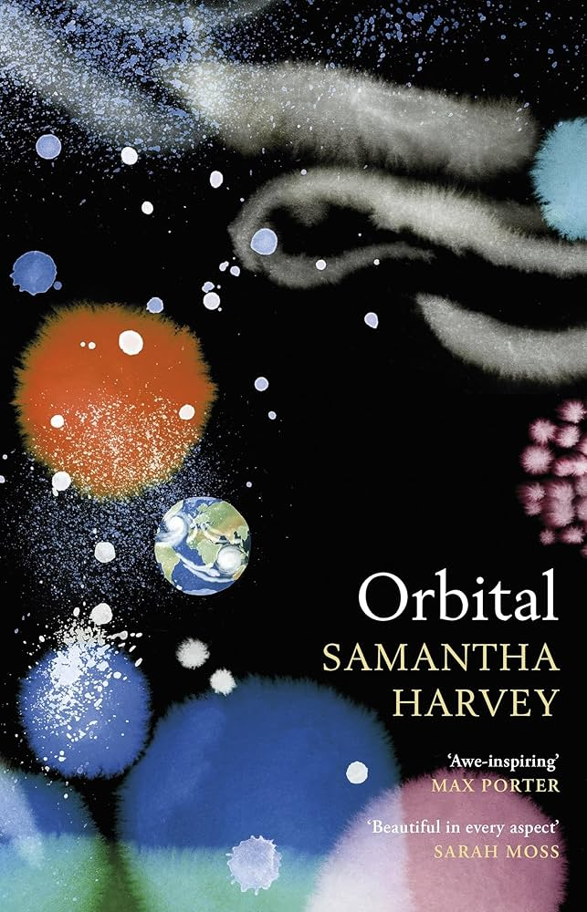

---    
date: 2025-06-02T11:53:46.267Z
title: "Orbital by Samantha Harvey"
description: "Orbital by Samantha Harvey reads like poetry, an offering unto our blue marble"
featuredimage: './cover.jpg'
tags: ["bookshelf", "fiction"]
---   

⭐ ⭐ ⭐  

Orbital by Samantha Harvey reads like poetry, an offering unto our blue marble. I had the privilege of hearing her live during Sydney's Writers Festival and she mentioned how she wanted to capture what she thought the "overview effect" would feel like - the strange phenomenon of seeing everything that ever existed, all the history, and all the future to come, contained in the glass orb suspended in nothingness. 

 

It made me think of this poem that I embarassingly read out to Samantha when I saw her

> tossed up through the clouds,
> beyond the the warmth of soil, I, 
> saw Oblivion

I really enjoyed the writing, the act of writing about the Earth with nothing much going on was an excercise in stillness.

Read sometime in May. 

---

The mind is a dayless freak zone, surfing earth's hurtling horizon. 

This photo had generated her first thought of space. 

You must never forget the price humanity pays for its moments of glory, because humanity doesn't know when to stop, it doesn't know when to call it a day, so be wary is what I mean though I saw nothing, be wary. 

They're humans with a godly view and thats a blessing and also a curse.

Speechless at the fact of her loved ones being down there on that stately and resplendent sphere, as if she's just discovered they've been living all along in the palace of a king or queen. People live there, she thinks. *I* live there. This seems improbable to her today.

The sound signature of a love-fdlooded brain, passing through the Oort Cloud, through solar systems, past hurtling meteorites, into the gravitional pull of stars that don't yet exist.

