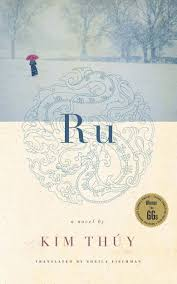

---    
date: 2024-08-20T13:12:49.317Z
title: "Ru by Kim Thúy"
description: "A review of Ru by Kim Thúy: a testament to bravery, and tenacity"
featuredimage: './cover.jpg'
tags: ["bookshelf", "fiction", "historical", "Vietnam", "war"]
---   
⭐ ⭐ ⭐ ⭐ 

Ru is a heart-wrenching tale of the aftermath of the Vietnam War, focusing on a family who were classified as bourgeois, but stripped of materially everything. It’s a story of being dehumanised, cast away from society, having to flee their home and redefine what it means to be alive. It’s a testament to bravery, and tenacity.

 

Read sometime in Malaysia. 

--- 

But there was only us, standing on a floor that was slowly sinking into the clay. After three months it tilted so severely to one side that we all had to find new positions so sleeping women and children wouldn't slip onto the plump bellies of their neighbours.

They could not understand why my family had so many coffee filters filed away in drawers lined with tissue paper. And why were they double? Was it because we always drink coffee with a friend? 
- Relating to brassiere that the military found, not knowing they were undergarments 
- To discover things completely out of the realm of possibility

We often forget about the existence of all those women who carried Vietnam on their backs while their husbands and sons carried weapons on thers.
We forget them because under their cone-shaped has they did not look up at the sky. They waited only for the sun to set on them so they could faint instead of falling asleep.
- lived experiences are distinct from history 

A Vietnamese saying has it that "Only those with long hair are afraid, for no one can pull the hair of those who have none." And so I try as much as possible to acquire only those things that don't extend beyond the limits of my body.
- I love this

Music to checkout
- the doors
- Slyvie Vartan
- Marbel Sardon

## Satisfaction and Nails 

From my father I inherited the permanent feeling of satisfaction. Where did he find it, though? Was it because he was the tenth child? Or because of the long wait for his kidnapped father's release? Before the French left Vietnam, before the Americans arrived, the Vietnamese countryside was terrorized by different factions of thugs introduced there by the French authorities to divide the country. It was common practice to sell wealthy families a nail to pay the ransom of someone who'd been kidnapped.

If the nail wasn't bought, it was hammered into an earlobe or elsewhere - on the kidnap victim.

My grandfather's nail was bought by his family.

When he came home, he sent his children to urban centres to live with cousins, thereby ensuring their safety and their access to education. Very early, my father learned how to live far away from his parents, to leave places, to love the present tense, to let go of any attachment to the past.

## Heros

The package of gold taels was returned to my parents a few days later. Subsequently, they gave it to the organizer of our sea-bound escape. All the taels were there. During this chaotic peacetime, it was the norm for hunger to replace reason, for uncertainty to usurp morality, but the reverse was rarely true. Anh Phi and his mother were the exception. They became our heroes.

To tell the truth, Anh Phi had been my hero long before he handed over the two and a half kllos of gold to my parents, because whenever I visited him, he would sit with me on his doorstep and make a candy appear from behind my ear instead of urging me to play with the other children.

My first journey on my own, without my parents, was to Texas, to see Anh Phi again and this time give him a candy. We were sitting side by side on the floor against his single bed in the university residence when I asked him why he'd given the package of gold back to my parents, when his widowed mother had to mix their rice with barley, sorghum and corn to feed him and his three brothers. Why that heroically honest deed? He told me, laughing and hitting me repeatedly with his pillow, that he wanted my parents to be able to pay for our passage because otherwise he wouldn't have a little girl to tease.

He was still a hero, a true hero, because he couldn't help being one, because he is a hero without knowing it, without wanting to be.

## A rented love
For five dollars they got a clumsily made-up girl who came for a coffee or a beer with them and roared with laughter because the man had just said the Vietnamese word urinate instead of pepper, two words differentiated only by an accent, a tone that is nearly imperceptible to the untrained ear. A single accent for a single moment of happiness.

## Love because you know death
I cried with joy as I took my two sons by the hand, but I cried as well because of the pain of that ater Vietnamese mother who witnessed her son's cxcution. An hour before his death, that boy was running across the rice paddy with the wind in his hair, to deliver messages from one man to another, from one hand to another, from one hiding place to another, to prepare for the revolution, to do his part for the resistance, but also, sometimes, to help send a simple love note on its way.
That son was running with his childhood in his Jegs. He couldn't see the very real risk of being picked up by soldiers of the enemy camp. He was sir years old, maybe seven. He couldn't read yet.

All be knew was how to hold tightly in his hands the scrap of paper he'd been given. Once he was captured, though, standing in the midst of rifles pointed at him, he no longer remembered where he was running to, or the name of the person the note was addressed to, or his precise starting point.

Panic muted him. Soldiers silenced him. His frail body collapsed on the ground and the soldiers left, chewing their gum. His mother ran across the rice paddy where traces of her son's footprints were still fresh. In spite of the sound of the bullet that had tora space open, the landscape stayed the same.

## A vaccination scar

Coming home after leaving my cousins at the University of Sherbrooke, I was approached in a gas station by a Vietnamese man who had recogized my vaccination scar. One look at that scar took him back in tine and let him see himself as a little boy walking to school along a dirty path with his slate under his arm. One look at that scar and he knew that our eyes had already seen the yellow blossoms on the branches of plum trees at the front door of every house at New Years. One look at that scar brought him back to the delicious aroma of caramelized fish with pepper, simmering in an earthen pot that sat directly on the coals. One look at that scar and our ears heard again the sound produced by the stem of a young bamboo as it sliced the air then lacerated the skin of our backsides. One look at that scar and our tropical roots, transplanted onto land covered with snow, emerged again. In one second we had seen our own ambivalence, our hybrid state: half this, half that, nothing at all and everything at once.

A single mark on the skin and our entire shared history was spread out between two gas pumps in a station by a highway exit. He had concealed his scar under a midnight blue dragon. I couldn't see it with my naked eye. He had only to run his finger over my immodestly exhibited scar, however, and take my finger in his other hand and run it over the back of his dragon and immediately we experienced a moment of complicity, of communion.

