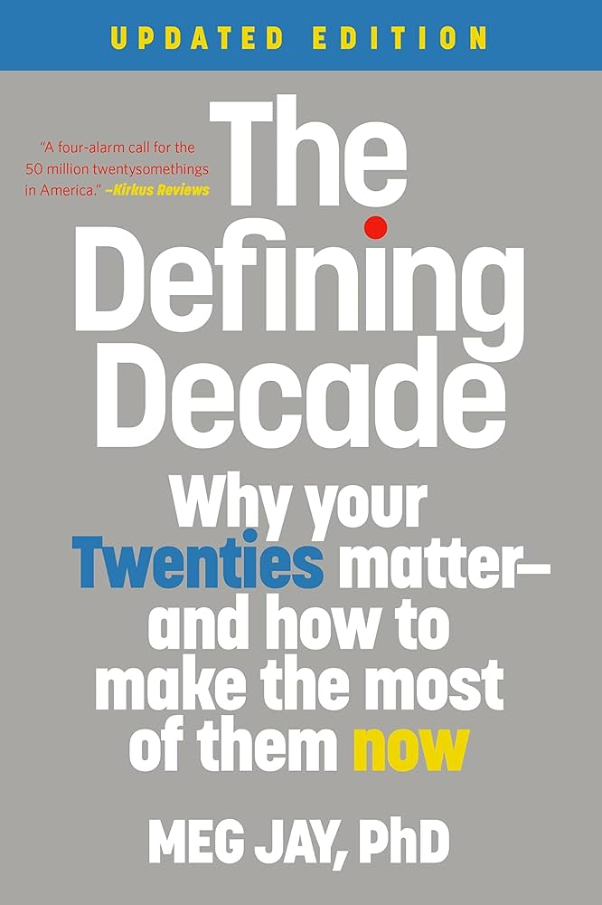

---    
date: 2025-03-01T03:20:22.602Z
title: "The Defining Decade: Why your Twenties matter - and how to make the most of them now by Meg Jay"
description: "The Defining Decade by Meg Jay is a reminder of living life intentionally, especially in the complex, and exciting era of your twenties"
tags: ["bookshelf", "non-fiction"]
featuredimage: './cover.jpg'
---   
import { Link } from 'gatsby';

⭐ ⭐ ⭐ ⭐ 

The Defining Decade by Meg Jay is a reminder of living life intentionally, especially in the complex, and exciting era of your twenties. 

 

Culturally, Meg argues that we've relegated our twenties as a time-boxed period where we should prioritise having fun with no-strings-attached, whereupon 'real life' and adulthood start in our thirties. This is coincided with even more young adults navigating underemployment - their once illustrous career aspirations contended with menial early career realities, where what they studied might not equate to what kind of work they do. It's in this context, where the phrase your thirties are your new twenties, that Meg produces a body of work which vehemently argues that's not the case.  

Instead, she paints a picture, where our twenties are our foundation for the life we envision (the critical word here), in our thirties, forties, and beyond. The book is structured into categories, such as work, love, and the brain and body which aims to give advice about these three seismic areas of our life. Envisioning, is the secret glue that binds this book together, I believe it's underlying theme is taking ownership of your life, and in doing so, conceptualising the present, and future in a way that you are both happy and proud of that dictates 'success'.

I think to reduce the definition of success to something purely financial, or material does a disservice to what the gift of life is. However, this can sometimes teeter on the edge of being content with any reality you inherit. Meg offers pragmatic advice, based on her extensive therapy work with twentysomethings over a decade. 

> 80% of life's most defining moments take place by age 35.

By roughly getting your career in order, understanding the trajectory of your life and where you are now compared to your envisioned future, you can then focus efforts in love. With love, comes the potential reality of a family, which Meg talks candidly about. Despite the statistic that people are having children older, and older, our bodies have a clock - and deferring the thought of children and marriage until we're thirty often leads to rushing through the years where you and your partner have each other exclusively. 

Overall, I think this book is catered to an audience that is in search for some structure to help navigate the feeling that you're in the middle of the ocean, perfectly able to swim, but not knowing where land is. Leaning in to hundreds of twentysomething experiences, she aims to provide a rough blueprint to having a fulfilling decade. 

Read as part of bookclub, sometime in January 2025.

---
# Notes

20s is the foundation. If you continue with the trajectory you're on where do you see yourself?

Having grown up in New York City, at age 26 and now living in Virginia, she still did not have a drivers license, despite the fact that this limited her employment opportunities and made her feel like a passenger in her own life.
- what are some skills you can use as *foundation* for a life moving forward? 

"The unexamined life is not worth living" by Socrates, contrasted with Shelden Kopp's "The unlived life is not worth examining".

Quotes by Twenty-somethings:
I feel like I'm in the middle of the ocean. Like I could swim in any direction, but I can't see land so I don't know which way to go.
- Learn to Scuba Dive (lol)

 last night, I prayed for just one thing in my life to be certain.

 Uncertainty makes people anxious, and distraction as the 21st-century opiate of the masses.

 We think that by avoiding decisions now, we keep all of our options open for later but not making choices is a choice all the same.
- Make more decisions, and take ownership of your choices and responsbilities. 

Like childhood, our twenties are a critical period where we are primed for gorwth - when simple exposure can lead to dramatic transformation.

Take ownership of your life!

# Identity Capital

Some advocate for a period of delay when youth could safely explore without risk or obligation. For some, this was college. For others, it was a personal walkabout or Wanderschaft.

Ientity capital is how we build ourselves, bit by bit, over time. 

# Weak Ties

Saying yes means you will do something new, meet someone new, and make a difference. 

Strength of weak ties - if you can lend any helping hand, DO IT!

People you are friends with are already filtered and curated to be similar enough to have a relationship with. Weak ties are precisely people, you don't necessarily need to envision friendship with, but are in each others orbit. Most life-changing forks in the road happen when you are faced with new circumstances and ideas, which weak ties can bring. 
- the coworkers we rarely talk with, neighbours we only say hello to, friends we lost touch with years ago, former employers, former professors. 

## Weakness of strong ties
Given the above, can we practise to *shift* this? With the rapport and support of strong ties.

"Betsy didn't want to be at the party any more than Cole did. She met the birthday girl in a spin class a couple years earlier and had been declined declining her Evites ever since. In an effort to meet new people, however, this time Betsy replied yes."
- Be the person who does the inviting!

Everything can change in a day. Especially if you put yourself out there. 

"He that hath once done you a kindness will be more ready to do another than he whom you yourself obliged" - Ben Franklin effect (eliciting favours & kindness generally sparks connection)

## Notes on networking
He presented himself as a serious person with a need that matched what the man had to offer. He made himself interesting. He made himself relevant. And he asked for a clearly defined and easily deliverable favor. 

# Unthought Known
When it comes to making choices, less is more. The fewer choices we have, the more likely we are to pick something. 
- Great to know for products & marketing too.

Unthought knowns are those things we know about ourselves but forget somehow. 
- Seeds already inside us. 

When we make choices, we open ourselves up to hard work and failure and heartbreak. 
- Exposure therapy: FAIL MORE.

# My life should look better on instagram
"What would an A in your twenties even mean?"

Upward social comparisons are when we compare our lvies to those who have - or seem t0 have - better ones. Sometimes this is benefical and motiviating, but usually it is detrimental and demotivating.
- Balance is key. 
- Sand shifts under our feet - these feelings come in milliseconds.

Motivation and outcome of sharing. 
- It's as if people are living for their Instagram or Snapchat stories to be seen and judged by others, not for themselves. 
- Be very explicit of why you are sharing and what you are sharing. 

# The search for glory

The tyranny of should.
- Goals feel like authentic dreams, while shoulds feel like oppresive standards. 

"No, the truth is ... I just want to go home"
- The power in regular therapy when the other person "knows" you through life stages. 
- "Just" was the important word here, because it indicates the discrepancy between how the person felt their life should be going and how they actually feel. 

Adult life is built not out of eating, praying, and loving but out of person, place, and thing: who we are with, where we live, and what we do for a living. 

I sat quietly as Talia cried for a bit. I thought about what I saw when I looked at her. I saw a young woman who had done some exploringg, worked hard, and earned some great identity capital. Now she felt she wasn't allowed to take that home. Her friends invalidated what was real, by *assuming that searching was better than finding*.

What do you want your life to look like when you're in your thirties?

Everyone wants what they don't and can't have. 

# The customised life
Distinctiveness is a fundamental part of identity. We develop a clearer sense of who we are by firming up the boundaries between ourselves and others. 
An identity or career cannot be built around what you don't want. 
- Think, <Link to="/bookshelf/greenlights">Greenlights</Link>

In business and culture, we have moved from mass production to mass customisation. 

Those who can tell a good story about who they are and what they think they want leap over those who can't. 

How does what you did before relate to what you want to do now, and how might that get you to what you want to do next? 

# An upmarket conversation

Once an early milestone of adulthood - or at least a stepping-stone toward it - marraige these days is often more of a capstone. For many, it is an undertaking that signals all else is in place. 

Careers matter and are often a precursor to love. 

After twenty-five, one's age at marriage does not predict divorce. 

Recent research shows that many young women still want men to take the lead in relationships, perhaps leaving them feeling more vulnerable than is necessary. 

"I love my boyfriend and, I can only say this to you, I want to marry him. But I feel like I'm not allowed to want that at this point in my life. So we keep taking breaks to date other people and then we end up talking all the time and getting back together. It's like neither one of us can say you're it. Like there is something wrong with that." 

"Friday and Staurday nights are all right until all the couples start getting their coats. I try to leave before that happens because it feels crappy, being one of the leftover people." 

"Dating for me in my twenties was like this musical-chairs thing. Everybody was running around and having fun. Then I hit thirty, and it was like the music stopped and everybody started sitting down. I didn't want to be the only one without a chair. Sometimes I think I married my husband because he was the cloest chair to me at thirty. Sometimes I think I Should have just waited for someone who might be a better partner, and maybe I should have, but that seemed risky. What I really wish I'd done is thought more about marriage sooner. Like when I was in my twenties."

# Picking your family
Friends can do long talks and good cries, but during holiday times or hard times everyone teamed up with family, and Emma was left standing alone.

Marriage was about bridging families. 

It meant she was now taking love as seriously as she had always taken work.

# On Dating Down

Dating apps are simply yet another place - like a bar or club or an ultimate Frisbee game or a picnic where you might come across someone new. 
- The pool increases with it, but what matters is "who you are in that moment" 

But what people say they are "looking for," often has something to do with what they think they can get - or what they think they deserve. 

The most difficult thing to cure is the patient's attempt at self-cure. Many adapt to their difficultures by putting their solutions in place. The things that once helped us feel better now get in our way. 

"A raft is a good thing to have when you're crossing a river. But when you get to the other side, put it down." 
- It's okay to move on from things. 

"The power to be desired. The power to feel special." 

Self-perceived mate value. 
- The biggest determinant of self-percieved mate value is how desired they have felt *so far*. 
- Percieved desirability is even weightier than whether we have had romantic relationships before. 

Twenties are wehn we become capable and interested in abstract thought, we start to create narratives out of these memories and firsts. We start to tell stories about who we are. 
- Excercise: Create a story about yourself. 

Things get betty only when we let new and better people in. Things get better when we let new and better people care about us or love us, or when we at least listen to  - and belive - what they have to say. 

# Cohabitation effect

Living together is not necessarily approximating married life.
- It doesn't give you these "tests" that you face throughout life.

Couples who make thoughtful and mutual decisions are more dedicated, more satisfied, and more faithful. 
- Non-passivitiy. 

It's not easy to get out of live-in relationship.

A life built on top of the "Maybe You'll Do" of cohabitation simply amy not feel as dedicated as a life built on top of the "We Do" of commitment or marriage. 
- Expectations are in-built. 

# Being in like

He imagined someone who woke up happy and headed out to the park for a run.

Chemistry is not the same thing as compatability. 

Studies have shown that couples who are like each other in areas such as socioeconomic status. education, age, ethnicity, religion, attractiveness, attitudes, values and intelligence are more likely to be satisifed with their relationships and are less likely to seek divorce. 

"Regardless of conceptions of romantic love, the 'one and only' typically lives within driving distance." 

Chat explicitly about gender roles. 

# Twenty-Nine Conversations

Similar to your story, try look forward and envision your future life.

# Forward thinking
Hairy problems depend on additional brain processing that we simply do not have until we are in our mid-twenties. 

Routine is so necessary, develop one especially with sleeping.

Was there a specific moment your frontal lobe developed? 

As work and love and the brain knit together in our twenties to make us into adults we want to be in our thirties and beyond.

# Social Experiment

Screen time is less valuable than "Real" time

Having limited screen time allows you think about who is making the effort to reach out to you, who isn't and whose emails you look forward to reading. In that sesne, it makes friendships and social media very simple. 

Balance of online and offline time, because obviously the internet can teach you and expose you to so much.

# Calm yourself

Flashbulb memories
- That's a lesson you'll never forget.
- What are yours? 

As we age, we feel less like leaves and more like trees. We have roots - and experiences - that ground us and sturdy trunks that may sway, but don't break, in the wind. The winds that blow can be more serious. But because we've weathered storms before, older adults - and even some twentysomethings who work at it - can be rooted in **the confidence that problems can be solved, or at least survived**.

# Outside In 
Wehehter we are talking about love or work, the confidence that overrides insecurity comes from experience. **There is no other way**.

A more robust confidence comes from succeeding - and from surviving some failures so the successes seem real.
- Durability.

"You can go to work and be in love at the same time, you know. In fact, it would be good for you."

# Getting along and getting ahead

Our personalities change more during the twentysomething years *than at any time before or after* 
- How do you want to change? 

Social Investment Theory
- Notion that becoming involved in the world around us is how we grow.
- Most of these moves are about making adult commitments - to bosses or partners or leases or roommates or coworkers or causes or communities - and these commitments shift how we are in this world and who we are inside.
- Involve, don't extricate yourself, plant yourself despite the fear, responsbility, DO THESE THINGS because you are meant to "connect". 

# Every Body

She taught me to not confuse feminism with not being allowed to want a family. She taught me that feminists want families too. That's how you make more feminists. 

What seemed plain to me was that I wasn't scared of lsoing my past. I was scared of losing my future. I felt like almost nothing in my life mattered up until just a few years ago. I realised all the good stuff is still to come. I was so sick and panicked that I might never see my son ride a bike, play soccer, graduate from school, get married, have his own kids. 

# Do the Math

Present bias is prioritising the rewards and consequences of the here-and-now over the rewards and consequences of the there-and-then. 
- You're only young once, have fun while you can - encourage risk taking and "now-or-never behaviours" that do't actually make use happy for the long; parting, multiple sex partners, blowing off responsbilities, being lazy, not having a real job. 

Memento Vivi - or ways to remember you are going to live. Life is going to continue on past your twenties, and that you might even want it to be great.

Being present is part of the answer, the next is looking forward. 

"Your life is not adding up."

Identify things you want in your thirties, forties, sixties - or what you don't want - that's how you live your life in real time. 

--- 

# Actionables:

Research the connection between waves of feminism & birth control. 

Watch the TV show "Friends" because of the cultural importance around it

Try things like Timeleft, and other avenues to purposefully meet new people & expand your circle.

Force yourself to expand your network. 

Read Voltaire, Mahatma Gandhi. 

Stop the glancing at phones, turning it over for no reason.

Identify things you want in your thirties, forties, sixties - or what you don't want - that's how you live your life in real time. Balance this with deep knowledge about the state of the world so you are grounded in reality.

