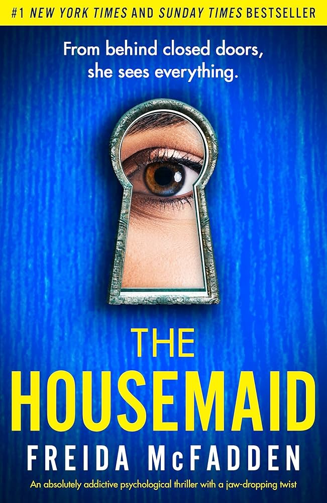

---    
date: 2024-12-30T09:29:02.255Z
title: "The Housemaid by Freida McFadden"
description: "The Housemaid was a thriller in every sense of the word"
tags: ["bookshelf", "fiction", "thriller"]
featuredimage: './cover.jpg'
---   
⭐ ⭐ ⭐ ⭐ 

 

The Housemaid was a thriller in every sense of the word. I haven’t really experienced many books like this, where the pages seemed as if they turned themselves. It felt like a movie, and was digestible enough to feel like you could read it in one sitting. There were a few completely left of centre plot twists that will shock you. 

Overall a read that wasn’t in my usual repertoire, but was definitely enjoyed. 

Read as part of book club, December 2024.
