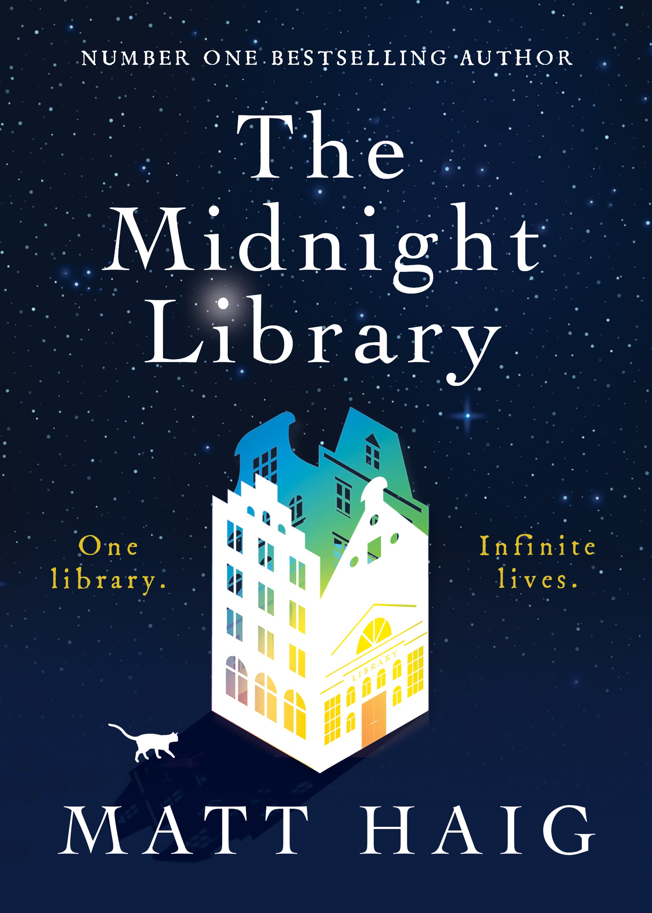

---    
date: 2024-10-01T22:20:18.003Z
title: "The Midnight Library by Matt Haig"
description: "A review of The Midnight Library by Matt Haig ⭐ ⭐ ⭐ ⭐"
featuredimage: './cover.jpg'
tags: ["bookshelf", "fiction", "wisdom"]
---   
⭐ ⭐ ⭐ ⭐

Matt Haig’s Midnight Library is a fable following the afterlife of Nora struck in between life and death in a mysterious shrouded library. It’s here she is given instructions that in this infinite room, there are infinite lives in which she can experience. Each of these lives have her in it, and are different based on the smallest decision. A multitude of universes branch out from any point your life, where you could have done something differently. 

 

Her original predicament was that she lived a life where she took every wrong turn, arriving at dead-ends, with nothing to show for it. A husk of a life, stalked by regret she came to the conclusion that it’s too painful to go on. We witness Nora confronted by a literal book of regrets, in which she believes she made the ‘wrong’ choice. 

Transported to lives where she undid these choices, she sees the possibilities of life that could have been.

It reminded me of Alan Watts, and his lecture on the dream of life. The basic premise in this, and the book, is after experiencing lifetime after lifetime, you come to the startling realisation that your treasure lies where you began. It’s an invigorating feeling to come to the realisation that life is full of possibility, since the very notion that these tangents exist, and versions of yourself can be found flourishing (as well as the inverse, suffering greatly). Armed with this knowledge, that you are a seed, able to grow in any climate, and mature into something beautiful - because to even live is a miracle - is a secret power. 

I quite enjoyed this book, it was simple enough to read whenever, and left me feeling hopeful. 

Read in September

--- 

## Humans and Complexity 
> I would think that the human brain can't handle the complexity of an open quantum wave function and so it organises or translates this complexity into something it understands.
>
> Nora had read about multiverses and knew a bit about Gestalt psychology. About how human brains take complex information about the world and simplify it, so that when a human looks at a tree it translates the intricately complex mass of leaves and branches into this thing called tree.

## Acceptance & Nature
> Nora had always had a problem accepting herself. From as far back as she could remember, shed had the sense that she wasn't enough.
>
> Her parents, who both had their own insecurities, had encouraged that idea.
>
> She imagined, now, what it would be like to accept herself completely. Every mistake she had ever made. Every mark on her body. Every dream she hadn't reached or pain she had felt. Every lust or longing she had suppressed.
>
> She imagined accepting it all. The way she accepted nature. The way she accepted a glacier or a puffin or the breach of a whale.
>
> She imagined seeing herself as just another brilliant freak of nature. Just another sentient animal, trying their best.
>
> And in doing so, she imagined what it was like to be free.

## No easy paths

> But maybe there are no easy paths. There are just paths. In one life, I might be married. In another, I might be working in a shop. I might have said yes to this cute guy who asked me out for a coffee. In another I might be researching glaciers in the Arctic Circle. In another, I might be an Olympic swimming champion. Who knows? Every second of every day we are entering a new universe. And we spend so much time wishing our lives were different, comparing ourselves to other people and to other versions of ourselves, when really most lives contain degrees of good and degrees of bad?
>
> I mean, it would have made things a lot easier if we understood there was no way of living that can immunise you against sadness.
>
> And that sadness is intrinsically part of the fabric of happiness.
>
> You can't have one without the other. Of course, they come in different degrees and quantities. But there is no life where you can be in a state of sheer happiness for ever. And imagining there is just breeds more unhappiness in the life you're in.

## Love
> You could eat in the finest restaurants, you could partake in every sensual pleasure, you could sing on stage in São Paulo to twenty thousand people, you could soak up whole thunderstorms of applause, you could travel to the ends of the Earth, you could be followed by millions on the internet, you could win Olympic medals, but this was all meaningless without love.

## Impossible to live without hurting people
>'It seems impossible to live without hurting people?'
>
> 'That's because it is?'
>
> 'So why live at all?'
>
> 'Well, in fairness, dying hurts people too. Now, what life do you want to choose next?'

## Importance of small things
> Never underestimate the big importance of small things, Mrs Elm said. 'You must always remember that'.

# A thing I have learned
## Written by a nobody who has been everybody
It is easy to mourn the lives we aren’t living in. Easy to wish we would develop other talents, said yes to different offers. Easy to wish we would work harder, loved better, handled our finances more astutely, been more popular, stayed in the band, gone to Australia, said yes to the coffee or done more bloody yoga.

It takes no effort to miss the friends we didn’t make and the work we didn’t do and the people we didn’t marry and the children we didn’t have. It is not difficult to see yourself through the lens of other people and to wish you were all the different kaleidoscopic versions of you they wanted you to be. It is easy to regret and keep regretting, ad infinitude until our time runs out.

But it is not the lives we regret not living that are the real problem. It is regret itself. It’s the regret that makes us shrivel and wither and feel like our own and other peoples worst enemy. We. can't tell if any of those other versions would have been better or worse. Those lives are happening, it is true, but you are happening as well, and that is the happening we have to focus on.

Of course, we can't visit every place or meet every person or do every job, yet most of what we would feel in any life is still available. We don't have to p.lay every game to know what winning feels like. We don't have to hear every piece of music in the world to understand music. We don't have to have tried every variety of grape from every vineyard to know the pleasure of wine. Love and laughter and fear and pain are universal currencies.

We just have to close our eyes and savour the taste of the drink in front of us and listen to the song as it plays. We are as completely and utterly alive as we are in any other life and have access to the same emotional spectrum. We only need to be one person. We only need to feel one existence. We don~t have to do everything in order to be everything, because we are already infinite. While we are alive we always contain a future of multifarious possibility.

So let~s be kind to the people in our own existence. Let’s occasionally look up from the spot in which we are because, wherever we happen to be standing, the sky above goes on forever. Yesterday I knew I had no future, and that is was impossible for me to accept my life as it is now. And yet today, that same messy life seems full of hope. Potential.

The impossible, I suppose, happens via living. Will, my life be miraculously free from pain, despair, grief, heartbreak, hardship, loneliness, depress. No. But do I want to live? Yes. A thousand times. Yes.
