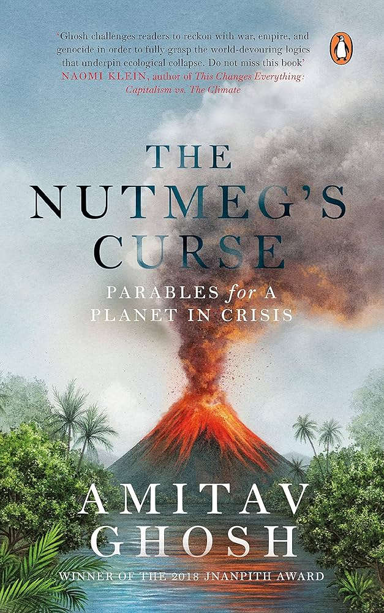

---    
date: 2025-07-27T15:14:43.080Z
title: "The Nutmegs Curse by Amitav Ghosh"
description: "Parables for a Planet in Crisis"
featuredimage: './cover.jpg'
tags: ["bookshelf", "non-fiction", "favourites", "cerebral", "capitalism", "colonialism"]
---   
⭐ ⭐ ⭐ ⭐ ⭐

A lamp drops to the ground in 1621 in the Banda Islands situated in Indonesia, and with it triggers a massacre of the Bandanese, after which the Dutch secured a monopoly over the global nutmeg trade. The rest which follows is history. 

 

The Nutmegs Curse by Amitav Ghosh is a head-spinning, dizzyingly addictive, world-expanding account of our planet in crisis. When I read this, it felt like I had discovered something forbidden, the sun rose to a new day but everything felt different. The worst part about learning something, is you can’t put the genie back into the bottle. 

# Colonialism as the Root of Climate Crisis
Ghosh presents a systematic and comprehensive reframing of the climate crisis gripping our planet, by digging into the roots of where it began. Traditionally, the understanding is it all started with the Industrial Revolution in the 18th century, when the movement towards mass manufacturing and factories sparked a vague resemblance to our modern consumerism. Ghosh however, disagrees, and traces it back further to the onset of European colonialism in the 15-17th centuries, arguing that the crisis we face is fundamentally rooted in centuries of geopolitical hegemony, all of which established the patterns of violence, extraction and de-identification of human with nature that we see today.

# Indigenous Animism and Vitalism

The massacre of the Bandanese was predicated on a new world view, where ‘terraforming’ was apparent in its nascency. The violent restructuring of landscapes, ecosystems and human-nature relationships served as the backbone for this change, moving us from something called vitalism towards mechanistic, and scientific modernity. 

Ghosh advocates for a return to the often Indigenous world views of vitalism & animism - both of which interpret the Earth and it’s variety of life-forms as alive and capable of agency. Concretely, this looks like acknowledging mountains, rivers, trees, and even spices like Nutmeg as active participants in history with their own agency, instead of inert and lifeless. It also means recognising the interconnection of all beings. Indigenous communities have understood this and imbued landscapes, animals, and plants with the same spiritual importance as humans in their stories and songs for millennia. 

# The Western Mechanistic Worldview Critique
The scientific naming system developed by the West displayed a cunning trick. By interchanging the unique nomenclature of “Nutmeg” with “Myristica fragrans”, we see a transmutation of something that has history and meaning to something that feels like a "vast machine made of interchangeable parts" that exists solely for human exploitation. Doing this, everything alive on the planet becomes stripped of its voice and meaning and instead becomes another pair of latin syllables. The most devastating repercussion of this is the false human & nature dichotomy that is so prevalent in our world today.

"Only once we imagined the world as dead could we dedicate ourselves to making it so”

# How This Differs from Conventional Climate Discourse beyond Techno-Solutionism

Contemporary discourse in both the media and politics tend to focus on technological solutions for climate change such as carbon capture, renewables and geoengineering. By accommodating the crisis into the framework of capitalism we see things like carbon trading and green growth with a hope that everything will be okay. 

Ghosh categorically rejects this "techno-solutionist" approach, arguing it perfectly represents the mechanistic thinking that created the crisis. 

# Climate change as a matter of justice

Since the conventional dialogue frames climate change as something that is happening in the future, Ghosh presents it as a matter of justice rooted in the histories of race, class and geopolitics. 

Those least responsible for emissions, primarily Black, Brown and Indigenous communities are bearing and will continue to bear the greatest burden. 

Since most Western nations built their wealth through centuries of extractive colonialism which facilitated their industrial upheavals, the world stage must acknowledge this debt. 

Furthermore, the main argument here is the power structures that exist globally now, exist in a way that cement fossil fuel dependence, and that must be confronted.

# The Military-Industrial Complex Omission

One of the most fascinating things I got from this book was Ghosh’s extensive analysis of the military-industrial complex's role in perpetuating the climate crisis. With resource after resource, Ghosh emphatically describes that the U.S. military is the world's largest institutional carbon emitter (my jaw dropped reading how much fuel a fighter jet consumes).

The most mind blowing thing was how fossil fuels and miltarism are structurally linked with the petrodollar system - whereby the buying of oil must be transacted in US dollars (often with the real threat of violence if this isn’t adhered).

This means there is a real incentive for the US to ensure fossil fuels are still in use, because it reinforces the superiority of the US dollar. 

# The Limitations of Scientific Rationalism

Another very interesting take I got from this book was how there is an epistemic hierarchy in science which reflects colonial power relations. The fact that a fisherman from the drowning nation of Kiribati is not valued in the same playing field as a climate professor from an accredited US university displays an intrinsic bias and appetite for Western rationalism as the only voice. However, to solve this crisis we need to extend our nature of knowledge to include everyone, especially vulnerable communities closest to the problems being faced. 

# The Path Forward

A central tenet of this book is mapping out the path for the future. Ghosh underlines that a fundamental transformation of economic relations is required, to sidestep the extractive economy and rampant consumerism that fuels endless growth. Another is the deconolosiation of knowledge systems, by integrating and centring Indigenous ways of understanding human-Earth relationships. Both of these lay the groundwork for a spiritual shift, recognising the interdependence of all life forms.

A beautiful takeaway I got from this book was the call to action for storytellers, artists, and cultural workers in facilitating that necessary consciousness shift. 

# Conclusion

The Nutmeg's Curse was grand, zooming into the narrative of the lamp which fell in 1621, triggering a centuries in the making climate catastrophe which we are now in the midst of. 

Delving into the deep historical, spiritual and systemic roots of our planetary crisis, we’re guided into a world view that once you gain the sensitivity for, it never leaves. 

## Notes
###  The Origins of Colonial Violence and Its Justifications
Summary: European colonialism was not merely opportunistic expansion but was undergirded by systematic ideological justifications that rendered mass violence acceptable. Religious doctrine, particularly through figures like Sir Francis Bacon, provided a theological and philosophical framework that granted Europeans a "god-given" right to exterminate peoples deemed "degenerate" or contrary to natural law. This violence became normalized, commercialized, and celebrated.

"The elders were taken into custody and orders were given for the construction of a circular enclosure, with bamboo stakes, a little way beyond the grim stone walls of Fort Nassau, on Banda Naira. On May 8, 1621, forty-four elders were led into this enclosure with their hands tied.21 Eight of them "who were the most guilty according to the judges" were placed apart, while "like a flock of sheep."
- Do not walk wilfully into the slaughter house

"The normalizing of the killing of noncombatants was taken a step further when English colonies began to offer bounties for the scalps of Indian men, women, and children. Not only did their embrace of scalp-hunting serve to commercialize war; it also legitimized the killing of noncombatants. The practice thus became "a permanent feature of both the colonial frontier economy and Americans' way of war."
- disgusting

European's "god-given" right to attack and extinguish people (evidenced by Sir Francis Bacon)
"If the victors assumed that they had the right to formally extinguish a tribe, it was because European doctrines of empire had indeed evolved in that direction. These doctrines found their fullest articulation in the work of the philosopher, polemicist, and Lord Chancellor of England, Sir Francis Bacon. In his An Advertisement Touching an Holy War, which was written around the time of the Banda massacre and published shortly before the Pequot War, Bacon lays out in some detail the reasons why it was lawful, in his view, for Christian Europeans to end the existence of certain groups: "For like as there are particular persons outlawed and proscribed by civil laws of several countries; so are there nations that are outlawed and proscribed by the law of nature and nations, or by the immediate commandment of God." These wayward countries, Bacon argues, are not nations at all, but rather "routs and shoals of people, as have utterly degenerated from the laws of nature."

"This argument effectively conferred on Christian Europeans a God-given right to attack and extinguish peoples who appeared errant or monstrous in their eyes. It is in this "crucial thought," argue Peter Linebaugh and Marcus Rediker, that "genocide and divinity cross. Bacon's advertisement for a holy war was thus a call for several types of genocide, which found its sanction in biblical and classical antiquity."

Beware of this intersection of religion and escalation into justified violence and war
"Bacon's reasoning may appear archaic, but it continues to animate the workings of empire to this day. In essence he was making the argument that a well-governed country ("any nation that is civil and policed") has an absolute right to invade countries that are "degenerate" or in violation of the "laws of nature and nations." This is, of course, the fundamental doctrine of "liberal interventionism," and it has been invoked many times in recent decades to justify "wars of choice" launched by Western powers.

Except now "god is dead", the basis of this moral right to justify violence is sourced elsewhere
"The first to be butchered were the eight elders who had been singled out as the ringleaders of the conspiracy. They were beheaded and then quartered. None of them resisted, although one elder, perhaps Callenbacker, was heard to say, in Dutch: "Sirs, have you no mercy then?"
No mercy was shown: the remaining thirty-six elders were also beheaded and quartered. The severed heads and dismembered body parts were impaled on stakes."

It's a very dangerous slope, when you forget the brother/sisterhood of man - the link we all share: once that disappears cognitive dissonance gives rise to treating other humans like cattle...
"Men like Jan Coen, John Mason, John Underhill, Jeffrey Amherst, and King Leopold II of Belgium did not die forgotten in miserable huts in the jungle; they were richly rewarded, and their names were commemorated in roads, parks, poems, and history books. John Mason, who massacred the Pequot, would be remembered in Connecticut as one of "the Instrumental Saviours of this Country in the most critical Conjunctures . . . the present and future Generations will for ever be obliged to revere their Memory."
- every monument is steeped with historical violence - theres always multiple sides.

"The idea of extermination," as Lindqvist himself emphasizes, "lies no farther from the heart of humanism than Buchenwald lies from the Goethehaus in Weimar. That insight has been almost completely repressed, even by the Germans, who have been made sole scapegoats for ideas of extermination that are actually a common European heritage."

###  Methods of Colonial Destruction: Disease, Biowarfare, and Structural Violence
Summary: European colonization employed multiple vectors of destruction beyond direct violence, including the strategic use of disease as a weapon and the creation of structural conditions that made Indigenous populations more vulnerable to epidemic illness. These methods were understood and deliberately deployed by colonizers.

"Great Dying" of Indigenous peoples during colonisation of Americas

"Why then did Native Americans succumb in such vastly disproportionate numbers? Quite possibly it was because their susceptibility to disease was greatly increased by the multiple kinds of structural violence that accompanied European colonization, such as: "overwork in mines, frequent outright butchery, malnutrition and starvation resulting from the breakdown of Indigenous trade networks, subsistence food production and loss of land, loss of will to live or reproduce (and thus suicide, abortion and infanticide)."32 " When faced with similarly stressful conditions, White settlers also fell prey to disease in large numbers, as happened in Jamestown, Virginia, in 1607"

Rethinking diseases as a combo with stressors that prove to be more fatal.

"As for European settlers, there is plenty of evidence to show that they knew very well that pathogens were their most effective allies. On June 24, 1763, in the thick of the Indian uprising known as Pontiac's Rebellion, two Lenape emissaries were in Fort Pitt, Pennsylvania, for a parlay. When it came time for them to leave they were given some parting gifts that had been issued and signed for by the fort's commanding officer. Later, a British trader called William Trent would note in his journal, "We gave them two Blankets and an Handkerchief out of the Small Pox Hospital. I hope it will have the desired effect." And so it did: an epidemic broke out in Ohio, coinciding "closely with the distribution of infected articles by individuals at Fort Pitt."
- Biowarfare has been understood for a long time

###  Language, Naming, and the Control of Meaning
Summary: Colonial power operated through language itself—through renaming places, redefining concepts like "massacre," and controlling who could make meaning. The power to name was among the greatest privileges of empire, creating new realities while erasing Indigenous ones.

"Massacre," in this sense, referred to White, Christian martyrdom; it was not used for mass killings in which Europeans slaughtered others, as was then happening across the Americas and elsewhere. Although several English traders knew, and disapproved, of the Banda killings of 1621, they did not describe that indiscriminate slaughter as a "massacre." Yet, two years later, they were quick to apply the word to the judicial execution of Englishmen at Amboyna."
- the inequality of language —> so important to use the right words... "In such acts of renaming, the adjective "New" comes to be invested with an extraordinary semantic and symbolic violence. Not only does it create a tabula rasa, erasing the past (of its prior meanings), but it also invests a place with meanings derived from faraway places, "our dear native country."
- WOAH

Names as power
"NAMES," WRITES THE Native American botanist Robin Wall Kimmerer, "are the way we humans build relationships, not only with each other but with the living world."18 The power to name, or rather rename, was thus one of the greatest privileges of empire, because it created the scaffolding of what is now the dominant mode of relating to the living world."

Example of giving stories to the world again
- "When I look at a pala lying in my palm and think of it as a jâyaphal, it is no great stretch to think of it as a tiny planet, or as a maker of history, or as something that hides within itself a vitality that endows it with the power to bless or curse. This possibility is not foreclosed even when I think of it as a "nutmeg" or nootmuskat. It is only when I think of it as Myristica fragrans Houtt. that those thoughts evaporate and the nut becomes subdued and muted—reduced, as was intended by the Linnaean system, to the status of an inert resource. To think of it then as anything but a commodity seems childlike and fantastical, almost savage."

###  Terraforming: The Systematic Transformation of Landscapes
Summary: Colonialism involved the violent remaking of entire environments—"terraforming"—that destroyed Indigenous ways of life by making their traditional activities impossible. This process continues today in places like the Amazon, following the same destructive patterns established centuries ago.

Sacrifice Zones existing which play into economic and racial disparities. Certain areas that are deemed acceptable to deal with health repercussions... 

The VOC (Vereenigde Oostindische Compagnie) launched a campaign to exterminate trees producing Nutmeg on over 1000 islands in the Banda region:
"In 1686 a Dutch governor, writing from Ternate, struggled to explain to his superiors in Amsterdam what he was up against:
Your Lordships would find it difficult to comprehend how many [spice trees] there are on most of the islands in this area. If we truly intend to uproot these trees, we must do it with hundreds of men divided into groups and spread out through the forests. For this we must have people who have the desire and inclination to carry out the work since the forests are so thick that a man can barely raise his head. Moreover, they are often full of thorns and bushes which tear to shreds whatever a man is wearing and damage his legs, hands, and face. . . . "The places are many, and the uprooting [of spice trees] appears to be nearly an impossible task. It is the most difficult and exhausting work that one can imagine. Sometimes [the spice trees] are so inaccessible that one must push up the [thorny] rattan vines in order to get to them. There is also the danger of breaking a leg. Sometimes the spice trees are surrounded by so many other trees and bushes that one cannot see them. . . . Over half come back sick or incapacitated from these expeditions."
- Can't believe this actually happened in history - imagine dying or becoming disabled because of this.

"From the day when a European settlement rises in the neighborhood of territory occupied by the Indians, the wild game takes fright . . . the moment the endless noises of European industrial activity are heard in any place, the animals begin to flee. . . . A few European families, by settling in widely separated locations, finally drive away the wild animals from all the intervening land for ever. The Indians who had lived there up to that time in some sort of abundance find it difficult to survive and more difficult still to acquire the necessary articles of barter. Driving away their game is the equivalent of turning our farmers' fields into barren wastes. Soon they lose, almost entirely, the means of subsistence. Then these doomed people are seen roaming like hungry wolves through their deserted forests.20"
- Example of "terraforming" - adapting an environment such that its previous activities could not be accomplished

Previously Terraforming of New England (America), seen now in Amazon.
"Conflicts over cattle have remained to this day a constant feature of the terraforming of the Americas. One of the main reasons why the deforestation of the Amazon is still accelerating is that settlers—and giant agribusiness corporations—are pushing to expand cattle farming in Brazil. Now, as in seventeenth-century New England, this requires large-scale deforestation and the creation of pasturage; now, as then, this entails the destruction of Indigenous life-worlds.
In a 1983 meeting of some Indigenous Amazonian groups, the activist and writer Ailton Krenak spoke in a vein that was strikingly similar to Miantonomi's: "We need to speak together against those who want to take over our land. Otherwise we will disappear, like our ancestors before us. . . . These fazendeiros (squatter farmers) want to chase us off the land where our ancestors lived by claiming that it belongs to them now! We are surrounded by their barbed wire and their cattle."...

###  Contrasting Worldviews: Indigenous Animism vs. Colonial Mechanicism
Summary: The fundamental difference between Indigenous and colonial worldviews lies in their understanding of the natural world. Indigenous cosmologies recognize the Earth and all beings as alive, ensouled, and meaningful, while colonial thinking reduces nature to inert matter suitable for exploitation.

"On one side of the world were people whose relationship with the living world was shaped by Skywoman, who created a garden for all. On the other side was another woman with a garden and a tree. But for tasting its fruit, she was banished from the garden. . . . That mother of men was made to wander in the wilderness and earn her bread by the sweat of her brow, not by filling her mouth with the sweet juicy fruits that bend the branches low. In order to eat, she was instructed to subdue the wilderness into which she was cast."

Stories of the world definitely impact the way we perceive and treat it - its a difference in world ideology.

"In any event it is increasingly clear that the Earth can, and does, act, except that its actions unfold over scales of time that shrink the four-hundred-year gap between 1621 and 2021 to a mere instant, like that which separates the slipping of a boulder on a mountain slope from the landslide that follows. From that perspective the climatic changes of our era are nothing other than the Earth's response to four centuries of terraforming, during which time the project, in its neoliberal guise, has come to be universally adopted by global elites.

These developments are making it ever more evident that many "savage" and "brutish" people understood something about landscapes and the Earth that their conquerors did not. This, perhaps, is why even hardheaded, empirically minded foresters, water experts, and landscape engineers have begun to advocate policies that are based on Indigenous understandings of ecosystems. Experts even have a name, and an acronym, for this now—"Traditional Ecological Knowledge" (TEK).21 Yet the very name is suggestive of a fundamental misunderstanding: it assumes that Indigenous understandings are usable "knowledge" rather than an awareness created and sustained by songs and stories.
You cannot relate to Gunung Api as the Bandanese did unless you know that your volcano is capable of producing meanings; you cannot relate to Dinétah as the Diné did unless the Glittering World glitters for you too.

The planet will never come alive for you unless your songs and stories give life to all the beings, seen and unseen, that inhabit a living Earth—Gaia."

The main premise of the text here as a call to action

"Scientists have determined that Budj Bim last erupted about 30,000 years ago, so this would be the event witnessed by the ancestors of the Gunditjmara.4 That would make this the oldest story to be passed down to modern times, superseding Indigenous Australian myths about sea level rise, which are thought to reflect events that occurred 7,000 years ago. Those were once believed to be humanity's oldest extant stories; the story of Budj Bim, if the dating is correct, would be many times older.5 Yet, even from that distant past, the magic of the volcano has continued to touch upon the lives of the Gunditjmara: the story of Budj Bim, passed down over thousands of generations, played a major part in this community's reclamation of some of their ancestral lands in 2007.6"
- one of the oldest stories told

Aboriginal tales are some of the oldest on Earth and reflect a keen knowledge of nature.
"This is a way of thinking about the past in which space and time echo each other, and it is by no means particular to the Bandanese. Indeed, this form of thought may well have found its fullest elaboration on the other side of the planet, among the Indigenous peoples of North America, whose spiritual lives and understanding of history were always tied to specific landscapes. In the words of the great Native American thinker Vine Deloria Jr., a shared feature of Indigenous North American spiritual traditions is that they all "have a sacred center at a particular place, be it a river, a mountain, a plateau, valley, or other natural feature. . . . Regardless of what subsequently happens to the people, the sacred lands remain as permanent fixtures in their cultural or religious understanding."

"Developing this argument, Deloria contrasts modes of thought that take their orientation from terrestrial spaces with those that privilege time. For the latter, the crucial question in relation to any event is "when did it happen?" For the former, it is "where did it happen?"
- when vs where & spiritual centres

"For the Diné, on the other hand, every feature of the landscape was imbued with meaning. The nineteenth-century Diné leader Barboncito once explained his people's attachment to their land with these words: "When the Navajo were first created, four mountains and rivers were pointed out to us, inside of which we should live, that was to be our country, and was given us by the first woman of the Navajo tribe."4 These stories, and the landmarks to which they are tied, serve as a kind of scripture for the Navajo: mountains are their cathedrals; their outcrops and arroyos are the equivalent of stained-glass windows."

example of 4 corners where four states meet: Arizona, Colorado, New Mexico, and Utah - a place with no physical meaning - compared to the Glittering World of the Diné.

"That landscapes are alive has been reiterated again and again, throughout Native American history.9 In 1855, for instance, an Indian chief, a leader of the Cayuse of what is now Oregon, refused to sign a treaty because he felt that it excluded the voice of the Earth: "I wonder if the ground has anything to say?" he asked. "I wonder if the ground is listening to what is said?"10
For him, as for the Bandanese, the Earth could and did speak."

"or Jan Coen and the VOC, on the other hand, the trees, volcanoes, and landscapes of the Bandas had no meaning except as resources that could be harnessed to generate profit.17 This outlook reflected a metaphysic that was then emerging in Europe, in which matter was seen as "brute" and "stupid" and hence deserving of conquest "with the most destructive of technologies with nothing but profit and material wealth as ends. . . ."18 For Coen and his ilk the trees that were woven into the songs and memories of the Bandanese contained nothing beyond their utility; as for the idea that a volcano could make meaning, that would have been, for them, merely "superstition," or even "idolatry." Nor, in the eyes of Dutch colonists, was there any intrinsic connection between the Bandanese and the landscape they inhabited—they could simply be replaced by workers and managers who would transform the islands into a nutmeg-producing factory."

the shift from "Land" to "land", one where respect of the world and the multifaceted reality devolves to the material of science - the barbaric language of conquering the inconquerable.

### The Systematic Muting of Nonhuman Agency
Summary: Central to colonial and modern worldviews is the systematic silencing of nonhuman voices and agency. This "muting" was essential to economic extraction because it rendered nature as mere resource rather than as beings with their own rights and meanings.
"In the stories they tell, entities that lack language figure only as backdrops against which human dramas are enacted. Nutmegs, cloves, and volcanoes may figure in these stories, but they cannot themselves be actors in the stories that historians tell; nor can they tell stories of their own."
- stripping the natural world of its voice gives history a stage where only humans are the actors. When in fact, things are so inter-linked.

"Those elite orthodoxies, in turn, were the product not just of the subjugation of human "brutes and savages," but also of an entire range of nonhuman beings—trees, animals, and landscapes. Indeed, "subdue" was a key word in these conquests, recurring again and again in reference not just to human beings but also to the terrain. Out of these processes of subduing and muting was born the idea of "Nature" as an inert entity, a conception that would in time become a basic tenet of what might be called "official modernity."27 This metaphysic, fundamentally an ideology of conquest, would eventually become hegemonic in the West, and is now shared by the entire global elite: within its parameters the idea that a volcano can produce meaning, or that the nutmeg can be a protagonist in history, can never be anything other than a delusion or a "primitive superstition."

To envisage the world in this way was a crucial step toward making an inert Nature a reality. As Ben Ehrenreich observes: "Only once we imagined the world as dead could we dedicate ourselves to making it so."
- Central tenet here - stripping meaning from Nature was systematic - so that it could be subdued.

"history." To this day American departments of history devote just 17 percent of their research to regions outside Europe and North America.

"... "As a process, then, the muting of a large part of humanity by European colonizers cannot be separated from the simultaneous muting of "Nature." Colonization was thus not merely a process of establishing dominion over human beings; it was also a process of subjugating, and reducing to muteness, an entire universe of beings that was once thought of as having agency, powers of communication, and the ability to make meaning—animals, trees, volcanoes, nutmegs. These mutings were essential to processes of economic extraction—because, as the philosopher Akeel Bilgrami observes, in order to see something as a mere resource, "we first need to see it as brute, as something that makes no normative demands of practical and moral engagement with us."
- voices turned off
- Strip stories, history voice till inert then consume.

But for some reason science doesn't allow it.
"Yet, even the most sensitive of scientists are prevented, by the conventions of their disciplines, from seeing their objects of study as protagonists in their own right, fully capable of generating forms of narrative and meaning. And in the absence of meaning it sometimes becomes impossible, even for those who are so inclined, to imagine a productive relationship between humans and the world around them."
- The unbridgeable gap

###  Animism, Vitalism, and the Taboo of Modernity
Summary: Modern Western thought has constructed vitalism and animism—the belief that nonhumans have souls or agency—as the ultimate taboo, associated with "savagery" and "primitiveness." Yet this worldview is essential for understanding human-Earth relationships and addressing planetary crisis.

##### Animism / Vitalism
"Lovelock, for his part, probably expected this reaction: in a short essay called "What Is Gaia?" he makes it clear that the name was intended as a provocation.
Long ago the Greeks . . . gave to the Earth the name Gaia or, for short, Ge. In those days science and theology were one and science, although less precise, had soul. As time passed this warm relationship faded and was replaced by the frigidity of schoolmen. The life sciences, no longer concerned with life, fell to classifying dead things and even to vivisection. . . . Now at least there are signs of a change. Science becomes holistic again and rediscovers soul, and theology, moved by ecumenical forces, begins to realize that Gaia is not to be subdivided for academic convenience and that Ge is much more than a prefix.

But Lovelock's provocation was not intended only for the scientific community: by calling for the rediscovery of "soul" (anima in Latin) in material objects and earthly forces he was conjuring up the specter of "vitalism," or even "animism"—the belief that humans are not the only ensouled beings.2 And to do this is to violate one of the most powerful taboos of official modernity."

#### Why was animism inverted?

"As the ideologies of modernity were rising to dominance, the war against vitalism would go hand in hand with the expansion of European projects of colonialism and conquest. An essential element of these projects was the idea that only "savages" and "primitives" believe that the Earth—or earthly entities like forests and volcanoes—have qualities that elude human perception. To be "civilized" was to accept that the Earth is inert and machine-like, and that no aspect of it, in principle, can elude human knowledge. A defining characteristic of "savagery," on the other hand, was the "belief in the vitality of natural and celestial objects."5"
- link to degrowth book

"humanity as being so closely entangled with the products of the Earth that the past cannot be remembered without them."

"The peculiar nature of opium's enmeshment with human life shows that it possesses a power that exceeds its materiality: that it can enter history and have effects upon the world in ways that are not determined by human beings. "Uncanny" is the only word that comes close to describing the inexplicable aspects of the poppy's enmeshment with human life. These enmeshments cannot be accounted for either through the language of resources or by the chemical properties of the flower that goes by the scientific name of Papaver somniferum."

###  The Foundations of Racial Capitalism
Summary: Capitalism emerged not as an abstract economic system but through the concrete historical processes of slavery, colonial conquest, and racial exploitation. Understanding this foundation reveals why contemporary economic and climate inequities reproduce colonial patterns.

##### Racial Capitalism
" "From whatever vantage point one chooses," writes Robinson, "the relationship between slave labor, the slave trade, and the weaving of the early capitalist economies is apparent. Whatever were the alternatives, the point remains: historically, slavery was a critical foundation for capitalism."

"The evisceration of these assumptions is one of the most important achievements of what Cedric J. Robinson identified as the Black Radical Tradition. Starting with W. E. B. Du Bois, the thinkers of this tradition have repeatedly shown that colonial conquest, slavery, and race were essential to the emergence of capitalism as a system. As Robinson saw it, the mass enslavement of Amerindians and Africans that started in the sixteenth century was actually an amplification of the preexisting practices of states like Venice, Genoa, Portugal, and England, which had long traded in slaves from the peripheries of Europe—Ireland, eastern Europe, the Caucasus, the Slavic lands, and so on. With the conquest of the Americas those patterns of enslavement mutated into far larger, more complex, and more brutal systems, engulfing principally Amerindians and Africans: it was their labor, forcibly extracted within the confines of mines and plantations, that produced the precious metals and commodities—sugar, alcohol, tobacco, cotton, and so on—that made the emergence of capitalism possible in the eighteenth and nineteenth centuries."
- borrowing free labour for 200+ years and then suddenly staying we built it from scratch - > catpialsim now, foundations, brutal and bloody.

##### Why do we not talk about geopolitical contexts when talking about capitalism?
"Why then does capitalism so often come to be abstracted from its wider geopolitical contexts? Cedric Robinson suggests, obliquely, that "the preoccupation of Western radicalism with capitalism as a system" is a way of avoiding the real "nastiness." The implication, I think, is that Western intellectual and academic discourse is so configured that it is easier to talk about abstract economic systems than it is to address racism, imperialism, and the structures of organized violence that sustain global hierarchies of power.2"

"The monetary returns on spices were astronomical, amounting on occasion to more than 400 percent of the initial investment on a voyage.32 Profits like these helped to underwrite the remarkable flourishing of the arts that occurred in Holland in the seventeenth century, a period that came to be known as the Dutch Golden Age. "

The curios case of expropriating ancient art and culture rooted in connection to the world, to the "fine arts"

"The vital connection between war and trade was of course perfectly well understood by early empire builders like Jan Coen. Not till the eighteenth century did this connection come to be obscured by a liberal myth in which war and conquest were seen as aberrations that had nothing to do with what we now call the economy. In fact, as the historian Priya Satia notes: "Violence committed abroad, in service of imperial expansion, was central to the making of capitalist modernity."21 The forever wars of today show that not much has changed."
- war was the way it all happened

### Fossil Fuels, Energy, and the Architecture of Power
Summary: The choice of fossil fuels over alternative energy sources was not determined by efficiency but by social control and power relations. Coal, then oil, were selected because they enabled greater extraction of surplus value from workers and freed capital from local constraints.

"That modernity established a directly transitive relationship between economic growth and fossil fuels is often acknowledged. What tends to pass unremarked is that exactly the same equation holds true for fossil fuels in relation to war-making.1 In other words, a country's ability to project military force is directly connected to the size of its carbon footprint—and this has been true since the early nineteenth century."... The knowledge that the worst of climate change will be brunt by black and brown people may have had the opposite effect in terms of galvanising support, since affluent people thought this can be ignored.

#### Coal Mills vs Water Mills
"The reason why coal-powered mills began to edge out their water-powered competitors in the early nineteenth century was not that coal was cheaper or more efficient. Water-powered mills were just as productive, and far cheaper to operate than coal-fired mills. It was for social rather than technical reasons that steam-powered machines prevailed: because, for example, coal-mills allowed mill owners to locate their factories in densely crowded cities, where cheap labor was easily available. "The [steam] engine," writes Malm, "was a superior medium for extracting surplus wealth from the working class, because, unlike the waterwheel, it could be put virtually anywhere."4"
Social reasons predicated why coal was chosen as an energy source.

#### Oil vs Coal - why it is used as an energy source - reinforcing structures of POWER
"THE MATERIAL CHARACTERISTICS of oil make it even more potent than coal in its ability to reinforce structures of power. For the ruling classes, coal had one great drawback, which was that it had to be extracted by large numbers of miners, working in conditions that ensured their radicalization; this was why miners were at the forefront of the world's labor movements through the late nineteenth and early twentieth centuries. As Timothy Mitchell has shown, this was one of the reasons why Anglo-American elites decided to engineer a transition from coal to oil as the world's main source of energy. Unlike coal, the extraction and transportation of oil does not require large numbers of workers.5 It frees capital from local entanglements and allows it to roam the world at will."

#### Global Oil Protection Service
"In short, over the course of the twentieth century access to oil became the central focus of global geopolitical strategy: for a Great Power, to be able to ensure or hinder the flow of oil was to have a thumb on the jugulars of its adversaries. In the first part of the twentieth century the guarantor of the flow of oil was Britain. After the Second World War, the baton was passed, along with a string of British naval bases, to the United States. The role of guarantor of global energy flows is still crucial to US strategic dominance and to its position as global hegemon.

Today, as Elizabeth DeLoughrey has pointed out, "US energy policy has become increasingly militarized and secured by the Navy, the largest oceanic force on the planet."5 In the words of the historian Michael Klare, the Iraq War of 2003 marked the transformation of the US military into "a global oil protection service, guarding pipelines, refineries, and loading facilities in the Middle East and elsewhere."6"

##### Petrodollar as a structural device (American hegemony)
"The petrodollar emerged out of the geopolitical turmoil of the postwar years and the strategic struggles of the Cold War. In 1974, a group of Arab nations imposed an oil embargo in retaliation for the US's support of Israel in the Yom Kippur War. In response President Richard Nixon sent his Treasury Secretary, William Simon, to Saudi Arabia on a vitally important mission. Simon was to offer security guarantees as well as preferential access to American Treasury bonds, in return for which Saudi Arabia would undertake to conduct all its sales of oil in dollars. The mission succeeded, and because of Saudi Arabia's heft in the global oil market, every other oil-producing nation also had to conduct its sales in dollars from then on. As a result, every country that buys oil must first buy dollars, and this cycle has become one of the foundations of the contemporary American economy."

"It has been said that the petrodollar regime "is in many respects more important than US military superiority."8 It is hardly surprising, then, that the US government has repeatedly shown that it will be vigorous in defending the petrodollar regime. Not the least of Saddam Hussein's offenses was that he had begun to trade oil in currencies other than the dollar. Venezuela, under Hugo Chavez, also strayed from the petrodollar regime. That may explain why the US has been so persistent in trying to bring about regime change in that country."

petrodollar should be more widely known... Strategic incentives to not move to renewables

"The possibility of India or China being able to meet all their energy needs from renewables is distant, at best. Yet both countries clearly have strategic as well as economic reasons for moving in that direction as fast as possible. This, no doubt, is one of the reasons why China has been so quick to establish itself as the world leader in this sector: it is today by far the world's largest oil importer, and in the long run this is its greatest strategic vulnerability.11

The same logic applies in reverse to the world's dominant maritime powers—that is to say, the US and its close allies in the Anglosphere. If the geopolitical implications of the petroleum economy have created incentives for India, China, and many others to move toward renewables, then they have also created specifically strategic (as opposed to economic) vested interests in the fossil-fuel economy for the world's dominant powers. Simply put, fossil fuels are the foundation on which the Anglosphere's strategic hegemony rests."

### Militarism: The Ecological and Structural Foundations of Power
Summary: Military institutions form the protective shell of capitalism while generating their own imperatives and logic. They are the world's largest consumers of fossil fuels and the most ecologically destructive institutions, yet this crucial aspect of climate change remains understudied.

#### Military and energy use
"Today the Pentagon is the single largest consumer of energy in the United States—and probably in the world.4 The US military maintains vast fleets of vehicles, ships, and aircraft, and many of these consume huge amounts of fossil fuels."

Evidence
"The US military maintains vast fleets of vehicles, ships, and aircraft, and many of these consume huge amounts of fossil fuels. A non-nuclear aircraft carrier consumes 5,621 gallons of fuel per hour; in other words, these vessels burn up as much fuel in one day as a small midwestern town might use in a year. But a single F-16 aircraft consumes a third as much fuel in one hour of ordinary operations—around 1,700 gallons. If the plane's afterburners are engaged, it consumes two and a half times as much fuel per hour as an aircraft carrier—14,400 gallons.5 The US Air Force has around a thousand F-16s, and they are but a small part of the air fleet. Needless to add, battle tanks, armored cars, Humvees, and so on also require large amounts of fuel. Nor are these machines idle in peacetime; many of them are in constant use, not just for purposes of training and maintenance, but also because the US's nine hundred domestic military installations need to be connected to its network of around a thousand bases in other countries.6

"In the 1990s the three branches of the US military consumed approximately 25 billion tons of fuel per year. This was more than a fifth of the country's total consumption, and "more than the total commercial energy consumption of nearly two thirds of the world's countries."7 During the years of the Iraq War, the US military was consuming around 1.3 billion gallons of oil annually for its Middle Eastern operations alone. That was more than the annual consumption of Bangladesh, a country of 180 million people."

#### Military follows its own logic
"Militarization," it has been said, "is the single most ecologically destructive human endeavor."13 Yet the subject is so little studied that, according to three leading scholars in the field, "research on the environmental impacts of militarism [is] non-existent in the social sciences."14 Of the scholars who do study the subject, several are associated with the so-called "treadmill of destruction" school of sociology.15 One of the consistent findings of this school is that while the "military-industrial complex" is, of course, closely connected to the economy, it is by no means subordinate to it, because it generates its own imperatives and follows its own logic.16 Indeed, not only is the military itself a major driver of the economy; it forms the protective outer shell that allows capitalism to function."

#### Military facing the biggest problem
"Indeed, the predicament of the US Department of Defense is a refraction of the quandary that now confronts the world's status quo powers: how do you reduce your dependence on the very "resources" on which your geopolitical power is founded? How do you reduce the fossil-fuel consumption of a gargantuan military machine that exists largely to serve as a "delivery service" for hydrocarbons?

"The job of the world's dominant military establishments is precisely to defend the most important drivers of climate change—the carbon economy and the systems of extraction, production, and consumption that it supports. Nor can these establishments be expected to address the unseen drivers of the planetary crisis, such as inequities of class, race, and geopolitical power: their very mission is to preserve the hierarchies that favor the status quo. No one has ever stated this more clearly than George Kennan, one of the architects of the postwar strategic order: "We have about 50 percent of the world's wealth," he told the leaders of the US in 1948, "but only 6.3 percent of its population. In this situation, we cannot fail to be the object of envy and resentment. Our real task in the coming period is to devise a pattern of relations which will permit us to maintain this position of disparity. To do so, we will have to dispense with all sentimentality and day-dreaming; and our attention will have to be concentrated everywhere on our immediate national objectives."
- HOLY MOLY... Climate related disaster have themselves become a contributing factor in the steep increase in military spending that is under way around the world

#### Examples of geopolitical quesitons
"How, for instance, will Washington adjust to the decline of the petrodollar as an instrument for the projection of power? How will Saudi Arabia, Qatar, and the United Arab Emirates, which have amassed enormous influence in Washington through the skillful use of money and diplomacy, respond to the prospect of a diminution in their geopolitical heft? How will the United States reconcile its enormous investments in Middle Eastern military and strategic assets with the shrinking importance of that region's energy exports?"

###  Climate Crisis as Colonial Continuity
Summary: Climate change reproduces colonial patterns of inequality, disproportionately affecting those least responsible while privileging those most culpable. The crisis reveals the ongoing operation of colonial hierarchies and the need for climate justice rooted in historical understanding.

#### Lifestyle vs geopolitical order stages
"Would this professor, eager as she is to make sacrifices to shrink her carbon footprint, be willing to put up with an inversion in her circumstances whereby foreign powers would exercise an influence within her university equivalent to that which she wields in relation to foreign institutions? In other words, would she be willing to sacrifice any part of the power quotient that is hidden within her carbon footprint? I suspect not: her peers' responses to Chinese and Russian attempts to increase their international influence in the spheres of education, information, and media strongly suggest otherwise. Indeed, she would probably be willing to take to the barricades to resist such a change. For her, and for many in her circumstances, making lifestyle sacrifices will be much easier psychologically than adjusting to a significantly altered geopolitical order."

"It is increasingly clear now that it is these inequities, rather than GDP or per capita income, that will determine how countries are impacted by the planetary crisis."
"Once the disproportionate impact of the epidemic was revealed to the American political and financial elite," wrote the journalist Adam Serwer on May 8, "many began to regard the rising death toll less as a national emergency than as an inconvenience."
- in relation to figures published about ethnicities affected

"This may well be an indicator of how climate change will unfold: the locations that will be most adversely affected are those that have been most intensively interfered with—"terraformed," in other words. "

"But it is nonetheless important to recognize that the reason our first messages about climate change came from scientists, rather than from marginal farmers, or women who fetch water, is not that scientists were the only people to notice what was under way: it was because scientists were more visible within the circles that wield power in the world. Sadly, they were themselves too much on the margins of those circles to be visible enough.

"It is largely in affluent countries, then, and mainly among the more privileged, that climate change is perceived as a techno-economic concern oriented toward the future; for the have-nots of the world, in rich and poor countries alike, it is primarily a matter of justice, rooted in histories of race, class, and geopolitics. From this perspective, climate negotiations are not just about emissions and greenhouse gases; they hinge precisely upon issues that are not, and can never be, discussed—issues that are ultimately related to the global distribution of power."

"Often, while visiting Ternate's graying clove orchards, I would ask those who worked in them: "Since climate change is killing your trees, do you think the people of Ternate, and Indonesia in general, should make an effort to reduce their consumption and cut back their carbon emissions?"
Almost always the answer was some variant of the following: "Why should we cut back our consumption and our emissions, when they are still far below Western levels? Wouldn't that be unjust to us? The West enriched itself at our expense when we were weak and powerless. It's our turn to catch up now."
- so difficult

"Until I have what the Other has, I am poor"; or "Not till I have what the Other has will justice be served." It follows then that this conception of wealth is founded on the Other's conception of the Good Life, as a standard to be aspired to. Hence, if the Other's conception of the Good Life were to change, then the resonances would be felt everywhere."
- a solution to the above

"Just as, in the seventeenth and eighteenth centuries, innumerable Indigenous groups were displaced by gradual environmental changes like the disappearance of deer, increased flooding, and the encroachments of livestock, so too are people like Khokon being forced from their land by inexorably rising seas, or by catastrophic floods or desertification. The acceleration of these processes too is the result of the slow violence of inaction."

"Now, as before, the fact that the devastation is being effected by nonhuman, "natural" forces makes it possible for many people, especially in the West—and especially in countries with settler-colonial histories—to claim that climate change is occurring independently of human intentions and agency. The grounds for this claim lie precisely within the gap that modernity created between nature and culture, human and nonhuman."
- mental models required: humans snd environment inseparable.

### The Manufacturing of Desire and Individualism
Summary: Colonial and capitalist systems required the cultivation of endless desire and competitive individualism as mechanisms of control and extraction. The transformation of contentment into discontent became essential for maintaining economic growth and social compliance.

" In 1896 a leading advocate for the Americanization of Indians wrote, with great urgency, of "the absolute need of awakening in the savage Indian broader desires and ampler wants. To bring him out of savagery into citizenship we must make the Indian more intelligently selfish before we can make him unselfishly intelligent. We need to awaken in him wants. In his dull savagery he must be touched by the wings of the divine angel of discontent. . . . Discontent with the teepee and the starving rations of the Indian camp in winter is needed to get the Indian out of the blanket and into trousers,—and trousers with a pocket in them, and with a pocket that aches to be filled with dollars!"6"
- more more more

How discontent are you? Is this the root of materialism
" Indeed, the ability to cooperate is now regarded by some scientists as a crucial evolutionary advantage.12 Inasmuch as the ability to cooperate is undermined by extreme attachments to personal freedoms, and by the valorization of the pursuit of individual interests at all costs, these ideas, and the behaviors they generate, could be described as forms of pathological or morbid individualism."

### The Persistence and Evolution of Colonial Categories
Summary: Colonial categories of "human" versus "brute," "civilized" versus "savage" continue to operate in contemporary discourse, often concealed by academic abstractions but still serving to maintain hierarchies of exploitation and extraction.

"It was probably that very lack of resolution that propelled the evolution of the word "brute": how were all these beings, not quite human and not quite animal, to be thought of and referred to? It is easy to see how a word like "brute" would be needed to fill the gap that had grown out of the inability of elite European intellectuals to reach agreement on the question of whether a large part of humanity was, in fact, fully human."... "As Wallerstein points out, as recently as the 1960s the most eminent British historian of his time, Sir Hugh Trevor-Roper, saw nothing amiss in proclaiming that "Africa had no "history." To this day American departments of history devote just 17 percent of their research to regions outside Europe and North America."
- enmeshed views

"Would the West have embarked on its reckless use of resources if it had imagined that a day might come when the rest of the world would adopt the practices that enabled affluent countries to industrialize, just as the West had itself adopted innumerable non-Western practices and technologies? If this possibility had been acknowledged a century ago, then maybe some thought would have been given to the consequences. But through the nineteenth and much of the twentieth centuries it was an unstated assumption among those who ruled the world that most non-Westerners were simply too stupid, too brutish, to make the transition to industrial civilization on a mass scale. Concealed by abstractions, these assumptions undergirded a range of academic disciplines like development studies, and some branches of economics and sociology, in which poverty was ascribed to "culture," a term that was often laden with racial baggage. These assumptions have penetrated so deep into these disciplines that they can perhaps never be expunged"
"The terrible irony is that the unbruting of the middle classes of the non-West has been achieved precisely by repeating, and even intensifying, the processes of brutalization that were set in motion by Europe's colonial conquests."

"brutes unbruting" perpetuating colonial like violence and western practices.

### The Question of Storytelling and Meaning-Making
Summary: The power to tell stories and make meaning has always been contested terrain. Contemporary discourse continues to privilege certain forms of knowledge while excluding others, particularly Indigenous ways of knowing that recognize nonhuman agency and communication.

"Contemporary reason requires of anyone who makes a claim to communication with nonhumans that they provide evidence of these interactions. That condition necessarily excludes anyone who says: "A nonhuman spoke to me, and only me, just once, when I was in an altered state of mind, and what was communicated by this nonhuman was not something useful, nor something verifiable: it was instead only a story."
- there are so many uncommunicable things throughout history and the world.

"So, once again, what is really at stake is not so much storytelling itself, but rather the question of who can make meaning. Once again the assumption is that nonhumans cannot make, or discern, meaning."
- another world view perpetuated by the elite to differentiate humans from non-humans, supposedly marking our superiority and dominion of the planet.

Counter argument is ""It is well established now that many animals have long memories and are able to communicate in complex ways. Some of these animals, like elephants, whales, and migratory birds, also move over immense distances and appear to have attachments to particular places. "
Problem: "It would seem then that the idea that humans are the only storytelling animal is by no means an unproblematic reflection of reality. It is something that some people like to believe, just as some once believed that most humans were brutes and thus incapable of making meaning. It is, in other words, a construct, one that is intimately connected with structures of power and with the forceful repression of the awareness of nonhuman forms of agency and expression."
- Maybe a sequence of this book can be world view -> evidence for -> repercussions

"This is the great burden that now rests upon writers, artists, filmmakers, and everyone else who is involved in the telling of stories: to us falls the task of imaginatively restoring agency and voice to nonhumans. As with all the most important artistic endeavors in human history, this is a task that is at once aesthetic and political—and because of the magnitude of the crisis that besets the planet, it is now freighted with the most pressing moral urgency."
- tell the story of the planet

"Abram argues that literacy, especially alphabetic literacy, creates a different way of seeing and thinking, abstracted from the nonhuman world. This is because "the letters of the alphabet, like the Platonic Ideas, do not exist in the world of ordinary vision. The letters, and the written words that they present, are not subject to the flux of growth and decay, to the perturbations and cyclical changes common to other visible things; they seem to hover, as it were, in another, strangely timeless dimension."
- Interesting!!!!

### Colonial Conquest as Historical Continuity
Summary: While conquest and colonization are ancient practices, European colonialism distinguished itself through unprecedented scale and speed of environmental transformation. Contemporary perceptions of Europeans as destroyers of worlds reflect accurate historical observations that continue to manifest today.

Conquest and colonisation not unique to past 500 years "Colonization and conquest are, of course, as old as human history itself. Even settler colonialism was neither new nor particular to the Americas. It had been practiced in the Canary Islands, in Ireland, and in parts of the Chinese Empire, which had its own parallel forms of settler colonialism. What makes the European colonization of the Americas distinctive, however, is the sheer scale and the rapidity of the environmental transformations that accompanied it, radically altering more than a quarter of the Earth's land surface in a few hundred years."... "Girolamo Benzoni, the Italian-born conquistador whose History of the New World was published in 1565, described Indigenous perceptions of Europeans with these words: "They say that we have come to this earth to destroy the world. They say . . . that we devour everything, we consume the earth, we redirect the rivers, we are never quiet, never at rest, but always run here and there, seeking gold and silver, never satisfied, and then we gamble with it, make war, kill each other, rob, swear, never say the truth, and have deprived them of their means of livelihood."

###  Indigenous Survival and Resilience
Summary: Despite predictions of disappearance and efforts at extinction, Indigenous peoples have not only survived but often flourished, demonstrating the resilience of alternative worldviews and ways of being.

"Kit Carson's commanding officer, General James H. Carleton, expressed the same thought in loftier language: "In their appointed time [God] wills that one race of men—as in races of lower animals—shall disappear off the face of the earth and give place to another race. . . . The races of the Mammoths and Mastodons, and great Sloths, came and passed away: the Red Man of America is passing away."
- the Eurocentrism and racism at play

"Yet what was once considered a certainty by Western scientists and administrators, educators and intellectuals, has not come to pass; neither the Pequot, nor the Diné, nor the Bandanese have disappeared. Having lived through the ending of their worlds, they have found ways not merely to survive, but even, in some instances, to flourish."
- Chills

###  Art, Culture, and the Representation of Death
Summary: Western artistic traditions, particularly genres like "still life," reflect and reinforce the colonial vision of nature as dead matter. These cultural forms both emerged from and supported the ideological foundations of extraction and exploitation.

"celebrated intellectuals like Paracelsus, Swedenborg, and Schopenhauer, as well as the writers of what has been called "the radical Enlightenment"—Hölderlin, Goethe, Blake, Shelley, William Morris, Whitman, Thoreau, and so on"
- would be cool to read some of these

"Spices would sometimes figure in the artwork of this era, especially in "still lifes," a genre of painting that became immensely popular at this time. These paintings, which depict "mute assemblages of ready comestibles," perfectly reflect the colonial envisioning of "nature" as a vast mass of inert resources—an enframing that is made even clearer by the French name for the genre: Nature Morte.33"
- Still Life as a way to freeze nature and make it "dead"

###  Modern Logistics and the Global Expansion of Colonial Logic
Summary: Contemporary global infrastructure, from logistics cities to modern trade networks, represents the direct evolution and expansion of colonial trading posts and company towns, spreading the "state of exception" that was once limited to specific colonial territories.

"The "logistics city" typically consists of a highly securitized distribution hub with a tightly controlled labor force.""Modern "logistics cities" may be new in appearance, but they are, of course, directly descended from the slave forts, trading posts, and "company towns" of the Dutch and English East India Companies. They are in fact the very apotheosis of Jan Coen's dictum: "No war without trade, no trade without war." In effect, the state of exception that was imposed on the islands of Maluku by European colonists is now slowly spreading across the globe."
Dubai, Oakland, Vancouver,

###  Literature, Mythology, and the Reversal of Colonial Perspectives
Summary: Works like H.G. Wells' "War of the Worlds" and analyses of texts like "Lord of the Flies" reveal how literature can either reinforce or challenge colonial worldviews, with some works serving to normalize elite assumptions about human nature while others expose the violence of colonial methods.

"What Wells does in War of the Worlds is reverse the colonial perspective: the metropolitan heartland of the world's biggest terrestrial empire is itself threatened with colonization by an advanced race of aliens, whose intention is to do to the inhabitants of the planet Earth what the British have done to countless others—wipe them out, seize their land, and adapt it for their own use. "The shock effect of Wells's fiction," writes the historian Christopher M. Clark, "derived not from the novelty of such destruction, which was already familiar from the European colonial past, but from its unexpected relocation to a white metropolitan setting."

"The inspiration for the novel is said to have come from one of the better known colonial "wars of extermination"—the conflict that eliminated the Indigenous people of Tasmania after the island's colonization by the British."

" In effect, far from reflecting anything universal, Lord of the Flies presents an image of human nature that Western elites want to believe because it is a product of the same imaginaries on which their own worldview is founded. That is why the book is taught to schoolchildren to this day." 

lord of the flies and the savagery was not reflected by actual reality of Tongan schoolchildren

###  The Contradictions of Western Thought and Science
Summary: The history of Western scientific and ecological thought is deeply intertwined with racist and militaristic ideologies. Understanding this history is crucial for recognizing how apparently neutral disciplines serve existing power structures.

""German writer Ernst Moritz Arndt's ideas were developed by his disciples and eventually grew into the völkisch movement, which "preached a return to the land, to the simplicity and wholeness of a life attuned to nature's purity." It was against this backdrop that the German zoologist Ernst Haeckel coined the term "ecology" in 1867. Haeckel was also the "chief popularizer of Darwin's evolutionary theory in the German-speaking world," which meant that from the very moment of its birth a connection was established between ecological thought and social Darwinism: "Haeckel believed in Nordic racial superiority, strenuously opposed race mixing and enthusiastically supported racial eugenics. . . . From its very beginnings, then, ecology was bound up in an intensely reactionary political framework." The defining characteristic of this ideological complex is "the direct, unmediated application of biological categories to the social realm."
- roots of ecology linked with social darwinism

"It remains true, nonetheless, that "dominant science" has a long history of reinforcing militarism and colonialism, and that it tends, generally speaking, to produce outcomes that favor the world's ruling classes and nations.32 Elements of this legacy can be discerned even today in the enthusiasm for geo-engineering that is already being evinced by some elite scientific and technological institutions."
- when people say science is not biased.

###  Temporal Disruption and the Emergence of New Forms of Knowledge
Summary: The planetary crisis has disrupted linear conceptions of time, creating space for alternative ways of knowing that were previously dismissed as "romantic" or "primitive." In this context, Indigenous wisdom and vitalist approaches become essential rather than atavistic.
"But the planetary crisis has done away with those linear conceptions of time; it is evident today that humanity is in an era where many different axes of time interpenetrate and exist alongside each other."
- different ribbons of time are unsplaying.

we can't just rely on credentialed experts here, primitivist, romantic, atavistic - all these terms conventionally marred with untrustworthiness are here to prove their worth... " the familial instinct to protect "all our relatives"—that is to say, the entire spectrum of nonhuman kin, including rivers, mountains, animals, and the spirits of the land.6"
- Deep political knowledge (especially technical knowledge that requires degrees) is not the driving force for those closest to the ground, its vitalism & stories that drive movements.

###  The Future of Capitalism and the Necessity of Transformation
Summary: Extractive capitalism is approaching its end as its fundamental premise—the future as a site of endless growth—becomes untenable. This creates both crisis and opportunity for fundamental transformation toward economies based on different principles.

"To everyone who is paying attention, especially young people, it is now perfectly clear that extractivist capitalism is on its last legs, its end foreordained by the withering of the very horizon on which its existence is predicated—the future. When the future becomes radically uncertain, nothing works—insurance, share prices, credit, dividends, even money (which is, after all, a promissory note that someone must redeem)."
- many learned people see this future - how to prepare.

"With the approach of the end, trust would be impossible since there would no longer be any time to come in which debts could be repaid, and money would lose all value since no one would accept it in payment of outstanding obligations."
- Capitalism as a problem? Maybe?

"Naomi Klein has gone further, arguing that the problem is capitalism as a global system, especially in its neoliberal avatar.3 She and many others have demonstrated that the free market, left to itself, will never make a concerted push for the adoption of renewable energy: the profits from fossil fuels are so great as to create enormous incentives for Big Oil and Big Coal to resist such a change."
- why stop? Under the ground - the promise of monetary wealth still exists: but at the omnicide foresight as to $ doesn't exist

###  The Necessity of Consciousness Change and Narrative Transformation
Summary: Solving the planetary crisis requires not just technical or policy changes but fundamental shifts in consciousness—recognizing our interdependence with all life and developing narratives of humility that center relationships rather than domination.

"A necessary first step toward finding solutions is to find a common idiom and a shared story—a narrative of humility in which humans acknowledge their mutual dependence not just on each other, but on "all our relatives."

The acceptance of such a narrative would of course require a seismic shift in consciousness for those who remain wedded to the conception that humans are the only ensouled beings and that the Earth is an inert entity that exists in order to provide its rulers with resources."
spiritual pioneers can architect this.

"It is essential now, as the prospect of planetary catastrophe comes ever closer, that those nonhuman voices be restored to our stories.
The fate of humans, and all our relatives, depends on it."

###  Contemporary Resonances and Planetary Connections
Summary: The modern world reveals uncanny parallels and connections that demonstrate the continued operation of colonial logics, from internet and pandemic responses to the poetry of flight that expresses humanity's desire to escape Earth's "surly bonds."

"Soon it was as if two nonhuman entities, the internet and the coronavirus, both operating at a planetary scale, had come together to create a ghostly portal to transport me, through the spirit of a long-dead Dutchman, to the Banda Islands on the night of April 21, 1621."

Story of banda
"If we put aside the myth-making of modernity, in which humans are triumphantly free of material dependence on the planet, and acknowledge the reality of our ever-increasing servitude to the products of the Earth, then the story of the Bandanese no longer seems so distant from our present predicament. To the contrary, the continuities between the two are so pressing and powerful that it could even be said that the fate of the Banda Islands might be read as a template for the present, if only we knew how to tell that story."

We will see more circulatory migration.

"They may have invoked ancient symbols and images in their writings"
- invoking forgotten symbols - I like this line.

High Flight
"Oh! I have slipped the surly bonds of Earth
And danced the skies on laughter-silvered wings;
Sunward I've climbed, and joined the tumbling mirth
of sun-split clouds, — and done a hundred things
You have not dreamed of – wheeled and soared and swung
High in the sunlit silence. Hov'ring there,
I've chased the shouting wind along, and flung
My eager craft through footless halls of air....
Up, up the long, delirious, burning blue
I've topped the wind-swept heights with easy grace.
Where never lark, or even eagle flew —
And, while with silent, lifting mind I've trod
The high untrespassed sanctity of space,
– Put out my hand, and touched the face of God."
- "Such is its power that it finesses the implications of what is indisputably its most arresting image: "the surly bonds of earth." Rarely does anyone stop to ask: what exactly is "surly" about the Earth's bonds? Or why should the planet be thought of as a home from which humans would be fortunate to escape?"

###  Land, Identity, and the Politics of Belonging
Summary: Different cultures understand the relationship between people and land in fundamentally different ways—some seeing land as created by people, others recognizing people as created by and embedded within living landscapes.

"For the Bandanese, on the other hand, as for the Diné, it was the landscape, and its vitality, that created meanings and thereby connected them with its autochthonous spirits. This is a form of emplacement in which the landscape, and its hidden forces, are active, vital participants: they are by no means subordinate to humans."
compared to "It be the people," he wrote, "that makes the land English, not the land the people."

###  The Interconnected Nature of Contemporary Crises
Summary: The current moment represents a convergence of multiple crisis systems—geopolitical, economic, climatic, and social—that reinforce and accelerate each other, requiring systemic rather than piecemeal responses.

Summing up the big problem: "It is a crisis that is all-pervasive and omnipresent, in which geopolitics; capitalism; climate change; and racial, ethnic, and religious divides interlock, each amplifying and accelerating the other. In these upheavals the residues of human history interact with nonhuman entities and agencies in ways that no one would have thought possible even a few years ago."

