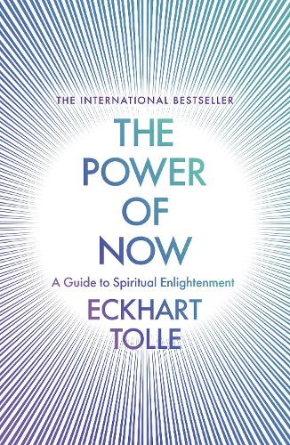

---    
date: 2024-12-30T09:31:39.232Z
title: "The Power of Now by Eckhart Tolle"
description: "The greater part of human pain is unnecessary. It is self-created as long as the unobserved mind runs your life"
tags: ["bookshelf", "non-fiction", "mindfulness", "meditation", "spirituality"]
featuredimage: './cover.jpeg'

---   
⭐ ⭐ ⭐ ⭐ ⭐

The Power of Now was a deeply insightful read, that I got a lot out of. Flipping through it's pages, the act of reading itself felt like a type of meditation. I really, really recommend this book.

 

For me, it was path validating, and a very welcome reminder of values and mindsets I would like to cultivate. To others, this may be their first encounter with spirituality, and I think it's a fantastic first read on the matter.

The overall premise of this text is: 
> The greater part of human pain is unnecessary. It is self-created as long as the unobserved mind runs your life. 

With many examples, and the question/answer format of the book, we are exposed to a new world of thinking, where we discover the difference between clock time and psychological time. And, how the latter is the basis of the negativity we face in life.

By opening our eyes, minds and hearts to the present, we can learn to disentangle our sense of self from our thoughts and ego, and instead understand that its one aspect of us.

Read sometime in August.

--- 

## The beauty of light

There is infinitely more to light than we realize.

It has a power we only begin to scratch, being in places with sunlight, it is energy incarnate, but beyond that it encapsulates so much. I wish to inhabit places with light, I want soft lighting, ambiance, flickering shadows. 

## 2 Defining questions that revolve around one’s world view:
A world view , seeks to answer two fundamental questions, "Who are we?" and
"What is the nature of the Universe in which we live?" Our answers to these questions dictate the quality and characteristics of our personal relationships with family, friends and employers/employees. When considered on a larger scale, they define societies.

## Spiritual Pioneers
What does this phrase mean?

## True Wealth is the radiant joy of Being
Those who have not found their true wealth, which is the radiant joy of Being and the deep, unshakable peace that comes with it, are beggars, even if they have great material wealth. They are looking outside for scraps of pleasure or fulfillment, for validation, security, or love, while they have a treasure within that not only includes all those things but is infinitely greater than anything the world can offer.

## Forgiveness
"Forgiveness" is a term that has been in use for 2,000 years, but most people have a very limited view of what it means. You cannot truly forgive yourself or others as long as you derive your sense of self from the past. Only through accessing the power of the Now, which is your own power, can there be true forgiveness. This renders the past pow-erless, and you realize deeply that nothing you ever did or that was ever done to you could touch even in the slightest the radiant essence of who you are. The whole concept of forgiveness then becomes unnecessary.

## 2 chances at Surrender
Your first chance is to surrender each moment to the reality of that moment. Knowing that what is cannot be undone — because it already is — you say yes to what is or accept what isn't. Then you do what you have to do, whatever the situation requires. If you abide in this state of acceptance, you create no more negativity, no more suf-fering, no more unhappiness. You then live in a state of nonresis-tance, a state of grace and lightness, free of struggle.

Whenever you are unable to do that, whenever you miss that chance — either because you are not generating enough conscious presence to prevent some habitual and unconscious resistance pattern from arising, or because the condition is so extreme as to be absolutely unacceptable to you — then you are creating some form of pain, some form of suffering. It may look as if the situation is creating the suffering, but ultimately this is not so — your resistance is.

Now here is your second chance at surrender. If you cannot accept what is outside, then accept what is inside. If you cannot accept the external condition, accept the internal condition. This means: Do not resist the pain. Allow it to be there. Surrender to the grief, despair, fear, loneliness, or whatever form the suffering takes.

Witness it without labeling it mentally. Embrace it. Then see how the miracle of surrender transmutes deep suffering into deep peace. This is your crucifixion. Let it become your resurrection and ascension.

## Moving past pain & suffering
Feeling sorry for yourself and telling others your story will keep you stuck in suffering. Since it is impossible to get away from the feeling, the only possibility of change is to move into it; otherwise, nothing will shift. So give your complete attention to what you feel, and refrain from mentally labeling it. As you go into the feeling, be intensely alert. At first, it may seem like a dark and terrifying place, and when the urge to turn away from it comes, observe it but don't act on it. Keep putting your attention on the pain, keep feeling the grief, the fear, the dread, the loneliness, whatever it is. Stay alert, stay present - present with your whole Being, with every cell of your body. As you do so, you are bringing a light into this darkness. This is the flame of your consciousness.

## Dharma catches you
Everybody you come in contact with will be touched by your presence and affected by the peace that you emanate, whether they are conscious of it or not.

## Worlds within worlds
Every being is a focal point of consciousness, and every such focal point creates its own world, although all those worlds are interconnected.

There are countless beings whose consciousness frequency is so different from yours that you are probably unaware of their existence, as they are of yours.

## When disaster strikes, and you’re so close to giving up
So whenever any kind of disaster strikes, or something goes seriously "wrong" - illness, disability, loss of home or fortune or of a socially defined identity, break-up of a close relationship, death or suffering of a loved one, or your own impending death — know that there is another side to it, that you are just one step away from something incredible: a complete alchemical transmutation of the base metal of pain and suffering into gold. That one step is called surrender.

I do not mean to say that you will become happy in such a situa-tion. You will not. But fear and pain will become transmuted into an inner peace and serenity that come from a very deep place - from the Unmanifested itself. It is "the peace of God, which passes all understanding." Compared to that, happiness is quite a shallow thing. With this radiant peace comes the realization - not on the level of mind but within the depth of your Being - that you are inde-structible, immortal. This is not a belief. It is absolute certainty that needs no external evidence or proof from some secondary source.

## A fork in the road, one step away from enlightenment or disillusion
Nothing out there will ever satisfy you except temporarily and superficially, but you may need to experience many disillusionments before you realize that truth.

Many people never realize that there can be no "salvation" in anything they do, possess, or attain. Those who do realize it often become world-weary and depressed: if nothing can give you true ful-fillment, what is there left to strive for, what is the point in anything?

The Old Testament prophet must have arrived at such a realization when he wrote "I have seen everything that is done under the sun, and behold, all is vanity and a striving after wind." When you reach this point, you are one step away from despair — and one step away from enlightenment.

## A flip switch when you associate your pain as identity
Once you have identified with some form of negativity, you do not want to let go, and on a deeply unconscious level, you do not want positive change. It would threaten your identity as a depressed, angry, or hard-done-by person. You will then ignore, deny or sabotage the positive in your life. This is a common phenomenon. It is also insane.

## The lessons in nature
Watch any plant or animal and let it teach you acceptance of what is, surrender to the Now. Let it teach you Being. Let it teach you integrity — which means to be one, to be yourself, to be real. Let it teach you how to live and how to die, and how not to make living and dying into a problem.

## Cycles
Your physical energy is also subject to cycles. It cannot always be at a peak. There will be times of low as well as high energy. There will be periods when you are highly active and creative, but there may also be times when everything seems stagnant, when it seems that you are not getting anywhere, not achieving anything. A cycle can last for anything from a few hours to a few years. There are large cycles and small cycles within these large ones. Many illnesses are created through fighting against the cycles of low energy, which are vital for regenera-tion. The compulsion to do, and the tendency to derive your sense of self-worth and identity from external factors such as achievement, is an inevitable illusion as long as you are identified with the mind. This makes it hard or impossible for you to accept the low cycles and allow them to be. Thus, the intelligence of the organism may take over as a self-protective measure and create an illness in order to force you to stop, so that the necessary regeneration can take place.

## The drama we create by introducing psychological time
When you let the past or future obscure the present, you are creating time, psychological time
— the stuff out of which drama is made. Whenever you are not honoring the present moment by allowing it to be, you are creating drama.

Most people are in love with their particular life drama. Their story is their identity. The ego runs their life. They have their whole sense of self invested in it. Even their - usually unsuccessful - search for an answer, a solution, or for healing becomes part of it.

What they fear and resist most is the end of their drama. As long as they are their mind, what they fear and resist most is their own awakening.
You wake up one day with no memory, do you savour this moment?

## Accepting things may not make you happy but you can still be at peace
Remember that we are not talking about happiness here. For example, when a loved one has just died, or you feel your own death approaching, you cannot be happy. It is impossible. But you can be at peace. There may be sadness and tears, but provided that you have relinquished resistance, underneath the sadness you will feel a deep serenity, a stillness, a sacred presence. This is the emanation of Being, this is inner peace, the good that has no opposite.
- I believe this is the underlying ‘things will be okay’ that echoes in my mind.

## Pain and identity

As long as you make an identity for yourself out of the pain, you cannot become free of it. As long as part of your sense of self is invested in your emotional pain, you will unconsciously resist or sabotage every attempt that you make to heal that pain. Why? Quite simply because you want to keep yourself intact, and the pain has become an essential part of you. This is an unconscious process, and the only way to overcome it is to make it conscious.

## Relationships when one is on the path of enlightenment 
If you are consistently or at least predominantly present in your relationship, this will be the greatest challenge for your partner. They will not be able to tolerate your presence for very long and stay uncon-scious. If they are ready, they will walk through the door that you opened for them and join you in that state. If they are not, you will separate like oil and water. The light is too painful for someone who wants to remain in darkness.

If you both agree that the relationship will be your spiritual prac-tice, so much the better. You can then express your thoughts and feelings to each other as soon as they occur, or as soon as a reaction comes up, so that you do not create a time gap in which an unexpressed or unacknowledged emotion or grievance can fester and grow. Learn to give expression to what you feel without blaming.
Leam to listen to your partner in an open, nondefensive way. Give your partner space for expressing himself or herself. Be present.

The greatest catalyst for change in a relationship is complete acceptance of your partner as he or she is, without needing to judge or change them in any way. That immediately takes you beyond ego.
All mind games and all addictive clinging are then over. There are no victims and no perpetrators anymore, no accuser and accused.
This is also the end of all codependency, of being drawn into somebody else's unconscious pattern and thereby enabling it to continue.
You will then either separate — in love — or move ever more deeply into the Now together — into Being. Can it be that simple? Yes, it is that simple.

If in your relationships you experience both "love" and the opposite of love — attack, emotional violence, and so on — then it is likely that you are confusing ego attachment and addictive clinging with love. You cannot love your partner one moment and attack him or her the next. True love has no opposite. If your "love" has an opposite, then it is not love but a strong ego-need for a more complete and deeper sense of self, a need that the other person temporarily meets.
It is the ego's substitute for salvation, and for a short time it almost does feel like salvation.

## What is God?
What is God? The eternal One Life underneath all the forms of life. What is love? To feel the presence of that One Life deep within yourself and within all creatures. To be it. Therefore, all love is the love of God.

## Dukkha

The Buddha taught that even your happiness is dukkha — a Pali word meaning "suffering" or "unsatisfactoriness." It is inseparable from its opposite. This means that your happiness and unhappiness are in fact one. Only the illusion of time separates them. 
- WOWOWOW I like the last line, because it adds the temporal dimension stretching the feelings arising and fading

## Time as an obstacle to salvation 

Your mind is telling you that you cannot get there from here. Something needs to happen, or you need to become this or that before you can be free and fulfilled. It is saying, in fact, that you need time — that you need to find, sort out, do, achieve, acquire, become, or understand something before you can be free or complete. You see time as the means to salvation, whereas in truth it is the greatest obstacle to salvation.

## Happiness as a form of salvation 

Happiness may be perceived as a heightened sense of aliveness attained through physical pleasure, or a more secure and more complete sense of self attained through some form of psychological gratification.
Aliveness can be experienced in different ways. 

## The meaning of surrender
Observe the attachment to your views and opinions. Feel the mental-emotional energy behind your need to be right and make the other person wrong. That's the energy of the egoic mind. You make it conscious by acknowledging it, by feeling it as fully as pos-sible. Then one day, in the middle of an argument, you will suddenly realize that you have a choice, and you may decide to drop your good own reaction - just to see what happens. You surrender. I don't mean dropping the reaction just verbally by saying "Okay, you are right, with a look on your face that says, "I am above all this child- e. g ish unconsciousness." That's just displacing the resistance to another level, with the egoic mind still in charge, claiming superiority. I am speaking of letting go of the entire mental-emotional energy feld inside you that was fighting for power.

Inner resistance is to say "no" to what is, through mental judgment and emotional negativity.

## Surrender is not resignation
For example, if you were stuck in the mud somewhere, you wouldn't say. "Okay, I resign myself to being stuck in the mud." Resignation is not surrender. You don't need to accept an undesirable or unpleasant life situation. Nor do you need to deceive yourself and say that there is nothing wrong with being stuck in the mud. No. You recognize fully that you want to get out of it. You then narrow your attention down to the present moment without mentally labeling it in any way. This means that there is no judgment of the Now. Therefore, there is no resistance, no emotional negativity. 

You accept the "isness" of this moment. Then you take action and do all that you can to get out of the mud. Such action I call positive action. It is far more effective than negative action, which arises out of anger, despair, or frustration. Until you achieve the desired result, you continue to practice surrender by refraining from labeling the Now. 

Start by acknowledging that there is resistance. Be there when it hap-pens, when the resistance arises. Observe how your mind creates it, how it labels the situation, yourself, or others. Look at the thought process involved. Feel the energy of the emotion. By witnessing the resistance, you will see that it serves no purpose. By focusing all your attention on the Now, the unconscious resistance is made conscious, and that is the end of it.

## On Love & what it means if it induces a state you wish to persist
On the positive side, you are "in love" with your partner. This is at first a deeply satisfying state. You feel intensely alive. Your existence has suddenly become meaningful because someone needs you, wants you, and makes you feel special, and you do the same for him or her. When you are together, you feel whole. The feeling can become so intense that the rest of the world fades into insignificance.

However, you may also have noticed that there is a neediness and a clinging quality to that intensity. You become addicted to the other person. He or she acts on you like a drug. You are on a high when the drug is available, but even the possibility or the thought that he or she might no longer be there for you can lead to jealousy, possessiveness, attempts at manipulation through emotional blackmail, blaming and accusing — fear of loss. If the other person does leave you, this can give rise to the most intense hostility or the most profound grief and despair. In an instant, loving tenderness can turn into a savage attack or dreadful grief. Where is the love now? Can love change into its opposite in an instant? Was it love in the first place, or just an addictive grasping and clinging?

## Forgiveness
Forgiveness is to relinquish your grievance and so to let go of grief. It happens naturally once you realize that your grievance serves no purpose except to strengthen a false sense of self. Forgiveness is to offer no resistance to life — to allow life to live through you.

## Feeling your emotions without labelling them

In any case, what matters is not whether you can attach a mental label to it but whether you can bring the feeling of it into awareness as much as possible.
 

## Be connected to your body at all moments
The key is to be in a state of permanent connectedness with your inner body — to feel it at all times. This will rapidly deepen and transform your life. The more consciousness you direct into the inner body, the higher its vibrational frequency becomes, much like a light that grows brighter as you turn up the dimmer switch and so increase the flow of electricity. At this higher energy level, negativity cannot affect you anymore, and you tend to attract new circumstances that reflect this higher frequency.

### Tangibly, what does this mean?
Please examine where your attention is at this moment. You are listening to me, or you are reading these words in a book. That is the focus of your attention. You are also peripherally aware of your sur-roundings, other people, and so on. Furthermore, there may be some mind activity around what you are hearing or reading, some mental commentary. Yet there is no need for any of this to absorb all your attention. See if you can be in touch with your inner body at the same time. Keep some of your attention within. Don't let it all flow out.

Feel your whole body from within, as a single field of energy. It is almost as if you were listening or reading with your whole body. Let this be your practice in the days and weeks to come.

## Do not turn away from the body 
But do not turn away from the body, for within that symbol of imperma-nence, limitation, and death that you perceive as the illusory creation of your mind is concealed the splendor of your essential and immortal reality

Transformation is through the body, not away from it.

## Group work
Group work can also be helpful for intensifying the light of your presence. A group of people coming together in a state of presence generates a collective energy field of great intensity.
- meditation retreats, sangha, 

## Eternity is no-time
He had gone beyond the consciousness dimension governed by time, into the realm of the timeless. The dimension of eternity had come into this world. Eternity, of course, does not mean endless time, but no time.

## Portals
Every portal is a portal of death, the death of the false self. When you go through it, you cease to derive your identity from your psy-chological, mind-made form. You then realize that death is an illu-sion, just as your identification with form was an illusion. The end of illusion — that's all that death is. It is painful only as long as you cling to illusion.
- Ego!

## Body Awareness
Then let your attention run through the body like a wave a few times, from feet to head and back again. This need only take a minute or so. After that, feel the inner body in its totality, as a single field of energy. Hold that feeling for a few minutes. Be intensely present during that time, present in every cell of your body. Don't be concerned if the mind occasionally succeeds in drawing your attention out of the body and you lose yourself in some thought. As soon as you notice that this has happened, just return your attention to the inner body.

## Listen with your whole body 
When listening to another person, don't just listen with your mind, listen with your whole body. Feel the energy field of your inner body as you listen. That takes attention away from thinking and creates a still space that enables you to truly listen without the mind interfer-ing. You are giving the other person space - space to be. It is the most precious gift you can give.

## Life is a flicker of wind
You got hold of a fraction of a dynamic process, a molecular dance, and made a separate entity out of it.

When we talk about watching the mind we are personalizing an event that is truly of cosmic signifi-cance: through you, consciousness is awakening out of its dream of identification with form and withdrawing from form.

## The past
The past cannot survive in your presence. It can only survive in your absence.

## Beauty in the present
Have you listened, truly listened, to the sound of a mountain stream in the forest? Or to the song of a blackbird at dusk on a quiet summer evening? To become aware of such things, the mind needs to be still.
You have to put down for a moment your personal baggage of prob-lems, of past and future, as well as all your knowledge; otherwise, you will see but not see, hear but not hear. Your total presence is required.
Beyond the beauty of the external forms, there is more here: something that cannot be named, something ineffable, some deep, inner, holy essence. Whenever and wherever there is beauty, this inner essence shines through somehow. It only reveals itself to you when you are present. Could it be that this nameless essence and your presence are one and the same? Would it be there without your presence? Go deeply into it. Find out for yourself.

When you experienced those moments of presence, you likely didn't realize that you were briefly in a state of no-mind. This is because the gap between that state and the influx of thought was too narrow. Your satori may only have lasted for a few seconds before the mind came in, but it was there; otherwise, you would not have experienced the beauty. Mind can neither recognize nor create beauty. Only for a few seconds, while you were completely present, was that beauty or that sacredness there. Because of the narrowness of that gap and a lack of vigilance and alertness on your part, you were probably unable to see the fundamental difference between the perception, the thoughtless awareness of beauty, and the naming and interpreting of it as thought: The time gap was so small that it seemed to be a single process. The truth is, however, that the moment thought came in, all you had was a memory of it.

## The ego wants to live
But the more you practice monitoring your inner mental-emotional state, the easier it will be to know when you have been trapped in past or future, which is to say unconscious, and to awaken out of the dream of time into the pre-sent. But beware: The false, unhappy self, based on mind identifica-tion, lives on time. It knows that the present moment is its own death and so feels very threatened by it. It will do all it can to take you out of it. It will try to keep you trapped in time.

## Thinking vs. feeling, on true acceptance
When you have been practicing acceptance for a while, as you have, there comes a point when you need to go on to the next stage, where those negative emotions are not created anymore. If you don't, your "acceptance" just becomes a mental label that allows your ego to continue to indulge in unhappiness and so strengthen its sense of separation from other people, your surroundings, your here and now. As you know, separation is the basis for the ego's sense of identity. True acceptance would transmute those feelings at once.

And if you really knew deeply that everything is "okay," as you put it, and which of course is true, then would you have those negative feelings in the first place? Without judgment, without resistance to what is, they would not arise. You have an idea in your mind that "every-thing is okay," but deep down you don't really believe it, and so the old mental-emotional patterns of resistance are still in place. That's what make makes you feel bad.

## Are you a waiter?
Are you a habitual "waiter"? How much of your life do you spend waiting? What I call "small-scale waiting" is waiting in line at the post office, in a traffic jam, at the airport, or waiting for someone to arrive, to finish work, and so on. "Large-scale waiting" is waiting for the next vacation, for a better job, for the children to grow up, for a truly meaningful relationship, for success, to make money, to be impor-tant, to become enlightened. It is not uncommon for people to spend their whole life waiting to start living.
Waiting is a state of mind. Basically, it means that you want the future; you don't want the present. You don't want what you've got, and you want what you haven't got. With every kind of waiting, you unconsciously create inner conflict between your here and now, where you don't want to be, and the projected future, where you want to be. This greatly reduces the quality of your life by making you lose the present.

## Never use negativity as the driving force for change

Either stop doing what you are doing, speak to the person concerned and express fully what you feel, or drop the negativity that your mind has created around the situation and that serves no purpose whatsoever except to strengthen a false sense of self. Recognizing its futility is important. Negativity is never the optimum way of dealing with any situation.

## The true test of your practise
If you cannot be present even in normal circumstances, such as when you are sitting alone in a room, walking in the woods, or lis. tening to someone, then you certainly won't be able to stay conscious when something "goes wrong" or you are faced with difficult people or situations, with loss or the threat of loss. You will be taken over by a reaction, which ultimately is always some form of fear, and pulled into deep unconsciousness. Those challenges are your tests. Only the way in which you deal with them will show you and others where you are at as far as your state of consciousness is concerned, not how long you can sit with your eyes closed or what visions you see.

## Accept your circumstances if they cannot be changed
If there is truly nothing that you can do to change your here and now, and you can't remove yourself from the situation, then accept your here and now totally by dropping all inner resistance. The false, unhappy self that loves feeling miserable, resentful, or sorry for itself can then no longer survive. This is called surrender. Surrender is not weakness. There is great strength in it. Only a surrendered person has spiritual power. Through surrender, you will be free internally of the situation. You may then find that the situation changes without any effort on your part. In any case, you are free.
Or is there something that you "should" be doing but are not doing it? Get up and do it now. Alternatively, completely accept your inactivity, laziness, or passivity at this moment, if that is your choice.
Go into it fully. Enjoy it. Be as lazy or inactive as you can. If you go into it fully and consciously, you will soon come out of it. Or maybe you won't. Either way, there is no inner conflict, no resistance, no negativity.
- at what point is surrender preferred to changing situations

## Die to the past 
Die to the past every moment. You don't need it. Only refer to it when it is absolutely relevant to the present. Feel the power of this moment. and the fullness of Being. Feel your presence.

## Tough but vital questions to ask yourself at every moment
Are you resisting your here and now? Some people would always rather be somewhere else. Their "here" is never good enough. Through self-observation, find out if that is the case in your life. Wherever you are, be there totally. If you find your here and now intolerable and it makes you unhappy, you have three options: remove yourself from the situation, change it, or accept it totally. If you want to take responsibility for your life, you must choose one of those three options, and you must choose now. Then accept the consequences. No excuses. No negativity. No psychic pollution. Keep your inner space clear.

## Are there really any problems?
When you create a problem, you create pain. All it takes is a simple choice, a simple decision: no matter what happens, I will create no more pain for myself. I will create no more problems. Although it is a simple choice, it is also very radical. You won't make that choice unless you are truly fed up with suffering, unless you have truly had enough. And you won't be able to go through with it unless you access the power of the Now. If you create no more pain for yourself, then you create no more pain for others. You also no longer contaminate the beautiful Earth, your inner space, and the collective human psyche with the negativity of problem-making.

Problems are mind-made and need time to survive.

They cannot survive in the actuality of the Now.

Focus your attention on the Now and tell me what problem you have at this moment.

## Remove time when faced with problems
When you are full of problems, there is no room for anything new to enter, no room for a solution. So whenever you can, make some room, create some space, so that you find the life underneath your life situation.
Use your senses fully. Be where you are. Look around. Just look, don't interpret. See the light, shapes, colors, textures. Be aware of the silent presence of each thing. Be aware of the space that allows everything to be. Listen to the sounds; don't judge them. Listen to the silence underneath the sounds. Touch something — anything — and feel and acknowledge its Being. Observe the rhythm of your breath-ing; feel the air flowing in and out, feel the life energy inside your body. Allow everything to be, within and without. Allow the "isness" of all things. Move deeply into the Now.

## Psychological time as the root cause of negativity
All negativity is caused by an accumulation of psychological time and denial of the present. Unease, anxiety, tension, stress, worry — all forms of fear — are caused by too much future, and not enough presence. Guilt, regret, resentment, grievances, sadness, bitterness, and all forms of nonforgiveness are caused by too much past, and not enough presence.
- if you close your eyes and are fully present, nothing else exists. No problems.

The enlightened person's main focus of attention is always the Now, but they are still peripherally aware of time. In other words, they continue to use clock time but are free of psychological time.

If you made a mistake in the past and learn from it now, you are using clock time.
On the other hand, if you dwell on it mentally, and self-criticism, remorse, or guilt come up, then you are making the mistake into "me" and "mine": you make it part of your sense of self, and it has become psychological time, which is always linked to a false sense of identity. **Nonforgiveness necessarily implies a heavy burden of psychological time.**

If you set yourself a goal and work toward it, you are using clock time. You are aware of where you want to go, but you honor and give your fullest attention to the step that you are taking at this moment.

If you then become excessively focused on the goal, perhaps because you are seeking happiness, fulfillment, or a more complete sense of self in it, the Now is no longer honored. It becomes reduced to a mere stepping stone to the future, with no intrinsic value.

## Identification with the mind at tough moments
Intense presence is needed when certain situations trigger a reaction with a strong emotional charge, such as when your self-image is threatened, a challenge comes into your life that triggers fear, things "go wrong," or an emotional complex from the past is brought up. In those instances, the tendency is for you to become "unconscious." The reaction or emotion takes you over — you "become" it. You act it out. You justify, make wrong, attack, defend..except that it isn't you, it's the reactive pattern, the mind in its habitual survival mode.

## Hope vs. Anxiety when thinking about the future
You will observe that the future is usually imagined as either better or worse than the present. If the imagined future is better, it gives you hope or pleasurable anticipation. fit is worse, it creates anxiety Both are illusory?

# Miscellany 
[] Read Rumi - research Sufism 

## Flow & it’s addictive qualities when mixed with adrenaline 
The reason why some people love to engage in dangerous activities, such as mountain climbing, car racing, and so on, although they may not be aware of it, is that it forces them into the Now — that intensely alive state that is free of time, free of problems, free of think-ing, free of the burden of the personality. Slipping away from the present moment even for a second may mean death. Unfortunately, they come to depend on a particular activity to be in that state. But you don't need to climb the north face of the Eiger. You can enter that state now.

## The past (identity) and future (salvation) & why we cling to it
To be identified with your mind is to be trapped in time: the compulsion to live almost exclusively through memory and anticipation.

This creates an endless preoccupation with past and future and an unwillingness to honor and acknowledge the present moment and allow it to be The compulsion arises because the past gives you an identity and the future holds the promise of salvation, of fulfilment in whatever form. Both are illusions.

## The ego’s search for Wholeness
Another aspect of the emotional pain that is an intrinsic part of the egoic mind is a deep-seated sense of lack or incompleteness, of not being whole In some people, this is conscious, in others unconscious. If it is conscious, it manifests as the unsettling and constant feeling of not being worthy or good enough. If it is unconscious, it will only be felt indirectly as an intense craving, wanting and needing. In either case, people will often enter into a compulsive pursuit of ego-gratification and things to identify with in order to fill this hole they feel within. So they strive after possessions, money, success, power, recognition, or a special relationship, basically so that they can feel better about themselves, feel more complete. But even when they attain all these things, they soon find that the hole is still there, that it is bottomless. Then they are really in trouble, because they cannot delude themselves anymore. Well, they can and do, but it gets more difficult.
- are my goals of striving? Think deeper as to my motivations. 

## The basis of fear

The psychological condition of fear is divorced from any concrete and true immediate danger. It comes in many forms: unease, worry, anxiety, nervousness, tension, dread, phobia, and so on. This kind of psychological fear is always of something that might happen, not of something that is happening now. You are in the here and now, while your mind is in the future. This creates an anxiety gap.

## Dissolving the pain body

Unconsciousness creates it consciousness transmutes it into itself.
St. Paul expressed this universal principle beautifully: **"Everything is shown up by being exposed to the light, and whatever is exposed to the light itself becomes light."** Just as you cannot fight the darkness, you cannot fight the pain-body. Trying to do so would create inner conflict and thus further pain. Watching it is enough. Watching it implies accepting it as part of what is at that moment.

## Pain Body
Watch out for any sign of unhappiness in yourself, in whatever form — it may be the awakening pain-body.
This can take the form of irritation, impatience, a somber mood, a desire to hurt, anger, rage, depression, a need to have some drama in your relationship, and so on. Catch it the moment it awakens from its dormant state.

## How to make life work for you, and stop contributing to pain
If you no longer want to create pain for yourself and others, if you no longer want to add to the residue of past pain that still lives on in you, then don't create any more time, or at least no more than is necessary to deal with the practical aspects of your life. How to stop ce-ating time? Realize deeply that the present moment is all you ever have. Make the Now the primary focus of your life. Whereas before you dwelt in time and paid brief visits to the Now, have your dwelling place in the Now and pay brief visits to past and future when required to deal with the practical aspects of your life situation. Always say "yes" to the present moment. What could be more futile, more insane, than to create inner resistance to something that already is?

What could be more insane than to oppose life itself, which is now and always now? Surrender to what is. Say "yes" to life — and see how life suddenly starts working for you rather than against you.

## Central Premise of the book
The greater part of human pain is unnecessary. It is self-created as long as the unobserved mind runs your life.
- The pitch —> the more you are able to honor here and accept the Now, the more you are free of pain, of suffering — and free of the egoic mind.

## Feeling is your body and not thoughts that are your present state
If you really want to know your mind, the body will always give you a truthful reflection, so look at the emotion or rather feel it in you body. If there is an apparent conflict between them, the thought will be the lie, the emotion will be the truth. Not the ultimate truth of who you are, but the relative truth of your state of mind at that time.
- Feelings win in telling you how you actually feel, rather than what you’re thinking

## Art and no-mind
All artists whether they know it or not, create from a place of no-mind, from inner stillness. The mind then gives form to the creative impulse or insight.

## The end result
When your deeper sense of self is derived from Being. when you are free of "becoming" as a psychological need, neither your happiness nor your sense of self depends on the outcome, and so there is freedom from fear. You don't seek permanency where it cannot be found: in the world of form, of gain and loss, birth and death. You don't demand that situations, conditions, places, or people should make you happy, and then suffer when they don't live up to your expectations.

## The quickest test to see if you’re present
To alert you that you have allowed yourself to be taken over by psychological time, you can use a simple criterion. Ask yourself: **Is there joy, ease, and lightness in what I am doing? If there isn't, then time is covering up the present moment, and life is perceived as a burden or a struggle.**
