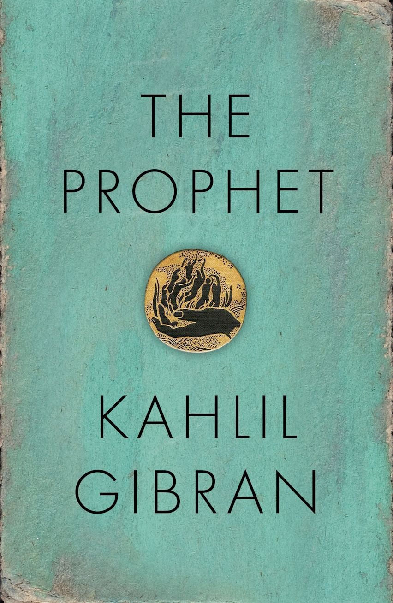

---    
date: 2026-06-04T03:57:09.401Z
title: "The Prophet by Khalil Gibran"
description: "Khalil Gibran’s The Prophet maps continents of the human experience"
featuredimage: './cover.jpg'
tags: ["bookshelf", "favourites", "spirituality"]
---   

Khalil Gibran’s *The Prophet* maps continents of the human experience. In it, we follow Almustafa, a prophet who comes to the island of Orphalese, living among the people in the city for years as if they were his brothers and sisters. Before he leaves for his home, he rises to their call; answering their questions on what constitutes a good life.

 

The Prophet is a book that you can carry with you for the rest of your life. I started reading it at the beginning of this year; slowly, chapter by chapter, letting each question settle deep within.

It is secular yet intensely spiritual, and I envision reading it again and again.

Read from January - May 2026

----

Say not, "I have found the path of the soul."
Say rather, "I have met the soul walking upon my
path.
For the soul walks upon all paths.
The soul walks not upon a line, neither does it
grow like a reed.
The soul unfolds itself, like a lotus of countless
petals.

A voice cannot carry the tongue and the lips that gave it wings. Alone must it seek the ether.
And alone and without his nest shall the eagle fly
across the sun.

And ever has it been that love knows not its own depth until the hour of separation.

And when one of you falls down he falls for those behind him, a caution against the stumbling stone.
Ay, and he falls for those ahead of him, who though faster and surer of foot, yet removed not the stumbling stone.

You cannot separate the just from the unjust and
the good from the wicked;
For they stand together before the face of the sun even as the black thread and the white are woven together.
And when the black thread breaks, the weaver shall look into the whole cloth, and he shall examine the loom also.

And forget not that the earth delights to feel your bare feet and the winds long to play with your hair.

And though in your winter you deny your spring, Yet spring, reposing within you, smiles in her
drowsiness and is not offended.

At night the watchmen of the city say, "Beauty shall rise with the dawn from the east."
And at noontide the toilers and the wayfarers say,
"We have seen her leaning over the earth from the windows of the sunset."

And beauty is not a need but an ecstasy.
It is not a mouth thirsting nor an empty hand
stretched forth,
But rather a heart enflamed and a soul enchanted.

For what is your friend that you should seek him
with hours to kill?
Seek him always with hours to live.

When you meet your friend on the roadside or in the market place, let the spirit in you move your lips and direct your tongue.
Let the voice within your voice speak to the ear of
his ear;
For his soul will keep the truth of your heart as
the taste of the wine is remembered
When the colour is forgotten and the vessel is no
more.

Verily when good is hungry it seeks food even in dark caves, and when it thirsts it drinks even of dead waters.

The wind and the sun will tear no holes in his
skin.

For what is it to die but to stand naked in the wind and to melt into the sun?
