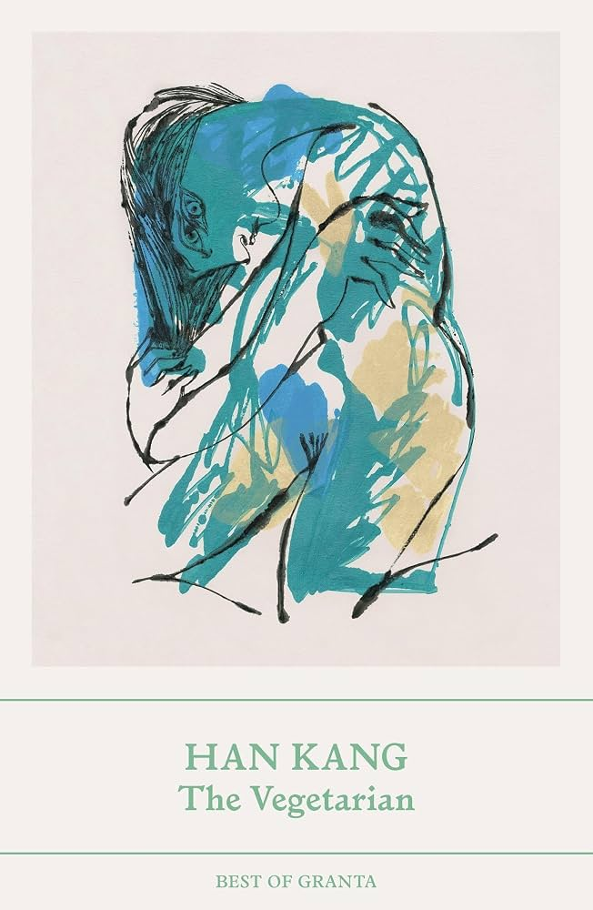

---    
date: 2026-10-03T11:12:48.181Z
title: "The Vegetarian by Han Kang"
description: "The Vegetarian is a reminder that our subconscious; our dreaming state and our waking state are inextricably linked"
tags: ["bookshelf", "fiction", "favourites"]
featuredimage: './cover.jpg'
---   

I picked this up in Paris at the Shakespeare and Company bookstore. Originally, I was drawn to the idea of an author capturing a radical shift in a stable relationship; I find it immensely interesting to observe people who redefine themselves, and risk tipping the ship. I didn't realise that the Vegetarian was so much more than just a simple change in diet. 

Han Kang captures the blurry line of sanity. What makes dreams, dreams? Why do we wake up into a different reality? These night visions change us indelibly; yet if we let them take over, we can lose everything.

 

If life is a series of obligations; a house of cards so to speak, it is a radical act to blow those cards down, even if one doesn’t want to play anymore. Radical, because ostensibly, lives can fall apart and change - change is the ceaseless spectre of nightfall, and we’re just moths clinging to the light.

The Vegetarian is a reminder that our subconscious; our dreaming state and our waking state are inextricably linked, and those lonesome visions we have, are just as real as the world we occupy. Kang writes these dreams lucidly, in a way empowering us to also examine our own unnameable thoughts; our patchwork of night.

When you look across at the face of a loved one, how much do you truly know? How much will you ever know? How much do you want to know? 

Now, look at yourself in the mirror.

Read in August and again in September in time for book club. 

--- 
