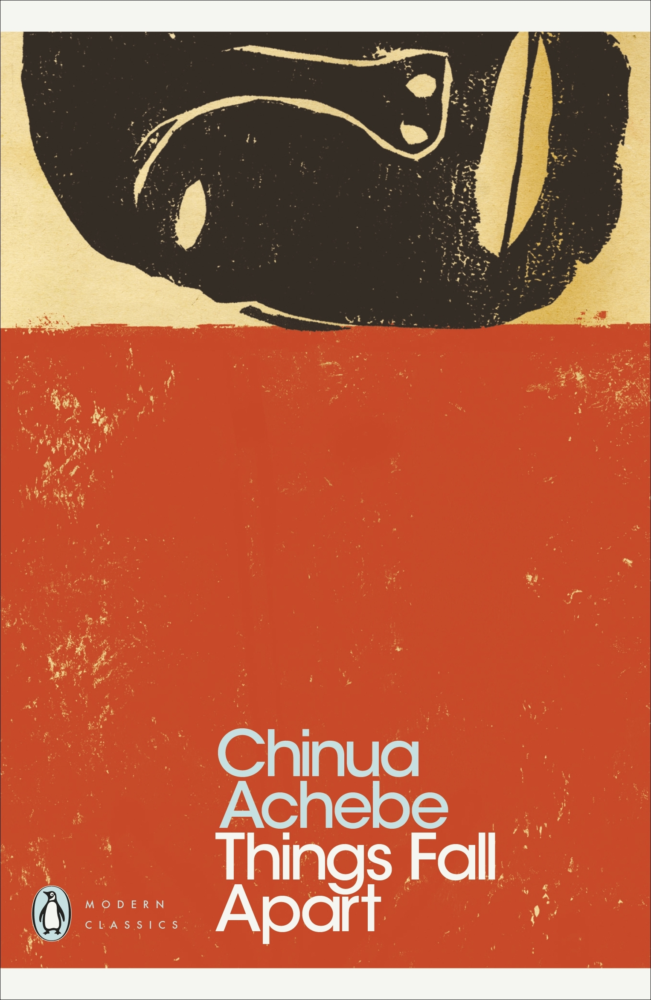

---    
date: 2026-01-17T06:51:16.441Z
title: "Things Fall Apart by Chinua Achebe"
description: "As one sun sets, another rises, and what we observe is the dissolution of a world that was overpowered by another - what makes one right and one wrong?"
featuredimage: './cover.jpg'
tags: ["bookshelf", "fiction", "international", "bookclub", "Africa", "colonialism", "storytelling"]
---   
⭐ ⭐ ⭐ ⭐ 

Chinua Achebe’s *Things Fall Apart* is a tale which places you into the villages of East Nigeria nearing the end of the 19th century. We see a society pulsating with ancient stories in an effort to make meaning of their lives, and derive order for their clans. 

 

There was a certain rhythm to life, which was marked by the passing of full moons, and falling of ‘nuts of the water of heaven’. 

Achebe both transplants us as an outsider, and insider into Igbo clan of Umuofia, where we live alongside Okonowo, a man who built his reputation with the strength of his hands, and the fearlessness of war; the true embodiment of the warrior spirit. He did this because of the secret fear that his path was destined to follow in the footsteps of his father: lazy, unambitious, and worst of all - disrespected. 

The demarcation of man and woman is front and centre in this text, and Okonowo commands respect throughout the land through his strong-headedness. Any semblance of ‘womanly’ feelings or actions is tamped out in order to not look weak in the company of his clansmen. In his world, divine oracles sanction filicide, dead children (known as ogbanje) are mutilated, and women are beaten to near-death. These actions are not explained, but are accepted as part of the fabric of reality. For us, it’s only after the acceptance of things we cannot understand, that we come closer to reality. 

What Achebe depicts is a tale in which the characters are human, riddled with the same quavering questions of morality, and what they should be doing. You may not need to approve on their methodologies of raising children, and distinguishing between right or wrong, but you must acknowledge that theirs was a complex society, linked with a mystical connection with the world. 

Moments of tenderness are surreptitious; when Okonowo and his wife journey overnight, walking across the land to ensure the safety of their daughter, who was taken away to the Oracle in the caves, under the cover of a moonless night. What we perceive as brutality is accepted because life is by its very nature difficult. 

> ‘For whom is it well, for whom is it well? 
>  There is no one for whom it is well.’

What transforms this almost ethnographic account into a tragedy is at meeting of two incompatible cultures, when we first encounter the ‘white man’, at first thought to be an albino. He brings with him Christianity, and we witness firsthand the slow blending of Western religion; the very byproduct of translation from one culture to another. 

> ‘We cannot leave the matter in his hands because he does not understand our customs, just as we do not understand his’.

Observing how religion expands is fascinating. In the beginning we see a clear divide between the local black man and the foreign white man, however, this is disrupted when the composition of ‘the other’ is changed; namely due to religious conversion. Suddenly, the Christians are those who are also clanspeople. It makes me think about the structural upheaval that religion can facilitate, especially when the rules of ‘what is deemed a good life’ is called into question. 

> ‘How do you think we can fight when our own brother have turned against us?’

This also demonstrates the reason religious movements in the past have led to persecution, because the very nature of power is questioned. 

As one sun sets, another rises, and what we observe is the dissolution of a world that was overpowered by another - what makes one right and one wrong? 

> ‘Those were the days that men were men.’ 

Read as part of bookclub January 2026.

----
## Thoughts to nibble on

How interesting is it for the capacity of misunderstanding when not knowing the language. 

I think of how the stories we construct make us human, but also inhuman, especially when they give rise to cruelty. But cruelty in the eyes of who? 

----
## Quotes

‘Since I survived that year,’ he always said, ‘I shall survive anything.’

Nwoye knew that it was right to be masculine and to be violent, but somehow he still preferred the stories that his mother used to tell. 

And when he did this he saw that his father was pleased, and now longer rebuked him or beat him. 

“If the song ended on his right foot, his mother was alive. If it ended on his left, she was dead. No, not dead, but ill. It ended on the right. She was alive and well. 
He sang the song again, and it ended on the left. But the second time did not count.”

“He heard Ikemefuna cry, "My father, they have killed me!" as he ran towards him. Dazed with fear, Okonkwo drew his machete and cut him down. He was afraid of being thought weak”

“As our people say, 'When mother-cow is chewing grass its young ones watch its mouth.”

“But as the dog said, 'If I fall down for you and you fall down for me, it is play'.”

“Like a hen whose only chick has been carried away by a kite.” 

“The land of the living was not far removed from the domain of the ancestors. There was coming and going between them, especially at festivals and also when an old man died, because an old man was very close to the ancestors. A man's life from birth to death was a series of transition rites which brought him nearer and nearer to his ancestors.”

“It was an angry, “metallic and thirsty clap, unlike the deep and liquid rumbling of the rainy season. A mighty wind arose and filled the air with dust. 

Palm trees swayed as the wind combed their leaves into flying crests like strange and fantastic coiffure. 

When the rain finally came, it was in large, solid drops of frozen water which the people called "the nuts of the water of heaven." They were hard and painful on the body as they fell, yet young people ran about happily picking up the cold nuts and throwing them into their mouths to melt.”

“The imagery of an efulefu in the language of the clan was a man who sold his machete and wore the sheath to battle.”

“What did he say?" the white man asked his interpreter. But before he could answer, another man asked a question: "Where is the white man's horse?" he asked. The Ibo evangelists consulted among themselves and decided that the man probably meant bicycle. They told the white man and he smiled benevolently. 

"Tell them," he said, "that I shall bring many iron horses when we have settled down among them.”

“The hymn about brothers who sat in darkness and in fear seemed to answer a vague and persistent question that haunted his young soul--the question of the twins crying in the bush and the question of Ikemefuna who was killed. He lelt a relief within as the hymn poured into his parched soul. The words of the hymn were like the drops of frozen rain melting on the dry palate of the panting earth.”

“Living fire begets cold, impotent ash.”

“But let us ostracise these men.”
- perhaps the feeling of being “above” local customs led to religious persecution

“A man who calls his kinsmen to a feast does not do so to save them from starving. They all have food in their own homes. When we gather together in the moonlit village ground it is not because of the moon. Every man can see it in his own compound. We come together because it is good for kinsmen to do so.”

“Umuofia was like a startled animal with ears erect, sniffing the silent, ominous air and not knowing which way to run.”

