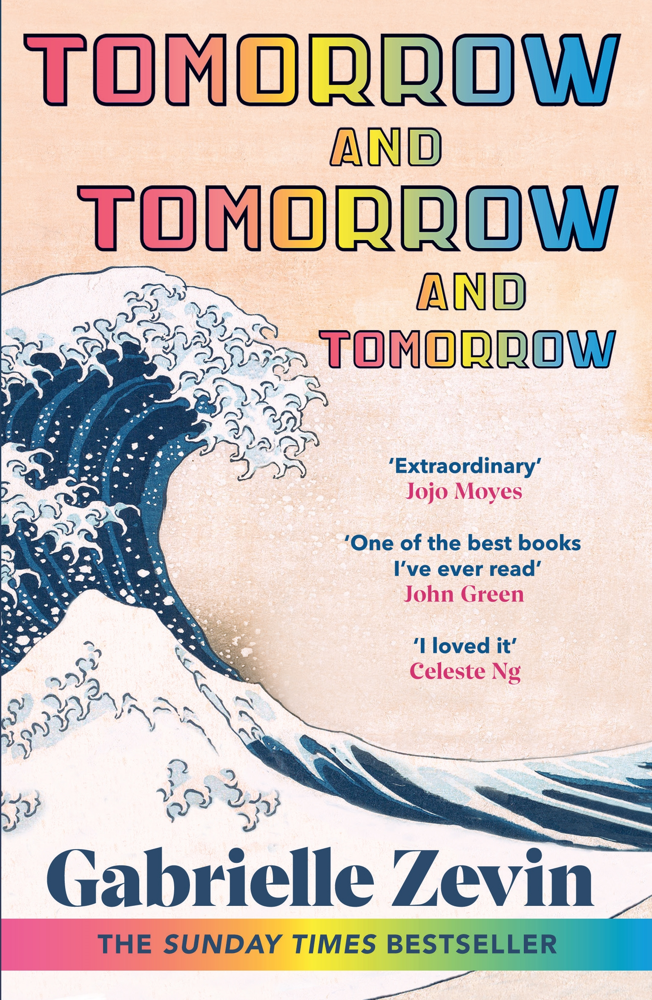

---    
date: 2024-12-30T09:25:45.108Z
title: "Tomorrow, and Tomorrow, and Tomorrow by Gabrielle Zevin"
description: "Tomorrow and Tomorrow and Tomorrow is a read that attempts to span a lifetime"
tags: ["bookshelf"]
featuredimage: './cover.jpg'
---   
⭐ ⭐ ⭐ ⭐ 

Tomorrow and Tomorrow and Tomorrow is a read that attempts to span a lifetime. 

 

It begins with Sam, crippled at a young age, meeting with Sadie in a hospital. Both were children, but had wholly different upbringings, but bringing them together was the act of passing around a controller playing Mario. Flashing forward a few years, they meet again under different circumstances, and out of happenstance, decide to spend a summer making a video game. 

How worlds can change with one interaction. We are introduced to Sam’s guardian angel, Marx whose sacrificial like dedication to doing the right thing propels both Sam and Sadie’s venture into making a game studio.

In between all the years, we see love in many forms: in the simple acts of showing up, grand gestures proclaiming forever, memorising hands and fingertips, deeply knowing a person, choosing to be kind, obsessive and blurring. 

The characterisation in this novel, is not breathtaking, but there are some phrases that did take my breath away. It made me feel things, and I was thinking about some of the words a long time after I’d read it.

A faint air of nostalgia washed over me when Sadie and Sam were so wholly enraptured by magic of a new world that games provide. I was transported back to my own childhood, where I spent summers glued to the television and computer screen, and think back to that young boy. 

Zevin is sometimes blunt, and tells rather than shows, but sometimes that’s more than okay. 

Read sometime in November 

---

Sam looked at Sadie, and he thought, This is what time travel is. It's looking at a person, and seeing them in the present and the past, concurrently. And that mode of transport only worked with those one had known a significant time.

She started walking toward the train, and Sam tried to figure out a way to make her stop. If this were a game, he could hit pause. He could restart, say different things, the right ones this time. He could search his inventory for the item that would make Sadie not leave.

"There are people like you and like me. We have bad things happen to us, and we survive them. We are sturdy. But with people like your friend, you must be exceptionally gentle, or they may break."

Why did Marx do this for this strange boy, who most people found vaguely unpleasant? He liked Sam. He had spent his childhood among rich and supposedly interesting people, and he knew that truly unusual minds were rare. He felt that when Harvard had assigned them to be roommates, Sam had become his responsibility. So, he protected Sam, and he made the world a little easier for Sam, and it cost him next to nothing to do so. Marx's life had been filled with such abundance that he was one of those people who found it natural to care for those around him. In this case, what Marx received in return was the pleasure of Sam's company.

But this was classic Sam he had learned to tolerate the sometimes-painful present by living in the future.

It was Marx who suggested the famous "underworld" sequence in Ichigo ("Ichigo needs to be as low as possible," he said, and it was Marx who turned them on to Takashi Murakami and Tsuguharu Foujita. It was Marx, with his love of avant-garde instrumental music, who played Brian Eno, John Cage, Terry Riley, Miles Davis, and Philip Glass on his CD player while Sadie and Sam worked.
It was Marx who suggested they reread The Odyssey and The Call of the Wild and Call It Courage. He also had them read the story structure book The Hero's Journey, and a book about children and verbal development, The Language Instinct.

"Sadie, that's completely normal. The best teams are constantly at each other's throats. It's a part of the process. If you aren't fighting, then someone doesn't care enough about the work. Say you're sorry. Move on."

"You don't love me," she said.
"Zoe, of course I love you."
"But you don't love me enough," she said
"What's enough?" Marx asked.
"Enough is .. Maybe this is selfish, but I don't want to love more than I am loved. And I don't want to be with someone who loves something or someone more than me."

He was no longer the boy who wanted to taste everything at the buffet, and he considered it a sign of his own maturity that he had not thought to end things with Zoe. But his disdain for his former itinerancy had made it so he could not recognize the reasons a person should stay.

"Sadie, do you see this? This is a persimmon tree! This is my favorite fruit." Marx picked a fat orange persimmon from the tree, and he sat down on the now termite-free wooden deck, and he ate it, juice running down his chin. "Can you believe our luck?" Marx said. "We bought a house with a tree that has my actual favorite fruit."
Sam used to say that Marx was the most fortunate person he had ever met—he was lucky with lovers, in business, in looks, in life. But the longer Sadie knew Marx, the more she thought Sam hadn't truly understood the nature of Marx's good fortune. Marx was fortunate because he saw everything as if it were a fortuitous bounty. It was impossible to know were persimmons his favorite fruit, or had they just now become his favorite fruit because there they were, growing in his own backyard? He had certainly never mentioned persimmons before. My God, she thought, he is so easy to love.
"Shouldn't you wash that?" Sadie asked.

The way to turn an ex-lover into a friend is to never stop loving them, to know that when one phase of a relationship ends it can transform into something else. It is to acknowledge that love is both a constant and a variable at the same
time.

Sam, its not so difficult as you tink. People want to be com-fored, and then, honestly, they want to carry on. Tell them lous m g to go back to the foe, and that their seming frivolous an it will worth doing in the face of a random, violent
387

Still, he did what he could for Sadie. He went to work, even when he didn't want to, even when he was in pain.
He called Alice, whom he disliked, to see how Sadie was. He drove past her house to make sure her lights were on, but he kopt his distance because that was what she had asked. Maybe i want enough, but it was what he could do.

In most respects, it was an ordinary marriage, punctuated by competitive rounds of Go. Indeed, Emily felt the greatest intimacy with Daedalus when they were playing games together.
She confessed to Alabaster, "There must be more to life
than working and swimming and playing Go."
"The boredom you speak of," Alabaster said. "It is what most of us call happiness."

"Love you, Sammy," Dong Hyun said.
"I love you, too, Grandpa." For most of his life, Sam had found it difficult to say I love you. It was superior, he believed, to show love to those one loved. But now, it seemed like one of the easiest things in the world Sam could do. Why wouldn't you tell someone you loved them? Once you loved someone, you repeated it until they were tired of hearing it. You said it until it ceased to have meaning. Why not? Of course, you goddamn did.

“It isn’t a sadness, but a joy, that we don’t do the same things for the length of our lives.”

“Promise me you’ll always forgive me, and I promise I’ll always forgive you.” These, of course, are the kinds of vows young people feel comfortable making when they have no idea what life has in store for them.”

“And what is love, in the end?" Alabaster said. "Except the irrational desire to put evolutionary competitiveness aside in order to ease someone else's journey through life?”

“It isn’t a sadness, but a joy, that we don’t do the same things for the length of our lives.”

“To allow yourself to play with another person is no small risk. It means allowing yourself to be open, to be exposed, to be hurt. It is the human equivalent of the dog rolling on its back---I know you won't hurt me, even though you can. It is the dog putting its mouth around your hand and never biting down. To play requires trust and love. Many years later, as Sam would controversially say in an interview with the gaming website Kotaku, "There is no more intimate act than play, even sex." The internet responded: no one who had had good sex would ever say that, and there must be something seriously wrong with Sam.”

