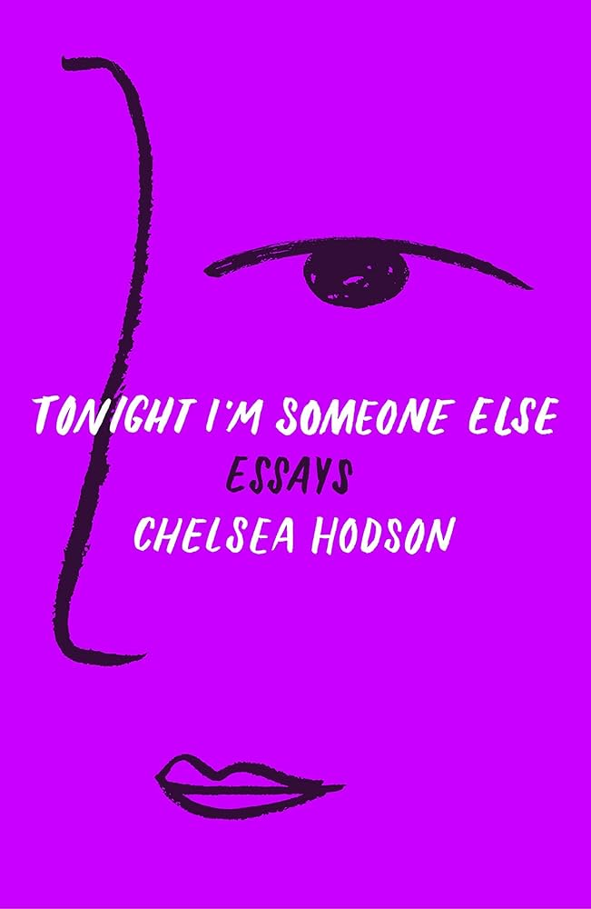

---    
date: 2026-06-04T04:01:28.764Z
title: "Tonight I’m Someone Else by Chelsea Hodson"
description: "Hodson writes with a wild passion borne from a lifetime of clawing through cages; as if the words themselves are a balm for the wounds she carries"
featuredimage: './cover.jpg'
tags: ["bookshelf", "love", "experimental-writing"]
---   

*Tonight I’m Someone Else* by Chelsea Hodson is raw and evocative, blending a stream of consciousness with delectable knack for powerful images.

 

> Our loneliness went out with our breath, but then we had no choice but to breathe it back in.

Hodson writes with a wild passion borne from a lifetime of clawing through cages; as if the words themselves are a balm for the wounds she carries. And she carries rooms of these of which you’re given the briefest stain of light.

I think the power of this novel is in its dream-like vignettes, and if read before bed, you drift into a shadow-world of bittersweet longing.

I wonder if she’s lived with the intention to share her experiences; knocking down dangerous doors.

I also hope that one day she finds what she is looking for.

Read in May 2026, finished in New York, written up at the New York Public Library.

---

Cody kept staying out all night. I kept not saying anything. kept thinking eventually he'd come back to me for good.
My room was too bright for sleep, so I held my pillow over my face, exhaled into the black of it. I saw beautiful things.

1 have listened to music I hated until Loved it. I have looked at ugly clothes so long they began appearing as desirable objects. I have lived in America so long that money started to seem like a good idea.

But in New York, you can make a friend like that, do something you've never done with anyone, have the best of intentions to see each other, and then disappear

I once loved so hard I almost lost everything, including his life, including my own. Only then did I realize: perhaps love's physicality is death itself. 1 think I was taught that love, in its ideal form, is like a newborn baby: full of possibility, still warm from the heated privacy of the womb. But I think, at the end of my life, I won't see a figure cloaked in black velvet or a swirling void waiting to take me—/ will see the face of love. It will be a recognizable light, the one that lived behind all those other faces 1 knew up close, the light I suspected but could never prove. When I see the face of love, 1 wont be afraid. 1 will see what I've been searching for all my life.

Schopenhauer wrote, The scenes of our life resemble pictures in rough mosaic: they are ineffective from close up, and have to be viewed from a distance if they are to seem beautiful. He argued that attaining a goal was beside the point-it's the ad interim which makes up our lives, that time leading up to the thing we thought we wanted
The summer in between high school and college seemed disposable, and I woke up each day ready to waste it. I regarded college as the moment my life would finally begin.

When the sand gets in our eyes, we blame the shifting of the ground; we feel the world adding itself up. The old love was a meadow where deer approached it you stayed still long enough. The old love was a staring contest in which blinking meant you were still playing. The old love was a basket of fruit begging to be painted, and sometimes we did paint it.

He only wants to make things so that people adore him. I say that attention is beside the point, making beautiful things should be the only goal, but then I remember how badly I want him to adore me.

Our loneliness went out with our breath, but then we had no choice but to breathe it back in.

“I always hear stories about how insignificant we are, how alone we are, how the universe is expanding and aren’t we so small, isn’t our English so adorable, so prone to disappearance. And yet, one person’s hand can change a life—one palm, one touch”

When everything seems on the verge of collapse, I don’t know what to do besides indulge every desire. Help?

Everything I do is an effort to answer a question, even if the question is, How selfish can I be?

He slept with his back to me, which made me jealous of his dreams. Hey. Hey. Wake up.

When I watched him cry so hard he could barely drive, I had just one thought: This is the pain to make up for the pleasure, this is the pain to make up for the pleasure, this is the pain to make up for the pleasure.

How many truths have I blazed through, not listening?

I give myself up to oration, to God, which is you when I let it be, when you say mine in my ear. You changed me, I told you, because it was the highest praise I knew.

There is a mystery to our badness—it’s not the things we do but the ease with which we do them.

We must want each other to break in a way—why else would we take it this far? We must like the idea of burning down our homes and creating one out of the body we share.

I told you once that there was a button inside your mouth, and you closed your eyes every time I put my thumb inside to press it. I was the only witness to that machine, and you were mine, and, for a while, we worked.

Isn’t it remarkable the way knowing one person can alter a life? If you’re really lucky, you’ll find someone who reminds you of yourself. Not the version everyone knows, but the part of yourself you thought you kept hidden: now you see it in him.

She’s in a kind of loop, but the light is beautiful and she is mostly happy and what else can I do but tell her I love her and then leave?

I’m afraid to lose the thing I decided could save me. He’s a muse because he’s something I can’t control, can’t fully write down. I see what isn’t there, I hear who isn’t speaking, I do not touch him, I believe him into being. Mine! I say, holding a thing I found. My insistence makes it even less mine, and soon I find I did not want to own the feeling at all, I just wanted to know it, and I do. (I knew you.)