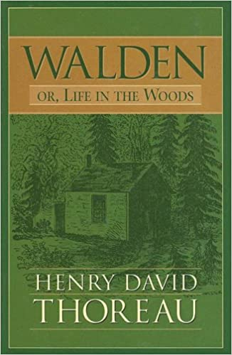

---    
date: 2025-03-18T11:03:13.615Z
title: "Walden by Henry David Thoreau"
description: "Walden by Henry David Thoreau is a deeply moving read"
tags: ["bookshelf", "fiction", "cerebral", "historical", "wisdom"]
featuredimage: './cover.jpg'
---   

⭐ ⭐ ⭐ 

Walden by Henry David Thoreau was a deeply moving read. Set in the mid 1800’s, at the height of America’s industrialisation, Thoreau set out to escape the madness he deemed society was heading in by building a house near Walden Pond, and living there in solitude for a period of two years.

 

He found some land, and used primitive supplies and tools to construct an abode. Learning agriculture, he toiled the land to grow an assortment of beans and vegetables to be roughly self-sufficient. Throughout all of this, he kept a meticulous journal, which this text originates from. 

Classified as an experiment, this endeavour had many learnings, which gratefully have been documented so one doesn’t need to do the same.

By no means an easy text to read, it is filled with long winded dialogues that branch into allegories, mythology, and philosophical musings. However, if you give it some time, you observe some of the most beautiful writing ever written. 

Read sometime in February 

---

“I have travelled a good deal in Concord; and everywhere, in shops, and offices, and fields, the inhabitants have appeared to me to be doing penance in a thousand remarkable ways. What I have heard of Bramins sitting exposed to four fires and looking in the face of the sun; or hanging suspended, with their heads downward, over flames; or looking at the heavens over their shoulders “until it becomes impossible for them to resume their natural position, while from the twist of the neck nothing but liquids can pass into the stomach”; or dwelling, chained for life, at the foot of a tree; or measuring with their bodies, like caterpillars, the breadth of vast empires; or standing on one leg on the tops of pillars—even these forms of conscious penance are hardly more incredible and astonishing than the scenes which I daily witness. The twelve labors of Hercules were trifling in comparison with those which my neighbors have undertaken; for they were only twelve, and had an end; but I could never see that these men slew or captured any monster or finished any labor. “They have no friend Iolaus to burn with a hot iron the root of the hydra’s head, but as soon as one head is crushed, two spring up.”

“Most men, even in this comparatively free country, through mere ignorance and mistake, are so occupied with the factitious cares and superfluously coarse labors of life that its finer fruits cannot be plucked by them. Their fingers, from excessive toil, are too clumsy and tremble too much for that. “Actually, the laboring man has not leisure for a true integrity day by day; he cannot afford to sustain the manliest relations to men; his labor would be depreciated in the market. He has no time to be anything but a machine. How can he remember well his ignorance—which his growth requires—who has so often to use his knowledge? We should feed and clothe him gratuitously sometimes, and recruit him with our cordials, before we judge of him. The finest qualities of our nature, like the bloom on fruits, can be preserved only by the most delicate handling. Yet we do not treat ourselves nor one another thus tenderly.”

“The whole ground of human life seems to some to have been gone over by their predecessors, both the heights and the valleys, and all things to have been cared for. ”

“We might try our lives by a thousand simple tests; as, for instance, that the same sun which ripens my beans illumines at once a system of earths like ours. If I had remembered this it would have prevented some mistakes. This was not the light in which I hoed them. The stars are the apexes of what wonderful triangles! What distant and different beings in the various mansions of the universe are contemplating the same one at the same moment! Nature and human life are as various as our several constitutions. Who shall say what prospect life offers to another? Could a greater miracle take place than for us to look through each other’s eyes for an instant? We should live in all the ages of the world in an hour; ay, in all the worlds of the ages. History, Poetry, Mythology!—I know of no reading of another’s experience so startling and informing as this would be.”

“To anticipate, not the sunrise and the dawn merely, but, if possible, Nature herself! ”

“It is an interesting question how far men would retain their relative rank if they were divested of their clothes. Could you, in such a case, tell surely of any company of civilized men which belonged to the most respected class?”

“I say, beware of all enterprises that require new clothes, and not rather a new wearer of clothes. If there is not a new man, how can the new clothes be made to fit? If you have any enterprise before you, try it in your old clothes. All men want, not something to do with, but something to do, or rather something to be. Perhaps we should never procure a new suit, however ragged or dirty the old, until we have so conducted, so enterprised or sailed in some way, that we feel like new men in the old, and that to retain it would be like keeping new wine in old bottles. Our moulting season, like that of the fowls, must be a crisis in our lives. The loon retires to solitary ponds to spend it. Thus also the snake casts its slough, and the caterpillar its wormy coat, by an internal industry and expansion; for clothes are but our outmost cuticle and mortal coil. Otherwise we shall be found sailing under false colors, and be inevitably cashiered at last by our own opinion, as well as that of mankind.”

“Every generation laughs at the old fashions, but follows religiously the new. ”

“While civilization has been improving our houses, it has not equally improved the men who are to inhabit them. It has created palaces, but it was not so easy to create noblemen and kings.”

“I would rather ride on earth in an ox cart, with a free circulation, than go to heaven in the fancy car of an excursion train and breathe a malaria all the way.
The very simplicity and nakedness of man’s life in the primitive ages imply this advantage, at least, that they left him still but a sojourner in nature. When he was refreshed with food and sleep, he contemplated his journey again. He dwelt, as it were, in a tent in this world, and was either threading the valleys, or crossing the plains, or climbing the mountaintops. But lo! men have become the tools of their tools. The man who independently plucked the fruits when he was hungry is become a farmer; and he who stood under a tree for shelter, a housekeeper. We now no longer camp as for a night, but have settled down on earth and forgotten heaven. ”

“Under the most splendid house in the city is still to be found the cellar where they store their roots as of old, and long after the superstructure has disappeared posterity remark its dent in the earth. The house is still but a sort of porch at the entrance of a burrow.”

“To make a railroad round the world available to all mankind is equivalent to grading the whole surface of the planet. Men have an indistinct notion that if they keep up this activity of joint stocks and spades long enough all will at length ride somewhere, in next to no time, and for nothing; but though a crowd rushes to the depot, and the conductor shouts “All aboard!” when the smoke is blown away and the vapor condensed, it will be perceived that a few are riding, but the rest are run over—and it will be called, and will be, “A melancholy accident.” No doubt they can ride at last who shall have earned their fare, that is, if they survive so long, but they will probably have lost their elasticity and desire to travel by that time. This spending of the best part of one’s life earning money in order to enjoy a questionable liberty during the least valuable part of it reminds me of the Englishman who went to India to make a fortune first, in order that he might return to England and live the life of a poet. He should have gone up garret at once. “What!” exclaim a million Irishmen starting up from all the shanties in the land, “is not this railroad which we have built a good thing?” Yes, I answer, comparatively good, that is, you might have done worse; but I wish, as you are brothers of mine, that you could have spent your time better than digging in this dirt.”

“I am wont to think that men are not so much the keepers of herds as herds are the keepers of men, the former are so much the freer”

“The student who secures his coveted leisure and retirement by systematically shirking any labor necessary to man obtains but an ignoble and unprofitable leisure, defrauding himself of the experience which alone can make leisure fruitful. “But,” says one, “you do not mean that the students should go to work with their hands instead of their heads?” I do not mean that exactly, but I mean something which he might think a good deal like that; I mean that they should not play life, or study it merely, while the community supports them at this expensive game, but earnestly live it from beginning to end.”

“But I am wiser than that. I have learned that the swiftest traveller is he that goes afoot”

“The evil that men do lives after them” 

“Would it not be well if we were to celebrate such a “busk,” or “feast of first fruits,” as Bartram describes to have been the custom of the Mucclasse Indians? “When a town celebrates the busk,” says he, “having previously provided themselves with new clothes, new pots, pans, and other household utensils and furniture, they collect all their worn out clothes and other despicable things, sweep and cleanse their houses, squares, and the whole town of their filth, which with all the remaining grain and other old provisions they cast together into one common heap, and consume it with fire. After having taken medicine, and fasted for three days, all the fire in the town is extinguished. During this fast they abstain from the gratification of every appetite and passion whatever. A general amnesty is proclaimed; all malefactors may return to their town.”
“On the fourth morning, the high priest, by rubbing dry wood together, produces new fire in the public square, from whence every habitation in the town is supplied with the new and pure flame.”
“They then feast on the new corn and fruits, and dance and sing for three days, “and the four following days they receive visits and rejoice with their friends from neighboring towns who have in like manner purified and prepared themselves.”
- the idea of a metaphorical fire is alluring.

“For myself I found that the occupation of a day-laborer was the most independent of any, especially as it required only thirty or forty days in a year to support one. The laborer’s day ends with the going down of the sun, and he is then free to devote himself to his chosen pursuit, independent of his labor; but his employer, who speculates from month to month, has no respite from one end of the year to the other”
- the nature of working and time off - and how different types of labour arrangements can lead to more free time. 

“One young man of my acquaintance, who has inherited some acres, told me that he thought he should live as I did, if he had the means. I would not have anyone adopt my mode of living on any account; for, beside that before he has fairly learned it I may have found out another for myself, I desire that there may be as many different persons in the world as possible; but I would have each one be very careful to find out and pursue his own way, and not his father’s or his mother’s or his neighbor’s instead. The youth may build or plant or sail, only let him not be hindered from doing that which he tells me he would like to do. It is by a mathematical point only that we are wise, as the sailor or the fugitive slave keeps the polestar in his eye; but that is sufficient guidance for all our life. We may not arrive at our port within a calculable period, but we would preserve the true course.”
wiseness

“Some show their kindness to the poor by employing them in their kitchens. Would they not be kinder if they employed themselves there?”

“do not let your left hand know what your right hand does, for it is not worth knowing”

“Why, the owner does not know it for many years when a poet has put his farm in rhyme, the most admirable kind of invisible fence, has fairly impounded it, milked it, skimmed it, and got all the cream, and left the farmer only the skimmed milk.”
one is left with the mundanity whilst the other captures the essence & leaves.

“They say that characters were engraven on the bathing tub of King Tchingthang to this effect: “Renew thyself completely each day; do it again, and again, and forever again.” I can understand that. Morning brings back the heroic ages. I was as much affected by the faint hum of a mosquito making its invisible and unimaginable tour through my apartment at earliest dawn, when I was sitting with door and windows open, as I could be by any trumpet that ever sang of fame. It was Homer’s requiem; itself an Iliad and Odyssey in the air, singing its own wrath and wanderings. There was something cosmical about it; a standing advertisement, till forbidden, of the everlasting vigor and fertility of the world. The morning, which is the most memorable season of the day, is the awakening hour.”
the power of mornings. A new day

“It is something to be able to paint a particular picture, or to carve a statue, and so to make a few objects beautiful; but it is far more glorious to carve and paint the very atmosphere and medium through which we look, which morally we can do. To affect the quality of the day, that is the highest of arts.”
the lens from which you see the world. 

“Our life is like a German Confederacy, made up of petty states, with its boundary forever fluctuating, so that even a German cannot tell you how it is bounded at any moment. The nation itself, with all its so-called internal improvements, which, by the way are all external and superficial, is just such an unwieldy and overgrown establishment, cluttered with furniture and tripped up by its own traps, ruined by luxury and heedless expense, by want of calculation and a worthy aim, as the million households in the land; and the only cure for it, as for them, is in a rigid economy, a stern and more than Spartan simplicity of life and elevation of purpose. It lives too fast. Men think that it is essential that the Nation have commerce, and export ice, and talk through a telegraph, and ride thirty miles an hour, without a doubt, whether they do or not; but whether we should live like baboons or like men, is a little uncertain. ”
- What is this great pursuit of life? 

“If we read of one man robbed, or murdered, or killed by accident, or one house burned, or one vessel wrecked, or one steamboat blown up, or one cow run over on the Western Railroad, or one mad dog killed, or one lot of grasshoppers in the winter—we never need read of another. One is enough. If you are acquainted with the principle, what do you care for a myriad instances and applications?”
- the topic of news

“When we are unhurried and wise, we perceive that only great and worthy things have any permanent and absolute existence, that petty fears and petty pleasures are but the shadow of the reality. This is always exhilarating and sublime. By closing the eyes and slumbering, and consenting to be deceived by shows, men establish and confirm their daily life of routine and habit everywhere, which still is built on purely illusory foundations. Children, who play life, discern its true law and relations more clearly than men, who fail to live it worthily, but who think that they are wiser by experience, that is, by failure.”

“I have read in a Hindu book, that “there was a king’s son, who, being expelled in infancy from his native city, was brought up by a forester, and, growing up to maturity in that state, imagined himself to belong to the barbarous race with which he lived. One of his father’s ministers having discovered him, revealed to him what he was, and the misconception of his character was removed, and he knew himself to be a prince. So soul,” continues the Hindu philosopher, “from the circumstances in which it is placed, mistakes its own character, until the truth is revealed to it by some holy teacher, and then it knows itself to be Brahme.”
we need not be doused in holy water to be holy

“Be it life or death, we crave only reality.”

“The best books are not read even by those who are called good readers. What does our Concord culture amount to? There is in this town, with a very few exceptions, no taste for the best or for very good books even in English literature, whose words all can read and spell. Even the college-bred and so-called liberally educated men here and elsewhere have really little or no acquaintance with the English classics; and as for the recorded wisdom of mankind, the ancient classics and Bibles, which are accessible to all who will know of them, there are the feeblest efforts anywhere made to become acquainted with them
… “One who has just come from reading perhaps one of the best English books will find how many with whom he can converse about it? Or suppose he comes from reading a Greek or Latin classic in the original, whose praises are familiar even to the so-called illiterate; he will find nobody at all to speak to, but must keep silence about it.”
- I really like this paragraph 

“How many a man has dated a new era in his life from the reading of a book! The book exists for us, perchance, which will explain our miracles and reveal new ones. The at present unutterable things we may find somewhere uttered.”
highly resonate with this.

“Shall the world be confused to one Paris or one Oxford forever?” 
Centre points of art and culture, why do we take it for granted they exist only in one place? 

“My days were not days of the week, bearing the stamp of any heathen deity, nor were they minced into hours and fretted by the ticking of a clock; for I lived like the Puri Indians, of whom it is said that “for yesterday, today, and tomorrow they have only one word, and they express the variety of meaning by pointing backward for yesterday, forward for tomorrow, and overhead for the passing day.” ”

“It was worth the while to see the sun shine on these things, and hear the free wind blow on them; so much more interesting most familiar objects look out of doors than in the house.”

“When I meet the engine with its train of cars moving off with planetary motion—or, rather, like a comet, for the beholder knows not if with that velocity and with that direction it will ever revisit this system, since its orbit does not look like a returning curve—with its steam cloud like a banner streaming behind in golden and silver wreaths, like many a downy cloud which I have seen, high in the heavens, unfolding its masses to the light—as if this traveling demigod, this cloud-compeller, would ere long take the sunset sky for the livery of his train; when I hear the iron horse make the hills echo with his snort like thunder, shaking the earth with his feet, and breathing fire and smoke from his nostrils (what kind of winged horse or fiery dragon they will put into the new Mythology I don’t know), it seems as if the earth had got a race now worthy to inhabit it.”
what a wonderful description of a train.

“I rejoice that there are owls. Let them do the idiotic and maniacal hooting for men. It is a sound admirably suited to swamps and twilight woods which no day illustrates, suggesting a vast and undeveloped nature which men have not recognized. They represent the stark twilight and unsatisfied thoughts which all have. All day the sun has shone on the surface of some savage swamp, where the single spruce stands hung with usnea lichens, and small hawks circulate above, and the chickadee lisps amid the evergreens, and the partridge and rabbit skulk beneath; but now a more dismal and fitting day dawns, and a different race of creatures awakes to express the meaning of Nature there.”
- Description of owls.             

“To be alone was something unpleasant. But I was at the same time conscious of a slight insanity in my mood, and seemed to foresee my recovery. In the midst of a gentle rain while these thoughts prevailed, I was suddenly sensible of such sweet and beneficent society in Nature, in the very pattering of the drops, and in every sound and sight around my house, an infinite and unaccountable friendliness all at once like an atmosphere sustaining me, as made the fancied advantages of human neighborhood insignificant, and I have never thought of them since. Every little pine needle expanded and swelled with sympathy and befriended me. I was so distinctly made aware of the presence of something kindred to me, even in scenes which we are accustomed to call wild and dreary, and also that the nearest of blood to me and humanest was not a person nor a villager, that I thought no place could ever be strange to me again”
- when Nature befriends you 

“Society is commonly too cheap. We meet at very short intervals, not having had time to acquire any new value for each other. We meet at meals three times a day, and give each other a new taste of that old musty cheese that we are. We have had to agree on a certain set of rules, called etiquette and politeness, to make this frequent meeting tolerable and that we need not come to open war. We meet at the post-office, and at the sociable, and about the fireside every night; we live thick and are in each other’s way, and stumble over one another, and I think that we thus lose some respect for one another. Certainly less frequency would suffice for all important and hearty communications.”
- Interesting thought - how much is too much contact with people? 

“In him the animal man chiefly was developed. In physical endurance and contentment he was cousin to the pine and the rock. I asked him once if he was not sometimes tired at night, after working all day; and he answered, with a sincere and serious look, “Gorrappit, I never was tired in my life.” But the intellectual and what is called spiritual man in him were slumbering as in an infant. He had been instructed only in that innocent and ineffectual way in which the Catholic priests teach the aborigines, by which the pupil is never educated to the degree of consciousness, but only to the degree of trust and reverence, and a child is not made a man, but kept a child. When Nature made him, she gave him a strong body and contentment for his portion, and propped him on every side with reverence and reliance, that he might live out his threescore years and ten a child. He was so genuine and unsophisticated that no introduction would serve to introduce him, more than if you introduced a woodchuck to your neighbor. He had got to find him out as you did. “He would not play any part. Men paid him wages for work, and so helped to feed and clothe him; but he never exchanged opinions with them. He was so simply and naturally humble—if he can be called humble who never aspires—that humility was no distinct quality in him, nor could he conceive of it. Wiser men were demigods to him. If you told him that such a one was coming, he did as if he thought that anything so grand would expect nothing of himself, but take all the responsibility on itself, and let him be forgotten still. He never heard the sound of praise. He particularly reverenced the writer and the preacher. Their performances were miracles. When I told him that I wrote considerably, he thought for a long time that it was merely the handwriting which I meant, for he could write a remarkably good hand himself. I sometimes found the name of his native parish handsomely written in the snow by the highway, with the proper French accent, and knew that he had passed. I asked him if he ever wished to write his thoughts. “He said that he had read and written letters for those who could not, but he never tried to write thoughts—no, he could not, he could not tell what to put first, it would kill him, and then there was spelling to be attended to at the same time!
I heard that a distinguished wise man and reformer asked him if he did not want the world to be changed; but he answered with a chuckle of surprise in his Canadian accent, not knowing that the question had ever been entertained before, “No, I like it well enough.” It would have suggested many things to a philosopher to have dealings with him. To a stranger he appeared to know nothing of things in general; yet I sometimes saw in him a man whom I had not seen before, and I did not know whether he was as wise as Shakespeare or as simply ignorant as a child, whether to suspect him of a fine poetic consciousness or of stupidity. A townsman told me that when he met him sauntering through the village in his small closefitting cap, and whistling to himself, he reminded him of a prince in disguise.”
- The child-like innocence and presence of what some would call “ignorant” or animalistic, might be the closest to wisdom 

“We are wont to forget that the sun looks on our cultivated fields and on the prairies and forests without distinction. They all reflect and absorb his rays alike, and the former make but a small part of the glorious picture which he beholds in his daily course. In his view the earth is all equally cultivated like a garden. Therefore we should receive the benefit of his light and heat with a corresponding trust and magnanimity. What though I value the seed of these beans, and harvest that in the fall of the year? This broad field which I have looked at so long looks not to me as the principal cultivator, but away from me to influences more genial to it, which water and make it green. These beans have results which are not harvested by me. Do they not grow for woodchucks partly? The ear of wheat (in Latin spica, obsoletely speca, from spe, hope) should not be the only hope of the husbandman; its kernel or grain (granum from gerendo, bearing) is not all that it bears. How, then, can our harvest fail? Shall I not rejoice also at the abundance of the weeds whose seeds are the granary of the birds? It matters little comparatively whether the fields fill the farmer’s barns. The true husbandman will cease from anxiety, as the squirrels manifest no concern whether the woods will bear chestnuts this year or not, and finish his labor with every day, relinquishing all claim to the produce of his fields, and sacrificing in his mind not only his first but his last fruits also.”
Everything deserves to be here, categorising good and bad in the context of nature is irrelevant. 

“ I observed that the vitals of the village were the grocery, the barroom, the post-office, and the bank; and, as a necessary part of the machinery, they kept a bell, a big gun, and a fire-engine, at convenient places”
- what makes up a town

“It is a surprising and memorable, as well as valuable experience, to be lost in the woods any time. Often in a snowstorm, even by day, one will come out upon a well-known road and yet find it impossible to tell which way leads to the village. Though he knows that he has travelled it a thousand times, he cannot recognize a feature in it, but it is as strange to him as if it were a road in Siberia.”

“I am convinced, that if all men were to live as simply as I then did, thieving and robbery would be unknown. These take place only in communities where some have got more than is sufficient while others have not enough.”
the concept of theft & inequality.

“Perhaps on that spring morning when Adam and Eve were driven out of Eden Walden Pond was already in existence, and even then breaking up in a gentle spring rain accompanied with mist and a southerly wind, and covered with myriads of ducks and geese, which had not heard of the fall, when still such pure lakes sufficed them. Even then it had commenced to rise and fall, and had clarified its waters and colored them of the hue they now wear, and obtained a patent of Heaven to be the only Walden Pond in the world and distiller of celestial dews. Who knows in how many unremembered nations’ literatures this has been the Castalian Fountain? or what nymphs presided over it in the Golden Age? It is a gem of the first water which Concord wears in her coronet.”

“A lake is the landscape’s most beautiful and expressive feature. It is earth’s eye; looking into which the beholder measures the depth of his own nature”

“The cars never pause to look at it; yet I fancy that the engineers and firemen and brakemen, and those passengers who have a season ticket and see it often, are better men for the sight. The engineer does not forget at night, or his nature does not, that he has beheld this vision of serenity and purity once at least during the day. ”
Who decides what is worth seeing? 

“White Pond and Walden are great crystals on the surface of the earth, Lakes of Light. If they were permanently congealed, and small enough to be clutched, they would, perchance, be carried off by slaves, like precious stones, to adorn the heads of emperors; but being liquid, and ample, and secured to us and our successors forever, we disregard them, and run after the diamond of Kohinoor. They are too pure to have a market value; they contain no muck. How much more beautiful than our lives, how much more transparent than our characters, are they! We never learned meanness of them. How much fairer than the pool before the farmer’s door, in which his ducks swim! Hither the clean wild ducks come. Nature has no human inhabitant who appreciates her. The birds with their plumage and their notes are in harmony with the flowers, but what youth or maiden conspires with the wild luxuriant beauty of Nature? She flourishes most alone, far from the towns where they reside. Talk of heaven! ye disgrace earth.”
- The immeasurable value of nature that can’t be transmuted to wealth. 

“But therein, as I found, dwelt now John Field, an Irishman, and his wife, and several children, from the broad-faced boy who assisted his father at his work, and now came running by his side from the bog to escape the rain, to the wrinkled, sibyl-like, cone-headed infant that sat upon its father’s knee as in the palaces of nobles, and looked out from its home in the midst of wet and hunger inquisitively upon the stranger, with the privilege of infancy, not knowing but it was the last of a noble line, and the hope and cynosure of the world, instead of John Field’s poor starveling brat. ”
- Crazy throwing under the bus.

“No humane being, past the thoughtless age of boyhood, will wantonly murder any creature which holds its life by the same tenure that he does. The hare in its extremity cries like a child. I warn you, mothers, that my sympathies do not always make the usual phil-anthropic distinctions.
Such is oftenest the young man’s introduction to the forest, and the most original part of himself. He goes thither at first as a hunter and fisher, until at last, if he has the seeds of a better life in him, he distinguishes his proper objects, as a poet or naturalist it may be, and leaves the gun and fish-pole behind.”

“I believe that every man who has ever been earnest to preserve his higher or poetic faculties in the best condition has been particularly inclined to abstain from animal food, and from much food of any kind. It is a significant fact, stated by entomologists—I find it in Kirby and Spence—that “some insects in their perfect state, though furnished with organs of feeding, make no use of them”; and they lay it down as “a general rule, that almost all insects in this state eat much less than in that of larvae. The voracious caterpillar when transformed into a butterfly … and the gluttonous maggot when become a fly” content themselves with a drop or two of honey or some other sweet liquid. The abdomen under the wings of the butterfly still represents the larva. This is the tidbit which tempts his insectivorous fate. The gross feeder is a man in the larva state; and there are whole nations in that condition, nations without fancy or imagination, whose vast abdomens betray them.”

“Whatever my own practice may be, I have no doubt that it is a part of the destiny of the human race, in its gradual improvement, to leave off eating animals, as surely as the savage tribes have left off eating each other when they came in contact with the more civilized.”
- 1850’s premonitions 

“If one listens to the faintest but constant suggestions of his genius, which are certainly true, he sees not to what extremes, or even insanity, it may lead him; and yet that way, as he grows more resolute and faithful, his road lies. The faintest assured objection which one healthy man feels will at length prevail over the arguments and customs of mankind. No man ever followed his genius till it misled him.”
- You already know what your purpose is

“If the day and the night are such that you greet them with joy, and life emits a fragrance like flowers and sweet-scented herbs, is more elastic, more starry, more immortal—that is your success. All nature is your congratulation, and you have cause momentarily to bless yourself. The greatest gains and values are farthest from being appreciated. We easily come to doubt if they exist. We soon forget them. They are the highest reality. Perhaps the facts most astounding and most real are never communicated by man to man. The true harvest of my daily life is somewhat as intangible and indescribable as the tints of morning or evening. It is a little stardust caught, a segment of the rainbow which I have clutched.”
what beautiful writing

“I am glad to have drunk water so long, for the same reason that I prefer the natural sky to an opium-eater’s heaven”

“From exertion come wisdom and purity; from sloth ignorance and sensuality”

“If you would avoid uncleanness, and all the sins, work earnestly, though it be at cleaning a stable. Nature is hard to be overcome, but she must be overcome”

“Every man is the builder of a temple, called his body, to the god he worships, after a style purely his own, nor can he get off by hammering marble instead. We are all sculptors and painters, and our material is our own flesh and blood and bones. Any nobleness begins at once to refine a man’s features, any meanness or sensuality to imbrute them.”

“Why do precisely these objects which we behold make a world? Why has man just these species of animals for his neighbors; as if nothing but a mouse could have filled this crevice? I suspect that Pilpay & Co. have put animals to their best use, for they are all beasts of burden, in a sense, made to carry some portion of our thoughts.”

“Such an eye was not born when the bird was, but is coeval with the sky it reflects. ”

“You only need sit still long enough in some attractive spot in the woods that all its inhabitants may exhibit themselves to you by turns.”

“I was witness to events of a less peaceful character. One day when I went out to my woodpile, or rather my pile of stumps, I observed two large ants, the one red, the other much larger, nearly half an inch long, and black, fiercely contending with one another. Having once got hold they never let go, but struggled and wrestled and rolled on the chips incessantly. Looking farther, I was surprised to find that the chips were covered with such combatants, that it was not a duellum, but a bellum, a war between two races of ants, the red always pitted against the black, and frequently two red ones to one black. The legions of these Myrmidons covered all the hills and vales in my “wood-yard, and the ground was already strewn with the dead and dying, both red and black. It was the only battle which I have ever witnessed, the only battlefield I ever trod while the battle was raging; internecine war; the red republicans on the one hand, and the black imperialists on the other. On every side they were engaged in deadly combat, yet without any noise that I could hear, and human soldiers never fought so resolutely. I watched a couple that were fast locked in each other’s embraces, in a little sunny valley amid the chips, now at noonday prepared to fight till the sun went down, or life went out. The smaller red champion had fastened himself like a vice to his adversary’s front, and through all the tumblings on that field never for an instant ceased to gnaw at one of his feelers near the root, having already caused the other to go by the board; while the stronger black one dashed him from side to side, and, as I saw on looking nearer, had already divested him of several of his members. They fought with more pertinacity than bulldogs. Neither manifested the least disposition it was evident that their battle-cry was “Conquer or die.” In the meanwhile there came along a single red ant on the hillside of this valley, evidently full of excitement, who either had despatched his foe, or had not yet taken part in the battle; probably the latter, for he had lost none of his limbs; whose mother had charged him to return with his shield or upon it. Or perchance he was some Achilles, who had nourished his wrath apart, and had now come to avenge or rescue his Patroclus. He saw this unequal combat from afar—for the blacks were nearly twice the size of the red—he drew near with rapid pace till he stood on his guard within half an inch of the combatants; then, watching his opportunity, he sprang upon the black warrior, and commenced his operations near the root of his right fore leg, leaving the foe to select among his own members; and so there were three united for life, as if a new kind of attraction had been invented which put all other locks and cements to shame. … And certainly there is not the fight recorded in Concord history, at least, if in the history of America, that will bear a moment’s comparison with this, whether for the numbers engaged in it, or for the patriotism and heroism displayed”
how many battles have been fought

“The animal merely makes a bed, which he warms with his body, in a sheltered place; but man, having discovered fire, boxes up some air in a spacious apartment, and warms that, instead of robbing himself, makes that his bed, in which he can move about divested of more cumbrous clothing, maintain a kind of summer in the midst of winter, and by means of windows even admit the light, and with a lamp lengthen out the day. Thus he goes a step or two beyond instinct, and saves a little time for the fine arts”

“What a sorrowful act must that be—the covering up of wells! coincident with the opening of wells of tears. These cellar dents, like deserted fox burrows, old holes, are all that is left where once were the stir and bustle of human life, and “fate, free will, foreknowledge absolute,” in some form and dialect or other were by turns discussed.”

“There was only a narrow slit left between their lids, by which he preserved a peninsular relation to me; thus, with half-shut eyes, looking out from the land of dreams, and endeavoring to realize me, vague object or mote that interrupted his visions.”
owls

“A farmer, a hunter, a soldier, a reporter, even a philosopher, may be daunted; but nothing can deter a poet, for he is actuated by pure love. Who can predict his comings and goings? His business calls him out at all hours, even when doctors sleep.”

“How blind that cannot see serenity!”

“There we worked, revising mythology, rounding a fable here and there, and building castles in the air for which earth offered no worthy foundation”

“What do you mean by alarming the citadel at this time of night consecrated to me? Do you think I am ever caught napping at such an hour, and that I have not got lungs and a larynx as well as yourself? Boo-hoo, boo-hoo, boo-hoo! It was one of the most thrilling discords I ever heard. And yet, if you had a discriminating ear, there were in it the elements of a concord such as these plains never saw nor heard.”
what sounds have been heard by the world only to disappear without a trace

“Usually the red squirrel (Sciurus Hudsonius) waked me in the dawn, coursing over the roof and up and down the sides of the house, as if sent out of the woods for this purpose. In the course of the winter I threw out half a bushel of ears of sweet corn, which had not got ripe, on to the snow-crust by my door, and was amused by watching the motions of the various animals which were baited by it. In the twilight and the night the rabbits came regularly and made a hearty meal. All day long the red squirrels came and went, and afforded me much entertainment by their manoeuvres. One would approach at first warily through the shrub oaks, running over the snow-crust by fits and starts like a leaf blown by the wind, now a few paces this way, with wonderful speed and waste of energy, making inconceivable haste with his “trotters,” as if it were for a wager, and now as many paces that way, but never getting on more than half a rod at “a time; and then suddenly pausing with a ludicrous expression and a gratuitous somerset, as if all the eyes in the universe were eyed on him—for all the motions of a squirrel, even in the most solitary recesses of the forest, imply spectators as much as those of a dancing girl—wasting more time in delay and circumspection than would have sufficed to walk the whole distance—I never saw one walk—and then suddenly, before you could say Jack Robinson, he would be in the top of a young pitch pine, winding up his clock and chiding all imaginary spectators, soliloquizing and talking to all the universe at the same time—for no reason that I could ever detect, or he himself was aware of, I suspect. At length he would reach the corn, and selecting a suitable ear, frisk about in the same uncertain trigonometrical way to the topmost stick of my woodpile, before my window, where he looked me in the face, and there sit for hours, supplying himself with a new ear from time to time, nibbling at first voraciously and throwing the half-naked cobs about; till at length he grew more dainty still and played with his food, tasting only the inside of the kernel, and the ear, which was held balanced over the stick by one paw, slipped from his careless grasp and fell to the ground, when he would look over at it with a ludicrous expression of uncertainty, as if suspecting that it had life, with a mind not made up whether to get it again, or a new one, or be off; now thinking of corn, then listening to hear what was in the wind. So the little impudent fellow would waste many an ear in a forenoon; till at last, seizing some longer and plumper one, considerably bigger than himself, and skilfully balancing it, he would set out with it to the woods, like a tiger with a buffalo, by the same zigzag course and frequent pauses, scratching along with it as if it were too heavy for him and falling all the while, making its fall a diagonal between a perpendicular and horizontal, being determined to put it through at any rate;—a singularly frivolous and whimsical fellow;—and so he would get off with it to where he lived, perhaps carry it to the top of a pine tree forty or fifty rods distant, and I would afterwards find the cobs strewn about the woods in various directions.”
3 pages of SQUIRREL

“Nature puts no question and answers none which we mortals ask. She has long ago taken her resolution. “O Prince, our eyes contemplate with admiration and transmit to the soul the wonderful and varied spectacle of this universe. The night veils without doubt a part of this glorious creation; but day comes to reveal to us this great work, which extends from earth even into the plains of the ether.”

“I cut my way first through a foot of snow, and then a foot of ice, and open a window under my feet, where, kneeling to drink, I look down into the quiet parlor of the fishes, pervaded by a softened light as through a window of ground glass, with its bright sanded floor the same as in summer; there a perennial waveless serenity reigns as in the amber twilight sky, corresponding to the cool and even temperament of the inhabitants. Heaven is under our feet is well as over our heads.”

“wild men, who instinctively follow other fashions and trust other authorities than their townsmen, and by their goings and comings stitch towns together in parts where else they would be ripped.”

“Direct your eye right inward, and you’ll find
A thousand regions in your mind
Yet undiscovered. Travel them, and be
Expert in home-cosmography.”

“While England endeavors to cure the potato-rot, will not any endeavor to cure the brain-rot, which prevails so much more widely and fatally?”
brain rot in the 1800’s

The material was pure, and his art was pure; how could the result be other than wonderful?”

“However mean your life is, meet it and live it; do not shun it and call it hard names. It is not so bad as you are. It looks poorest when you are richest. The faultfinder will find faults even in paradise. Love your life, poor as it is. You may perhaps have some pleasant, thrilling, glorious hours, even in a poorhouse. The setting sun is reflected from the windows of the almshouse as brightly as from the rich man’s abode; the snow melts before its door as early in the spring. I do not see but a quiet mind may live as contentedly there, and have as cheering thoughts, as in a palace. The town’s poor seem to me often to live the most independent lives of any. Maybe they are simply great enough to receive without misgiving. Most think that they are above being supported by the town; but it oftener happens that they are not above supporting themselves by dishonest means, which should be more disreputable. Cultivate poverty like a garden herb, like sage. Do not trouble yourself much to get new things, whether clothes or friends. Turn the old; return to them. Things do not change; we change. Sell your clothes and keep your thoughts. God will see that you do not want society. If I were confined to a corner of a garret all my days, like a spider, the world would be just as large to me while I had my thoughts about me.”

“Moreover, if you are restricted in your range by poverty, if you cannot buy books and newspapers, for instance, you are but confined to the most significant and vital experiences; you are compelled to deal with the material which yields the most sugar and the most starch. It is life near the bone where it is sweetest. You are defended from being a trifler. No man loses ever on a lower level by magnanimity on a higher. Superfluous wealth can buy superfluities only. Money is not required to buy one necessary of the soul.”

“The learned societies and great men of Assyria—where are they? What youthful philosophers and experimentalists we are! There is not one of my readers who has yet lived a whole human life”

“The sun is but a morning star”.
