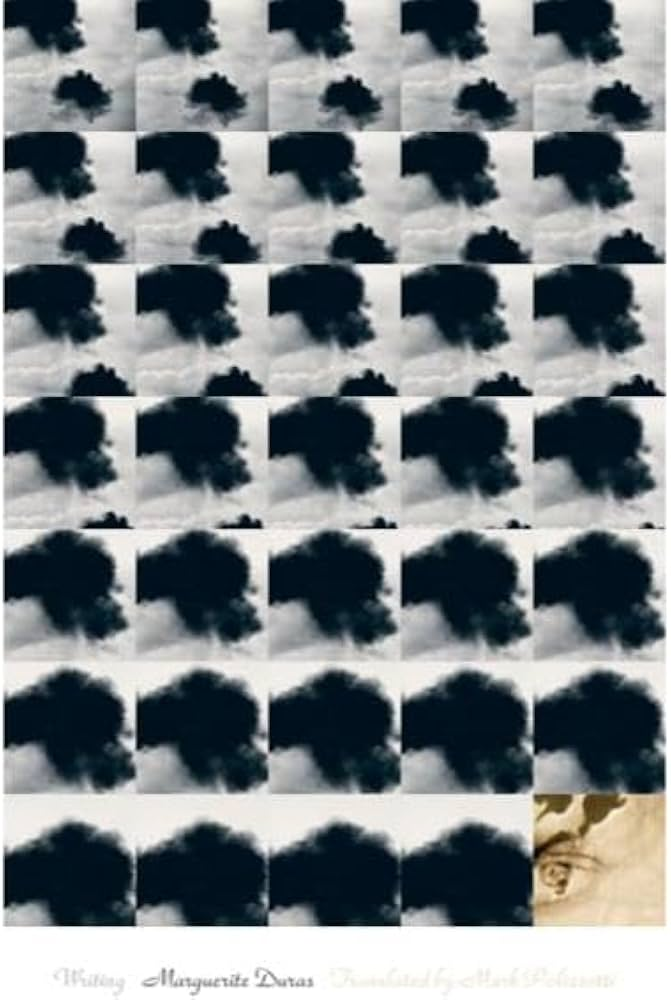

---    
date: 2026-10-03T11:12:48.181Z
title: "Writing by Marguerite Duras"
description: "Her essay on writing reads like a vigil in the night, surreptiously marking on wet stone the words of an oracle"
tags: ["bookshelf", "non-fiction", "cerebral"]
featuredimage: './cover.jpg'
---   

I came across this book inside the quaint establishment of Söderbokhandeln Hansson & Bruce in Stockholm. The cover reminded me of a womans head, and I was puzzled as to why it was repeated over thirty times. When I looked closer, I discovered it might instead be a dark cloud, or perhaps the absence of a cloud. This was enough to get me to turn to the first page. 

 

> The person who writes books must always be enveloped by a separation from others.

This was my first time reading Duras, and her voice felt simultaneously dream-like yet lucid. It was the pointed meditations of someone who felt deeply, and as a conseqeuence, lived a double-life.

> Writing comes like the wind. It's naked, it's made of ink, it's the thing written, and it passes like nothing else passes in life, nothing more, except life itself. 

Her essay on writing reads like a vigil in the night, surreptiously marking on wet stone the words of an oracle. 

She talks of the loneliness one experiences as one writes, the void from which *something* emerges. 

The process of writing is mired with challenges, worldly and also inexplainable. Yet it's the striving for. To write is to live, and to live is to write. 

> Around us, everything is writing; that's what we must finally perceive. Everything is writing. The fly on the wall is writing; there is much that it wrote in the light of the large room, refracted by the pon. The fly's writing could fill an entire page. And so this would be a kind of writing. From the moment that it could be, it already is a kind of writing. One day, perhaps, in the centuries to come, one might read this writing; it, too, will be deciphered, translated. And the vastness of an illegible poem will unfurl across the sky.

I was deeply inspired by her bravery, to cast into ink her own palatial constructs.

> And then one day, there will be nothing left to write, nothing to read, nothing left but the untranslatable fact of the life of that dead boy who was so young, young enough to make you scream.

I finished the second part of this work, *The Death of the Young British Pilot* at Clovelly, facing the undulating water, turning the seaweeds into gargantuan objects. A hundred years on I hear the story of a child, killed a day after the war had stopped. Who's to say it didn't begin oblivion?

Finished in September 2026, accompanied with me on my Tour de Mont Blanc (survivor of squashed lunches).

---

The person who writes books must always be enveloped by a separation from others.

When a book is finished - a book you have written, I mean - you can no longer say when reading it that this particualr book is a book you have written, or what things were written in it, in what state of despair or happiness, of discovery or failure that implicates your entire being. Because in the final account, nothing like that can be seen in a book. The writing is uniform in some way, tempered. Nothing more happens in such a book, once it's finished and published. And it rejoins the indecipherable innocence of its coming into the world. 

Every book, like every writer, has a difficult, unavoidable passage. And one must conciously decide to leave this mistake in the book for it to rmeain a true book, not a lie. 

The death of a fly is still death. It's death marching toward a certain end of the world, which widens the field of the final sleep. ... This might be the kind of very dark slippage - I don't like that word - that one runs the risk of experiencing. It isn't serious, but it's an event in itself, total, with enormous meaning; with inaccessible meaning and limitless breadth.

Around us, everything is writing; that's what we must finally perceive. Everything is writing. The fly on the wall is writing; there is much that it wrote in the light of the large room, refracted by the pon. The fly's writing could fill an entire page. And so this would be a kind of writing. From the moment that it could be, it already is a kind of writing. One day, perhaps, in the centuries to come, one might read this writing; it, too, will be deciphered, translated. And the vastness of an illegible poem will unfurl across the sky.

It's sad every time, but not tragic: winter, life, injustice. Absolute horror on a certain morning. It's only that: sad. One does not get used to it with time. 
- Winter definitely does suck.

Even if it's useless to cry, I still think we have to cry. Because despair is tangible. It remains. The memory of despair remains. Sometimes it kills.

Writing is the unknown. Before writing one knows nothing of what one is about to write. And in total lucidity. 

Writing comes like the wind. It's naked, it's made of ink, it's the thing written, and it passes like nothing else passes in life, nothing more, except life itself. 

And then the peasants say it was nothing, just the trees that have preserved in their sap the charcoal of their wounds.

Like a temporarily abandoned room awaiting lovers who haven't arrived yet because of bad weather.

That child who died in the war is also the secret of each one who found him at the top of that tall tree, crucified on that tree by the caracass of his airplane. One cannot write about that. One cannot write about that. Or else one can write about everything. To write about everything, everything at once, is not writing. It's nothing. To read it is untenable, like reading an advertisement. 
- Some emotions cannot be transmitted, the onus is on the reader

And then one day, there will be nothing left to write, nothing to read, nothing left but the untranslatable fact of the life of that dead boy who was so young, young enough to make you scream.

Her body must have passed through deserts, wars, the heat of Rome and the deserts, the stench of galleys, of exile. And after that we know nothing. 
